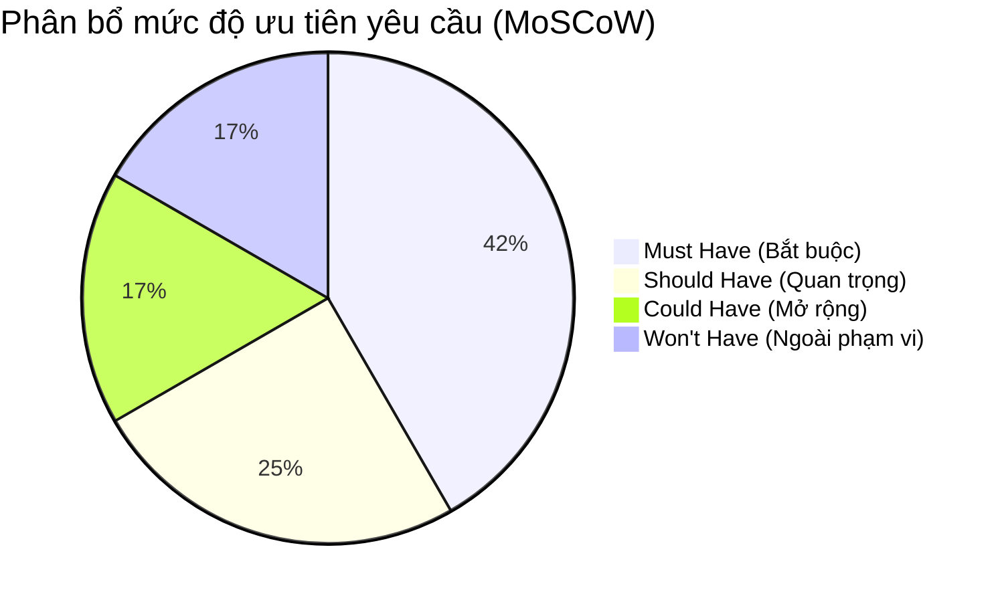
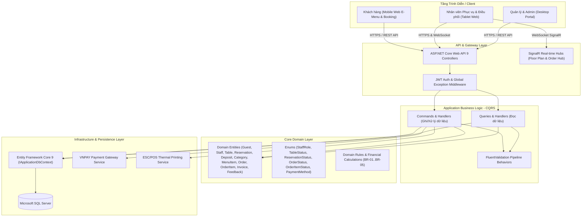
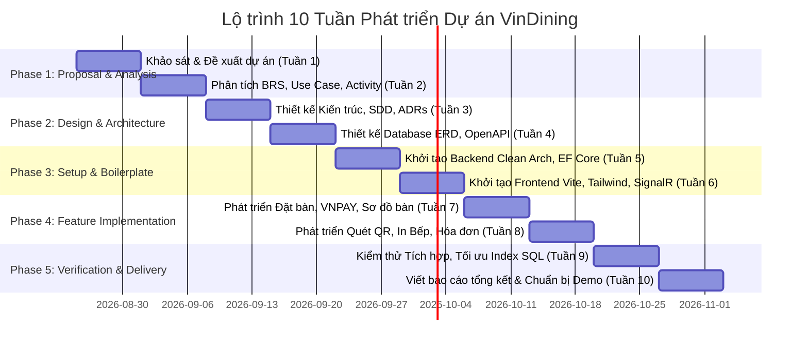

# ĐỀ ÁN PHÁT TRIỂN HỆ THỐNG (PROJECT PROPOSAL)
## Hệ thống Quản lý và Đặt bàn Nhà hàng Fine Dining (VinDining)

---

### THÔNG TIN CHUNG DỰ ÁN
* **Tên đề tài**: Hệ thống Quản lý và Đặt bàn Nhà hàng Fine Dining (**VinDining**)
* **Loại hình**: Đồ án Chuyên ngành / Đồ án Tốt nghiệp Kỹ thuật Phần mềm
* **Giảng viên hướng dẫn**: ThS. Phạm Hữu Tùng
* **Nhóm sinh viên thực hiện**:
  1. **Nguyễn Mạnh Quyền** — MSSV: `0023168` *(Trưởng nhóm)*
  2. **Đặng Quốc Khánh** — MSSV: `0023145` *(Thành viên)*
  3. **Nguyễn Hoàng Đạt** — MSSV: `0023120` *(Thành viên)*
* **Thời gian thực hiện**: 10 Tuần (Kỳ học 2026)

---

## CHƯƠNG 1: TỔNG QUAN & BỐI CẢNH DỰ ÁN

### 1.1 Bài toán thực tế của nhà hàng Fine Dining
Mô hình ẩm thực cao cấp (**Fine Dining**) là phân khúc nhà hàng đặc thù hướng tới sự sang trọng, đẳng cấp và tính cá nhân hóa tối đa cho thực khách. Thực đơn của nhà hàng Fine Dining thường được thiết kế theo dạng các set ăn cố định, công phu (**Tasting Menu**, phân chia theo các **Course**: Khai vị, Món chính, Tráng miệng) kết hợp với các dòng đồ uống/rượu vang tuyển chọn (**Wine Pairing**).

Tuy nhiên, việc vận hành thủ công thông thường đang kìm hãm hiệu suất và làm suy giảm sự đẳng cấp mà phân khúc này hướng tới. Sự ngắt quãng thông tin giữa Khách hàng, Phục vụ, Nhà bếp và Quản lý tạo ra những rào cản nghiêm trọng trong hoạt động vận hành thời gian thực.

### 1.2 Các "Nỗi đau" vận hành cốt lõi (Core Pain Points)
1. **Rủi ro bùng bàn (No-show)**: Khách hàng đặt trước các vị trí đẹp (bàn VIP, ban công) hoặc yêu cầu chuẩn bị các set Tasting Menu đắt tiền nhưng không xuất hiện, gây tổn thất lớn về chi phí chuẩn bị nguyên vật liệu cao cấp nhập khẩu của nhà hàng.
2. **Sai sót thông tin đặc biệt & Cảnh báo dị ứng**: Các yêu cầu về dị ứng thực phẩm nhạy cảm (hải sản, đậu phộng, gluten) hoặc sở thích vị giác của thực khách dễ bị thất lạc hoặc chuyển đạt sai sót từ phục vụ xuống nhà bếp do quy trình ghi chép giấy tờ thủ công.
3. **Trễ điều phối ra món giữa Phục vụ và Bếp**: Mỗi món ăn trong Course cần được bưng ra bàn ở nhiệt độ và trạng thái hoàn hảo nhất ngay khi bếp nấu xong. Quy trình thủ công làm chậm trễ truyền tin, dẫn đến đĩa ăn bị giảm chất lượng tại quầy ra món (Pass).
4. **Cấn trừ tiền cọc (Deposit) phức tạp**: Việc quản lý, đối chiếu thủ công các khoản tiền đặt cọc đã thu trực tuyến khi xuất hóa đơn thanh toán cuối bữa ăn thường xuyên xảy ra nhầm lẫn, gây mất thời gian của bộ phận thu ngân và giảm sự hài lòng của khách.

### 1.3 Giải pháp hệ thống đề xuất
Xây dựng **Hệ thống Quản lý và Đặt bàn Nhà hàng Fine Dining (VinDining)** dưới dạng một ứng dụng Web Responsive đa nền tảng kết hợp Backend RESTful Web API hiện đại, tập trung 100% vào mô hình **Phục vụ tại chỗ (In-House Dining)**:
* **Khách hàng (Guest)**: Truy cập Web đặt bàn trực tuyến, đặt cọc giữ chỗ qua cổng VNPAY (khóa bàn tạm 17 phút theo `BR-01`); khi đến nhà hàng, xem thực đơn qua thiết bị Digital Display (màn hình hiển thị) tại bàn. Thực khách **hoàn toàn không cần đăng ký tài khoản**, chỉ lưu thông tin liên lạc nhận diện theo lượt đặt bàn.
* **Nhân viên Phục vụ (Waitstaff)**: Sử dụng thiết bị di động/tablet cầm tay để check-in bàn, tiếp nhận yêu cầu gọi món từ khách, tư vấn dị ứng và tạo đơn trực tiếp trên phần mềm (kích hoạt in phiếu bếp tự động), nhận món từ quầy Pass bưng ra bàn.
* **Nhân viên Điều phối (Expediter / Checkfood)**: Túc trực cố định tại quầy Pass, đối chiếu chất lượng đĩa món và bấm "Xác nhận hoàn thành món" (`Served`) trên hệ thống theo quy tắc `BR-04`.
* **Nhà bếp (Kitchen Operations)**: Tiếp nhận order thông qua hệ thống máy in nhiệt phân khu (Hot kitchen, Cold kitchen, Bar) tự động nhả phiếu ngay khi nhân viên gửi đơn, phiếu in làm nổi bật các lưu ý dị ứng và phân nhóm món rõ ràng.
* **Quản lý & Admin (Manager & Admin)**: Sử dụng máy tính quản trị toàn diện danh mục thực đơn, sơ đồ bàn, ghép nối mã Pairing Code cho thiết bị Digital Display (`BR-02`), gán quyền nhân sự RBAC, theo dõi doanh thu thời gian thực và xử lý duyệt hoàn cọc ngoại lệ (`BR-05`).

---

## CHƯƠNG 2: MỤC TIÊU DỰ ÁN & TIÊU CHÍ THÀNH CÔNG

### 2.1 Chỉ số đo lường hiệu quả (Success Metrics / KPIs)

| Phân loại | Mục tiêu & Chỉ số (KPIs) | Phương pháp kiểm chứng & Đo lường |
| :--- | :--- | :--- |
| **Mục tiêu định lượng** | **Giảm tỷ lệ bùng bàn (No-show)** | Dưới **2%** trong vòng 3 tháng áp dụng hệ thống nhờ cơ chế bắt buộc đặt cọc giữ chỗ (Deposit) qua cổng VNPAY. |
| **Mục tiêu định lượng** | **Thời gian truyền tải & in phiếu order** | Dưới **30 giây** kể từ khi nhân viên phục vụ bấm duyệt đơn trên tablet đến khi máy in bếp nhả phiếu order tự động qua kết nối thời gian thực. |
| **Mục tiêu định lượng** | **Nâng cao hiệu suất xoay vòng bàn** | Tăng từ **15% đến 20%** vào các khung giờ cao điểm nhờ quy trình ra món nhịp nhàng và thông báo trạng thái bàn dọn dẹp tức thời. |
| **Mục tiêu định tính** | **Đạt tỷ lệ an toàn sai sót phục vụ** | Đạt tỷ lệ tuyệt đối **0%** sai sót liên quan đến dị ứng nguyên liệu của khách nhờ cơ chế hiển thị và in đậm cảnh báo dị ứng trên phiếu bếp. |
| **Mục tiêu định tính** | **Chuẩn hóa trải nghiệm dịch vụ cao cấp** | Số hóa quy trình xem thực đơn qua Digital Display, chuyên nghiệp hóa tương tác phục vụ và minh bạch 100% dòng tiền cấn trừ cọc trên hóa đơn. |

### 2.2 Phân loại mức độ ưu tiên yêu cầu (MoSCoW Prioritization)

#### M - Must Have (Bắt buộc phải có trong phiên bản hiện tại):
* **REQ-01**: Đặt bàn trực tuyến, lựa chọn ngày/ca/vị trí bàn và thực hiện thanh toán đặt cọc giữ chỗ (Deposit) qua cổng VNPAY (khóa giữ chỗ tạm 17 phút theo `BR-01`).
* **REQ-02**: Quản lý sơ đồ bàn trực quan, quản lý vòng đời trạng thái bàn (`Available` $\rightarrow$ `LockedForPayment` $\rightarrow$ `Reserved` $\rightarrow$ `Occupied` $\rightarrow$ `Cleaning`) và ghép nối thiết bị Digital Display theo từng bàn (`BR-02`).
* **REQ-03**: Khách xem thực đơn qua màn hình Digital Display tại bàn (chỉ xem E-Menu, nhân viên phục vụ nhận order trực tiếp).
* **REQ-04**: Nhân viên phục vụ tiếp nhận yêu cầu, tạo đơn trực tiếp trên thiết bị di động và kích hoạt in Bếp; Nhân viên Checkfood tại quầy Pass đối chiếu món và xác nhận hoàn thành (`BR-04`).
* **REQ-05**: Lập hóa đơn thanh toán tự động cấn trừ tiền cọc đặt trước, tính phí dịch vụ 5%, VAT 10% theo công thức `BR-03` và đóng bàn chuyển sang `Cleaning`.

#### S - Should Have (Quan trọng cần có để tối ưu vận hành):
* **REQ-06**: Quản trị danh mục thực đơn động tùy biến cao (A La Carte, Category món ăn, cảnh báo dị ứng thực phẩm).
* **REQ-07**: Cơ chế phân quyền tài khoản nội bộ Role-Based Access Control (Admin, Manager, Waitstaff, Expediter) xác thực bằng JWT Bearer Token. Khách hàng không duy trì tài khoản.
* **REQ-08**: Cơ chế duyệt hoàn tiền cọc thủ công ngoại lệ (Manual Refund Override) dành riêng cho cấp Quản lý khi khách gặp sự cố bất khả kháng (`BR-05`).

#### C - Could Have (Khuyến khích có nếu đủ thời gian):
* **REQ-09**: Khách hàng gửi đánh giá sao (1–5 sao) và phản hồi trực tiếp về chất lượng dịch vụ trên Web sau bữa ăn.
* **REQ-10**: Dashboard báo cáo thống kê trực quan doanh thu theo ca/ngày/tháng và các món ăn bán chạy nhất.

#### W - Won't Have (Không phát triển trong khuôn khổ đồ án hiện tại):
* **REQ-11**: Module Giao hàng tận nơi (Online Delivery) và tính phí vận chuyển theo khoảng cách (không phù hợp với định vị Fine Dining).
* **REQ-12**: Tích hợp API với các hãng giao nhận thức ăn bên thứ ba (GrabFood, ShopeeFood).

### 2.3 Các quy tắc nghiệp vụ bất biến (Core Business Rules)

| Mã quy tắc | Tên quy tắc nghiệp vụ | Công thức & Nội dung áp dụng chi tiết |
| :---: | :--- | :--- |
| **BR-01** | **Khóa bàn giữ chỗ tạm (17 Phút)** | Khi khách bấm chuyển hướng sang VNPAY, bàn chuyển sang `LockedForPayment` trong 17 phút. Quá 17 phút chưa thanh toán thành công, Worker tự động giải phóng về `Available`. |
| **BR-02** | **Ghép nối thiết bị Digital Display** | Thiết bị màn hình tại bàn phải nhập mã ghép nối (Pairing Code) 6 ký tự do Quản lý tạo để định danh đúng bàn ăn, đảm bảo tính bảo mật và độc lập thiết bị. |
| **BR-03** | **Tính toán Hóa đơn & Cấn trừ cọc** | $\text{Tổng hóa đơn} = \text{Tiền món} + (\text{Tiền món} \times 5\% \text{ Service Charge}) + (\text{Tiền món} \times 10\% \text{ VAT}) - \text{Tiền cọc}$. |
| **BR-04** | **Quyền xác nhận món ra bàn (Quầy Pass)** | Chỉ duy nhất Nhân viên Điều phối (Expediter / Checkfood) tại quầy Pass mới có quyền bấm xác nhận "Đã phục vụ" (`Served`) trên hệ thống sau khi đối chiếu chất lượng đĩa món. |
| **BR-05** | **Chính sách hủy bàn & Hoàn cọc** | Hủy trước giờ hẹn $\ge$ 4 tiếng: Tự động hoàn 100% tiền cọc qua cổng VNPAY. Hủy dưới 4 tiếng hoặc No-show: Mất 100% cọc. Quản lý có quyền duyệt hoàn ngoại lệ (Manual Refund Override). |

---

## CHƯƠNG 3: MÔ TẢ GIẢI PHÁP & KIẾN TRÚC KỸ THUẬT

### 3.1 Kiến trúc tổng thể hệ thống (Clean Architecture & 3-Layer)
Hệ thống được thiết kế theo mô hình **Client-Server phân tách hoàn toàn**, tầng Backend áp dụng chuẩn **Clean Architecture** kết hợp mô hình **CQRS** với **MediatR** nhằm đảm bảo nguyên tắc **SOLID**, khả năng mở rộng và kiểm thử độc lập:

> 📐 **Tệp thiết kế Draw.io**: [`architecture_clean_arch.drawio`](./drawio/architecture_clean_arch.drawio)

### 3.2 Bảng công nghệ sử dụng (Technology Stack)

| Phân tầng (Layer) | Công nghệ / Thư viện | Vai trò & Lý do lựa chọn |
| :--- | :--- | :--- |
| **Frontend Framework** | **React 18 + TypeScript (Vite)** | Đảm bảo tốc độ render nhanh, type-safe, Single Page Application tối ưu trải nghiệm người dùng. |
| **UI & Styling** | **Tailwind CSS + Lucide Icons** | Thiết kế giao diện sang trọng chuẩn Fine Dining, Responsive mượt mà trên Mobile/Tablet/Desktop. |
| **Frontend State & Cache** | **TanStack Query + Zustand** | Quản lý Server Cache và Client State nhẹ nhàng, hạn chế tối đa re-render thừa. |
| **Backend Framework** | **ASP.NET Core (.NET 9) Web API** | Hiệu năng xử lý cao, kiến trúc chuẩn Enterprise, hỗ trợ DI và async/await mạnh mẽ. |
| **Architectural Pattern** | **Clean Architecture + CQRS (MediatR)** | Tách biệt nghiệp vụ đọc/ghi, tuân thủ nguyên tắc SOLID, dễ mở rộng và bảo trì. |
| **Database & ORM** | **Microsoft SQL Server + EF Core 9** | Hệ CSDL quan hệ vững chắc, hỗ trợ Transaction ACID, Code-First Migrations chuẩn hóa. |
| **Real-time Protocol** | **ASP.NET Core SignalR Client/Server** | Truyền phát thông báo đơn mới, đồng bộ trạng thái sơ đồ bàn tức thời với độ trễ < 100ms. |
| **Thanh toán trực tuyến** | **Cổng thanh toán VNPAY (Sandbox API)** | Xử lý thanh toán cọc trực tuyến an toàn với cơ chế IPN xác thực giao dịch thời gian thực. |
| **In ấn hóa đơn & Bếp** | **ESC/POS Web Printing / LAN Printer** | Gửi lệnh in trực tiếp ra máy in nhiệt tại các phân khu bếp và quầy thu ngân. |

---

## CHƯƠNG 4: DANH MỤC PHÂN HỆ CHỨC NĂNG CỐT LÕI

> 📐 **Tệp thiết kế Draw.io**: [`use_case_overall.drawio`](./drawio/use_case_overall.drawio)

Hệ thống được tổ chức nhất quán thành **4 Phân hệ chức năng** bám sát 15 Use Case chuẩn hóa:

1. **Phân hệ 1: Khách hàng (Guest / Public Subsystem — `UC-U1` $\rightarrow$ `UC-U4`)**:
   - Đặt bàn trực tuyến, chọn khu vực bàn, ca hẹn và thanh toán tiền cọc giữ chỗ cố định qua cổng VNPAY (khóa bàn tạm 17 phút theo `BR-01`). Khách không cần tài khoản.
   - Xem danh mục thực đơn A La Carte và cảnh báo dị ứng trên thiết bị Digital Display tại bàn (`BR-02`).
   - Tự động hoàn cọc 100% khi khách hủy bàn trước giờ hẹn $\ge$ 4 tiếng (`BR-05`).
   - Gửi đánh giá sao và phản hồi chất lượng dịch vụ sau khi dùng bữa.

2. **Phân hệ 2: Nghiệp vụ Nhân viên Nội bộ (Employee Subsystem — `UC-E1` $\rightarrow$ `UC-E5`)**:
   - Đăng nhập an toàn bằng tài khoản nhân sự với JWT Bearer Token (`UC-E5`).
   - Nhân viên phục vụ (Waitstaff) theo dõi sơ đồ bàn real-time, check-in khách vào bàn (`Occupied`), tạo đơn gọi món trực tiếp tại bàn và tự động kích hoạt in phiếu Bếp (`UC-E1`).
   - Nhân viên Điều phối (Expediter) tại quầy Pass kiểm tra món và bấm xác nhận "Đã phục vụ" (`Served`) theo quy tắc `BR-04` (`UC-E2`).
   - Tự động tính toán hóa đơn cấn trừ tiền cọc (`BR-03`), đóng bàn và chuyển trạng thái sang `Cleaning` (`UC-E3`).
   - Hỗ trợ đổi bàn hoặc ghép nhiều bàn ăn theo yêu cầu thực tế của khách (`UC-E4`).

3. **Phân hệ 3: Quản lý & Quản trị (Admin & Manager Subsystem — `UC-A1` $\rightarrow$ `UC-A5`)**:
   - Quản trị danh mục thực đơn, cập nhật giá, quản lý trạng thái còn/hết món và thông tin dị ứng (`UC-A1`).
   - Thiết lập sơ đồ bàn ăn trực quan và ghép nối mã Pairing Code với thiết bị Digital Display tại bàn (`UC-A2`, `BR-02`).
   - Quản lý duyệt hoàn tiền cọc thủ công (Manual Refund Override) khi có sự cố bất khả kháng (`UC-A3`, `BR-05`).
   - Quản trị tài khoản nhân viên nội bộ và phân quyền RBAC (`UC-A4`).
   - Báo cáo thống kê trực quan doanh thu, tỷ lệ lấp đầy bàn và món ăn bán chạy (`UC-A5`).

4. **Phân hệ 4: Tự động Hệ thống (System Background Subsystem — `UC-S1`)**:
   - Tác vụ nền ngầm (Background Worker) định kỳ mỗi 60 giây quét và tự động giải phóng các vị trí bàn giữ cọc quá 17 phút (`BR-01`) mà chưa nhận được xác nhận IPN thanh toán, đưa bàn về trạng thái `Available` và bắn thông báo SignalR Hub.

---

## CHƯƠNG 5: KẾ HOẠCH PHÁT TRIỂN & PHÂN CÔNG 10 TUẦN

### Bảng phân công nhiệm vụ chi tiết:

| Tuần          | Giai đoạn                       | Công việc trọng tâm                                                                                                    | Deliverables chính                                                                | Phân công phụ trách                                                                                                                                           |
| :-------------:| :--------------------------------| :-----------------------------------------------------------------------------------------------------------------------| :----------------------------------------------------------------------------------| :--------------------------------------------------------------------------------------------------------------------------------------------------------------|
| **Tuần 1–2**  | **Proposal + Analysis**         | Khảo sát hiện trạng, phân tích bài toán Fine Dining, xây dựng Use Case, Activity & Sequence Diagrams                   | `01_PROJECT_PROPOSAL.md` `02_BAO_CAO_KHAO_SAT.md` `03_BAO_CAO_PHAN_TICH.md` | **Nguyễn Mạnh Quyền**: Quản lý tiến độ, BRS **Đặng Quốc Khánh**: Khảo sát & Flowchart **Nguyễn Hoàng Đạt**: Use Case & Activity Diagrams                |
| **Tuần 3–4**  | **System Design**               | Thiết kế Clean Architecture, Database ERD (SQL Server), OpenAPI contracts, UI/UX Wireframes                            | Sơ đồ ERD, Báo cáo Thiết kế Kiến trúc (SDD), OpenAPI Specs                        | **Nguyễn Mạnh Quyền**: Database ERD & Clean Arch **Đặng Quốc Khánh**: UI/UX Digital Display & Tablet **Nguyễn Hoàng Đạt**: SDD & API Contracts          |
| **Tuần 5–6**  | **Setup & Infrastructure**      | Thiết lập Backend .NET 9 Clean Arch, EF Core Migrations, Identity JWT, SignalR Hub; Setup Frontend React Vite Tailwind | Solution Backend & Frontend chạy được Skeleton, kết nối CSDL                      | **Nguyễn Mạnh Quyền**: Backend Solution & DbContext **Đặng Quốc Khánh**: Frontend Scaffold & Zustand **Nguyễn Hoàng Đạt**: Auth JWT & SignalR Hub setup |
| **Tuần 7–8**  | **Core Coding**                 | Lập trình module Đặt bàn + cọc VNPAY, Hiển thị Digital Menu, Order trực tiếp, In Bếp, Thanh toán cấn trừ cọc           | Hệ thống chạy thông luồng End-to-End từ đặt bàn đến thanh toán                    | **Nguyễn Mạnh Quyền**: Đặt bàn & VNPAY API **Đặng Quốc Khánh**: Digital E-Menu & Order Flow **Nguyễn Hoàng Đạt**: In phiếu Bếp & Hóa đơn cấn cọc        |
| **Tuần 9–10** | **Verification & Final Report** | Kiểm thử End-to-End, tối ưu Index CSDL, đóng gói báo cáo đồ án hoàn chỉnh, chuẩn bị Slide và kịch bản Demo             | Báo cáo Đồ án Tốt nghiệp hoàn chỉnh, Video/Slide Demo, Code Repository            | **Cả nhóm**: Kiểm thử hệ thống, hoàn thiện cuốn Báo cáo và bảo vệ đồ án trước Hội đồng                                                                        |

---

## CHƯƠNG 6: KẾT QUẢ DỰ KIẾN & TIÊU CHÍ ĐÁNH GIÁ

1. **Sản phẩm Phần mềm**:
   - Backend ASP.NET Core Web API .NET 9 hoàn chỉnh, bảo mật JWT, kết nối SQL Server và tích hợp cổng VNPAY Sandbox.
   - Frontend React SPA chuẩn Responsive chạy mượt mà trên Mobile/Tablet (E-Menu Digital Display), Tablet (Nhân viên phục vụ) và Desktop (Quản trị viên).
   - Tín hiệu Real-time qua SignalR đồng bộ tức thời trạng thái bàn và đơn gọi món mới.
2. **Bộ Tài liệu Đồ án**:
   - Bộ hồ sơ phân tích và thiết kế phần mềm hoàn chỉnh: BRS, Báo cáo khảo sát, Báo cáo phân tích hệ thống (Use Case, Activity, Sequence Diagrams), Thiết kế CSDL (ERD) và Tài liệu thiết kế kiến trúc (SDD).
   - Mã nguồn chuẩn Clean Architecture được quản lý phiên bản rõ ràng trên Git/GitHub.
