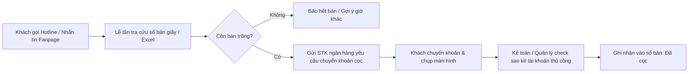
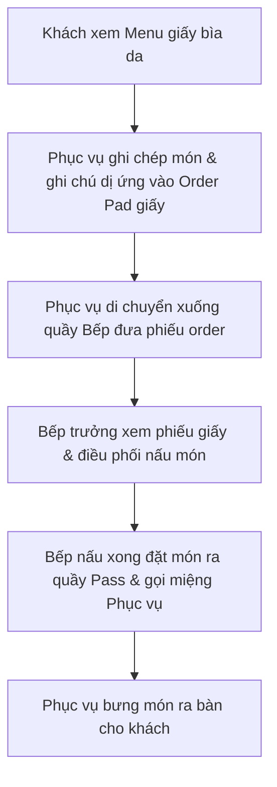
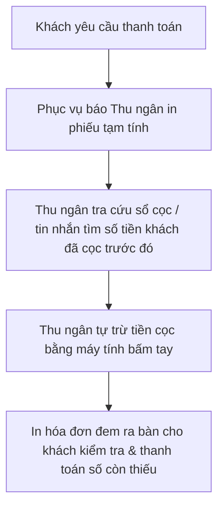
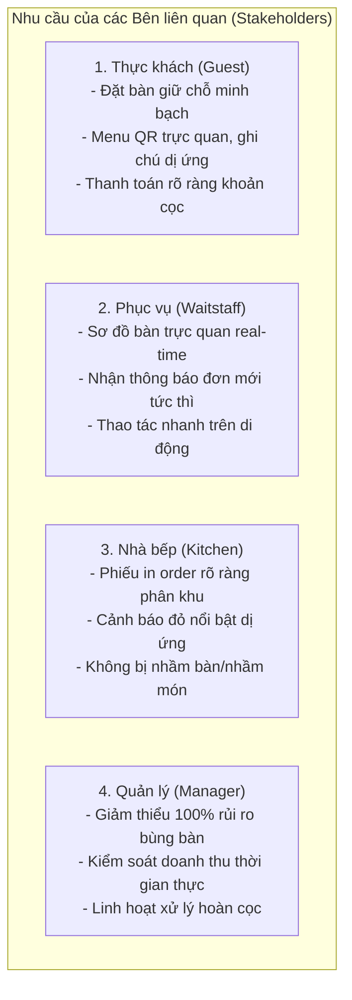
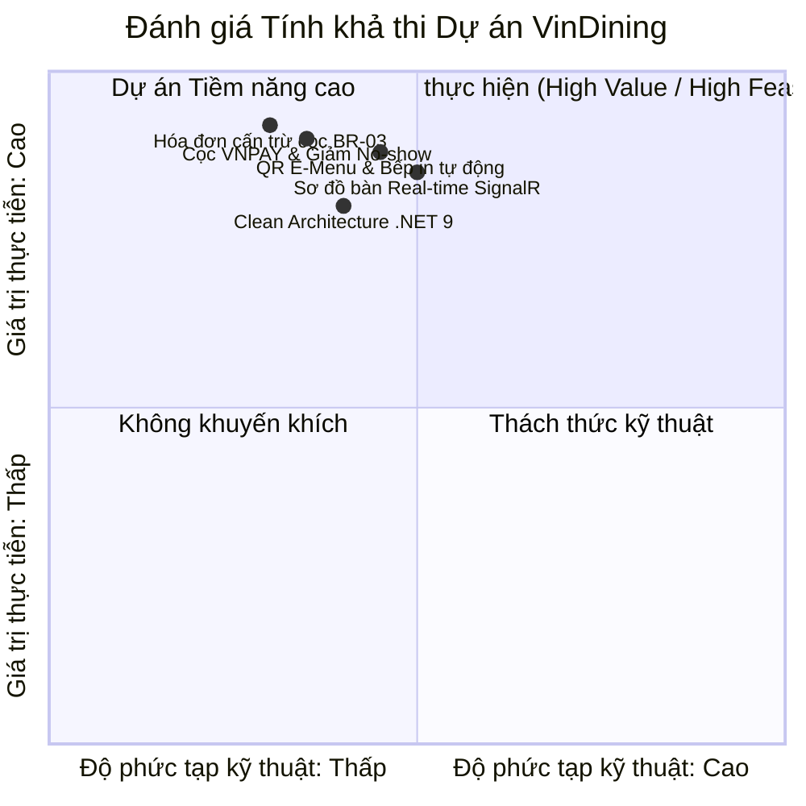

# BÁO CÁO KHẢO SÁT HỆ THỐNG & ĐÁNH GIÁ TÍNH KHẢ THI
## Dự án: Hệ thống Quản lý và Đặt bàn Nhà hàng Fine Dining (VinDining)

---

### THÔNG TIN TÀI LIỆU
* **Tên tài liệu**: Báo cáo Khảo sát Hiện trạng & Đánh giá Tính khả thi (System Survey & Feasibility Study Report)
* **Dự án**: VinDining — Fine Dining Restaurant Management & Reservation System
* **Giai đoạn**: Phase 1 (Tuần 1–2) — Proposal & Requirement Analysis
* **Nhóm thực hiện**: Nguyễn Mạnh Quyền, Đặng Quốc Khánh, Nguyễn Hoàng Đạt
* **Giảng viên hướng dẫn**: ThS. Phạm Hữu Tùng

---

## CHƯƠNG 1: KHẢO SÁT HIỆN TRẠNG QUY TRÌNH VẬN HÀNH FINE DINING THỰC TẾ

### 1.1 Khảo sát quy trình Đặt bàn & Thu cọc thủ công
Trong các nhà hàng Fine Dining truyền thống hiện nay tại Việt Nam, quy trình đặt bàn chủ yếu diễn ra qua điện thoại (Hotline), Fanpage Facebook/Instagram hoặc ứng dụng nhắn tin (Zalo):

#### Các hạn chế và điểm nghẽn phát hiện qua khảo sát:
* **Tốn kém thời gian đối soát**: Mất từ 15–30 phút để xác minh biên lai chuyển khoản ngân hàng; vào các khung giờ ngoài giờ hành chính, việc kiểm tra sao kê thường bị gián đoạn.
* **Nguy cơ nhầm lẫn thông tin**: Sổ bàn bằng giấy hoặc file Excel dùng chung giữa các nhân viên dễ bị ghi đè, trùng lặp khung giờ hoặc thất lạc ghi chú yêu cầu bàn tiệc (kỷ niệm ngày cưới, tiếp đối tác VIP).

---

### 1.2 Khảo sát quy trình Gọi món & Điều phối Bếp truyền thống
Đặc thù của ẩm thực Fine Dining là các set ăn công phu (**Tasting Menu**) phân chia theo các nhóm món (**Course**: Khai vị $\rightarrow$ Món chính $\rightarrow$ Tráng miệng) và kết hợp đồ uống/rượu vang (**Wine Pairing**):

#### Các hạn chế và điểm nghẽn phát hiện qua khảo sát:
* **Thất lạc hoặc ghi sai cảnh báo dị ứng thực phẩm**: Đây là rủi ro y tế và uy tín nghiêm trọng nhất. Chữ viết tay vội vã của nhân viên trên phiếu order giấy dễ khiến đầu bếp bỏ sót ghi chú dị ứng nghiêm trọng (dị ứng hải sản, hạt, bơ sữa, gluten).
* **Nguội lạnh món ăn do trễ truyền tin**: Khi bếp nấu xong và đặt ra quầy Pass, nếu nhân viên phục vụ đang bận ở khu vực khác mà không nghe thấy tiếng chuông/tiếng gọi miệng, đĩa ăn sẽ bị giảm nhiệt độ và hương vị chuẩn mực của ẩm thực cao cấp.

---

### 1.3 Khảo sát quy trình Thanh toán & Cấn trừ cọc cuối bữa
Khi khách kết thúc bữa ăn, quy trình thanh toán diễn ra như sau:

#### Các hạn chế và điểm nghẽn phát hiện qua khảo sát:
* **Thất thoát hoặc quên cấn trừ tiền cọc**: Thu ngân ca tối có thể không nắm được khoản tiền cọc khách đã chuyển khoản cho ca sáng, dẫn đến tính thừa tiền của khách hoặc phải mất thời gian tra soát lại lịch sử giao dịch.
* **Thời gian chờ đợi kéo dài**: Thời gian trung bình để xuất một hóa đơn cấn cọc thủ công mất từ 5–10 phút, gây cảm giác khó chịu cho khách hàng ở phân khúc cao cấp.

---

### 1.4 Ma trận phân tích điểm nghẽn & Tổn thất vận hành (Pain Points Matrix)

| Nhóm điểm nghẽn | Biểu hiện thực tế | Tác động định lượng & Rủi ro | Mức độ nghiêm trọng |
| :--- | :--- | :--- | :---: |
| **No-show (Bùng bàn)** | Khách đặt bàn đẹp nhưng không đến và không báo trước. | Chi phí hủy nguyên liệu cao cấp nhập khẩu (bò Wagyu, gan ngỗng, nấm Truffle) ước tính tổn thất **10–15% doanh thu ngày**. | **Rất cao (Critical)** |
| **Sai sót dị ứng** | Bếp nấu lẫn nguyên liệu khách bị dị ứng do phiếu ghi tay bị nhòe/sót. | Nguy cơ sốc phản vệ cho khách hàng, tổn hại nghiêm trọng uy tín thương hiệu nhà hàng. | **Nguy cấp (Fatal)** |
| **Trễ nhiệt độ món ăn** | Món chín nằm tại quầy Pass quá 3–5 phút trước khi được bưng ra bàn. | Giảm chất lượng món ăn cao cấp, trải nghiệm ẩm thực không xứng đáng với mức giá. | **Cao (Major)** |
| **Sai sót cấn trừ cọc** | Thu ngân tính nhầm hoặc quên trừ khoản cọc ban đầu của khách. | Gây tranh cãi với khách hàng tại quầy, mất trung bình **7–10 phút/bàn** để đối soát. | **Trung bình (Moderate)** |

---

## CHƯƠNG 2: KHẢO SÁT & ĐÁNH GIÁ CÁC GIẢI PHÁP PHẦN MỀM HIỆN CÓ

### 2.1 Khảo sát các giải pháp phần mềm tại thị trường Việt Nam

#### 1. iPOS.vn (iPOS POS & iPOS Booking):
* **Ưu điểm**: Phổ biến rộng rãi tại thị trường F&B Việt Nam, hỗ trợ in hóa đơn, in bếp và quản lý kho nguyên vật liệu mạnh mẽ.
* **Nhược điểm đối với Fine Dining**:
  - Giao diện đặt bàn và menu QR thiên về mô hình quán ăn nhanh / cà phê / buffet bình dân; thiếu tính thẩm mỹ sang trọng của Fine Dining.
  - Tính năng đặt cọc giữ bàn trực tuyến qua cổng thanh toán chưa được tối ưu mượt mà và thiếu cơ chế tự động cấn trừ đa điều kiện trên hóa đơn.

#### 2. CukCuk (MISA):
* **Ưu điểm**: Quản trị chuỗi nhà hàng tốt, báo cáo tài chính kế toán chuyên sâu.
* **Nhược điểm đối với Fine Dining**:
  - Giao diện người dùng trên thiết bị di động phức tạp, nhiều thao tác dư thừa đối với khách hàng quét mã QR.
  - Chưa hỗ trợ chuyên biệt quy trình phân loại Course Tasting Menu và cảnh báo dị ứng trực quan thời gian thực.

---

### 2.2 Khảo sát các giải pháp phần mềm quốc tế

#### 1. OpenTable / SevenRooms:
* **Ưu điểm**: Tiêu chuẩn vàng toàn cầu cho nhà hàng cao cấp (Fine Dining); quản lý đặt bàn trực tuyến, thu cọc bằng thẻ tín dụng (Stripe) và lưu trữ hồ sơ sở thích khách hàng (Guest Profile) rất chi tiết.
* **Nhược điểm**:
  - Chi phí bản quyền và phí duy trì hàng tháng cực kỳ đắt đỏ (\$249 – \$700+/tháng kèm phí commission trên mỗi lượt đặt chỗ).
  - Chưa tích hợp nội địa hóa các cổng thanh toán Việt Nam (như VNPAY, MoMo, VietQR) và ngôn ngữ tiếng Việt còn hạn chế.

#### 2. Toast POS:
* **Ưu điểm**: Tích hợp phần cứng POS, máy in nhiệt và phần mềm đám mây rất mượt mà.
* **Nhược điểm**: Chỉ triển khai tại thị trường Bắc Mỹ, bắt buộc sử dụng phần cứng độc quyền của hãng, không khả thi áp dụng tại Việt Nam.

---

### 2.3 Bảng so sánh ma trận tính năng (Feature Comparison Matrix)

| Tiêu chí so sánh | iPOS.vn | CukCuk | OpenTable | SevenRooms | **VinDining (Đề xuất)** |
| :--- | :---: | :---: | :---: | :---: | :---: |
| **Phù hợp phân khúc Fine Dining** | Trung bình | Thấp | Rất cao | Rất cao | **Rất cao (Chuyên biệt)** |
| **Đặt cọc trực tuyến cổng VN (VNPAY)** | Hạn chế | Không | Không (Chỉ Stripe) | Không (Chỉ Stripe) | **Có (VNPAY IPN tự động)** |
| **Tự động cấn trừ cọc trên Hóa đơn** | Thủ công | Thủ công | Tự động | Tự động | **Tự động 100% (BR-03)** |
| **E-Menu QR tĩnh cá nhân hóa theo Bàn** | Có | Có | Không | Hạn chế | **Có (Kích hoạt theo ca bàn)** |
| **In Bếp tự động & Nổi bật cảnh báo dị ứng** | Có | Có | Hạn chế | Hạn chế | **Có (In nhiệt ESC/POS)** |
| **Đồng bộ thời gian thực (SignalR / WebSocket)** | Polling | Polling | WebSocket | WebSocket | **SignalR (Độ trễ < 100ms)** |
| **Chi phí triển khai & Tự chủ công nghệ** | Thuê bao tháng | Thuê bao tháng | Rất đắt | Rất đắt | **Mã nguồn mở / Tự chủ 100%** |

---

### 2.4 Gap Analysis & Động lực xây dựng hệ thống VinDining
Từ kết quả khảo sát trên, nhóm nhận thấy một khoảng trống thị trường rõ rệt: **Thị trường Việt Nam đang thiếu một giải pháp chuyên biệt cho nhà hàng Fine Dining vừa đáp ứng tiêu chuẩn trải nghiệm dịch vụ cao cấp, vừa tích hợp liền mạch cổng thanh toán nội địa VNPAY để giải quyết triệt để bài toán No-show và Cấn trừ cọc tự động.**

Do đó, việc phát triển **Hệ thống VinDining** là hoàn toàn cấp thiết, mang tính ứng dụng thực tiễn cao và lấp đầy khoảng trống của các phần mềm hiện hành.

---

## CHƯƠNG 3: KHẢO SÁT NHU CẦU NGƯỜI DÙNG (STAKEHOLDER NEEDS ASSESSMENT)

Nhóm đã tiến hành khảo sát và tổng hợp yêu cầu từ 4 nhóm đối tượng chính:

### Bảng tổng hợp nhu cầu & Kỳ vọng chi tiết:

| Nhóm đối tượng | Kênh tương tác | Nhu cầu & Kỳ vọng cốt lõi | Yêu cầu hệ thống đáp ứng |
| :--- | :--- | :--- | :--- |
| **Thực khách (Guest)** | Smartphone cá nhân (Mobile Web) | Đặt bàn nhanh chóng không cần gọi điện; xem thực đơn hình ảnh bắt mắt; ghi chú dị ứng chuẩn xác; thanh toán cọc an toàn; hóa đơn minh bạch. | Web Responsive mượt mà, tích hợp VNPAY, E-Menu QR tĩnh không cần cài đặt App native. |
| **Nhân viên Phục vụ (Waitstaff)** | Tablet / Điện thoại cầm tay | Nắm bắt sơ đồ bàn trực quan; nhận thông báo rung tức thời khi khách gọi món; xác nhận duyệt đơn và ghi nhận phục vụ nhanh chóng. | SignalR Hub truyền nhận tín hiệu < 100ms, giao diện một chạm (One-touch action) tối ưu trên tablet. |
| **Nhà bếp (Kitchen Operations)** | Máy in nhiệt phân khu (Bếp nóng, Bếp lạnh, Bar) | Nhận phiếu order in rõ ràng số bàn, tên món, Course và in đậm ghi chú dị ứng nguy hiểm; không phải đọc màn hình phức tạp trong môi trường dầu mỡ. | Lệnh in ESC/POS tự động phân loại trạm in (Station split printing) ngay khi phục vụ bấm duyệt. |
| **Quản lý & Admin (Manager/Admin)** | Máy tính cá nhân (Desktop Web) | Giám sát tỷ lệ lấp đầy bàn ăn; theo dõi doanh thu theo ca/ngày; quản trị danh mục món ăn linh hoạt; duyệt hoàn cọc khi có sự cố bất khả kháng. | Web Portal trang bị biểu đồ thống kê, phân quyền RBAC chặt chẽ và tính năng Manual Refund Override. |

---

## CHƯƠNG 4: BÁO CÁO NGHIÊN CỨU TÍNH KHẢ THI (FEASIBILITY STUDY)

### 4.1 Tính khả thi về mặt Kỹ thuật (Technical Feasibility)
* **Backend (.NET 9 + ASP.NET Core Web API)**: Cung cấp nền tảng xử lý đa luồng mạnh mẽ, hỗ trợ Dependency Injection, Entity Framework Core 9 tối ưu truy vấn SQL Server, và SignalR Hub tích hợp sẵn cho giao tiếp WebSocket hai chiều.
* **Frontend (React + Vite + Tailwind CSS)**: Đảm bảo thời gian tải trang ban đầu dưới 1.5 giây, tương thích hoàn hảo với mọi trình duyệt di động (iOS Safari, Android Chrome) mà không gặp rào cản phân mảnh hệ điều hành.
* **Tích hợp bên ngoài (VNPAY Sandbox & Web Printing)**:
  - Cổng VNPAY cung cấp tài liệu API chuẩn và môi trường Sandbox kiểm thử giao dịch thanh toán IPN đầy đủ.
  - Giao thức in ấn qua mạng LAN/Wi-Fi sử dụng chuẩn ESC/POS thông dụng, dễ dàng kiểm thử và triển khai trên các thiết bị máy in nhiệt K80/K57 tiêu chuẩn.
* $\rightarrow$ **Kết luận kỹ thuật**: **Khả thi 100%**.

### 4.2 Tính khả thi về mặt Vận hành (Operational Feasibility)
* Hệ thống được thiết kế theo tư duy tối giản thao tác:
  - Khách hàng không cần đăng ký tài khoản bắt buộc để xem menu và quét QR gọi món.
  - Nhân viên phục vụ thao tác trên màn hình cảm ứng với các nút bấm trực quan, giảm thiểu thời gian đào tạo nhân sự mới xuống dưới 30 phút.
  - Nhà bếp giữ nguyên thói quen nhìn phiếu in truyền thống nhưng phiếu in giờ đây chuẩn xác, rõ ràng và không thể thất lạc.
* $\rightarrow$ **Kết luận vận hành**: **Rất thuận tiện và dễ tiếp nhận**.

### 4.3 Tính khả thi về mặt Kinh tế (Economic Feasibility)
* **Cắt giảm tổn thất No-show**: Bắt buộc đặt cọc giữ bàn giúp giảm tỷ lệ bùng bàn từ 15% xuống dưới 2%, bảo vệ doanh thu nguyên liệu đắt đỏ cho nhà hàng.
* **Tăng hiệu suất xoay vòng bàn**: Giảm thời gian trễ trong khâu gọi món, in bếp và thanh toán từ 25 phút/bàn xuống dưới 5 phút/bàn, giúp nhà hàng phục vụ thêm từ 15% – 20% lượt khách trong giờ cao điểm.
* $\rightarrow$ **Kết luận kinh tế**: **Hiệu quả đầu tư (ROI) rất cao**.

### 4.4 Tính khả thi về mặt Thời gian & Lộ trình (Schedule Feasibility)
* Dự án được phân rã thành 5 giai đoạn rõ ràng trong 10 tuần, với sự tham gia của 3 thành viên kỹ thuật.
* Các công nghệ cốt lõi đều nằm trong phạm vi kiến thức chuyên ngành và được hỗ trợ bởi các thư viện tiêu chuẩn của hệ sinh thái Microsoft & React.
* $\rightarrow$ **Kết luận thời gian**: **Khả thi hoàn thành đúng hạn 10 tuần**.

---

## CHƯƠNG 5: KẾT LUẬN & ĐỀ XUẤT HƯỚNG TRIỂN KHAI

Báo cáo khảo sát đã chứng minh rõ ràng tính cấp thiết, tính mới và tính khả thi toàn diện của Dự án **Hệ thống Quản lý và Đặt bàn Nhà hàng Fine Dining (VinDining)**.

Nhóm đề xuất chuyển ngay sang **Báo cáo Phân tích Hệ thống (System Analysis Report)** để chi tiết hóa các mô hình Use Case, sơ đồ Activity, sơ đồ Sequence và ma trận quy tắc nghiệp vụ làm cơ sở vững chắc cho giai đoạn Thiết kế Kiến trúc (Design) ở Tuần 3–4.
