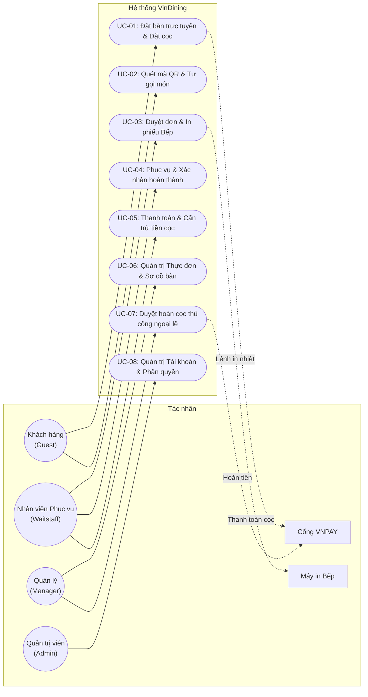
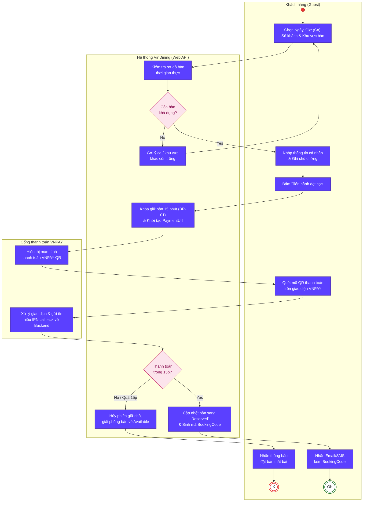
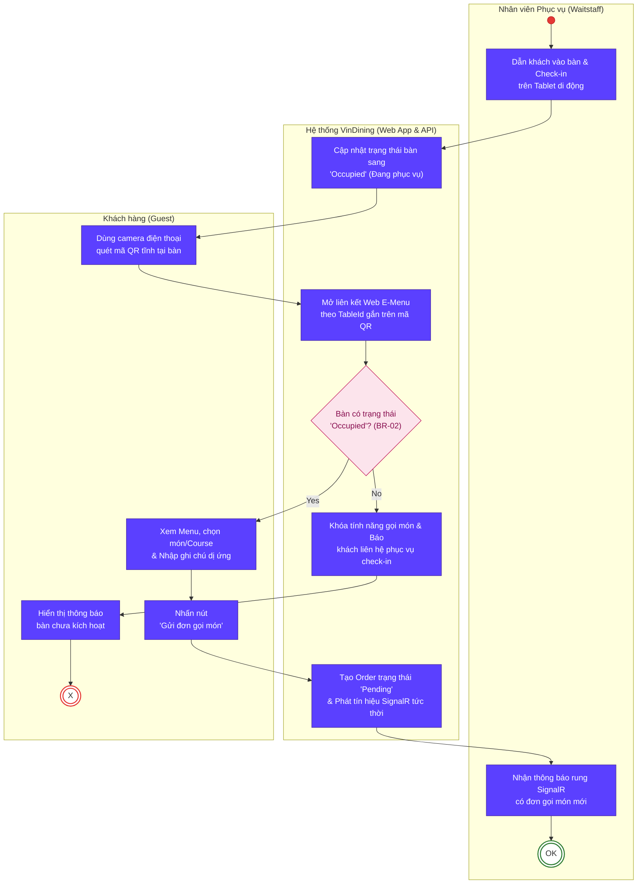
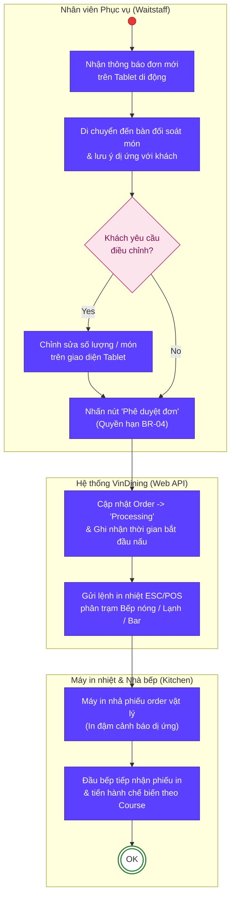
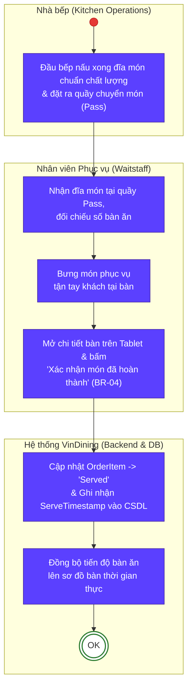
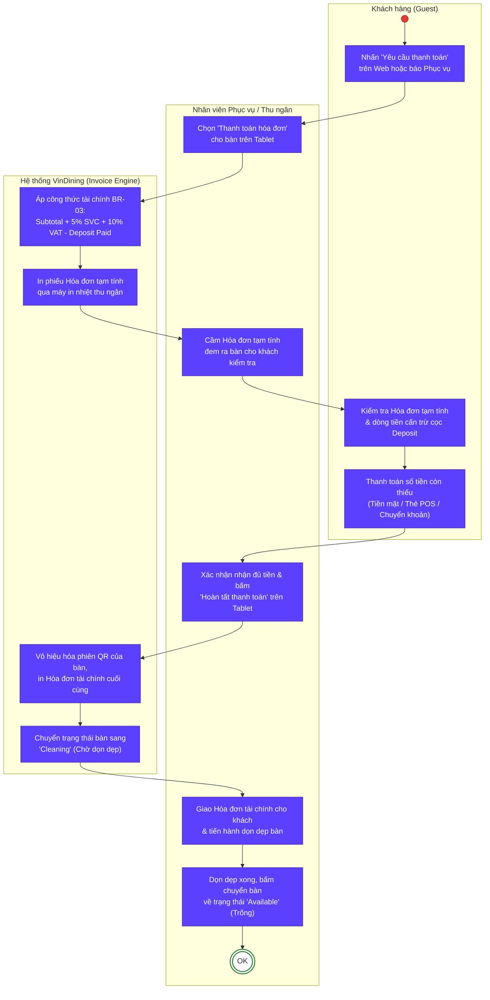
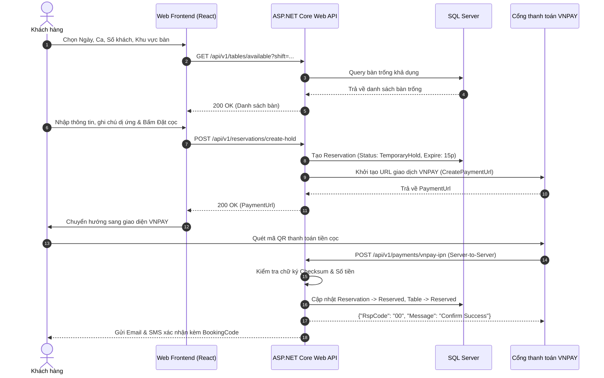
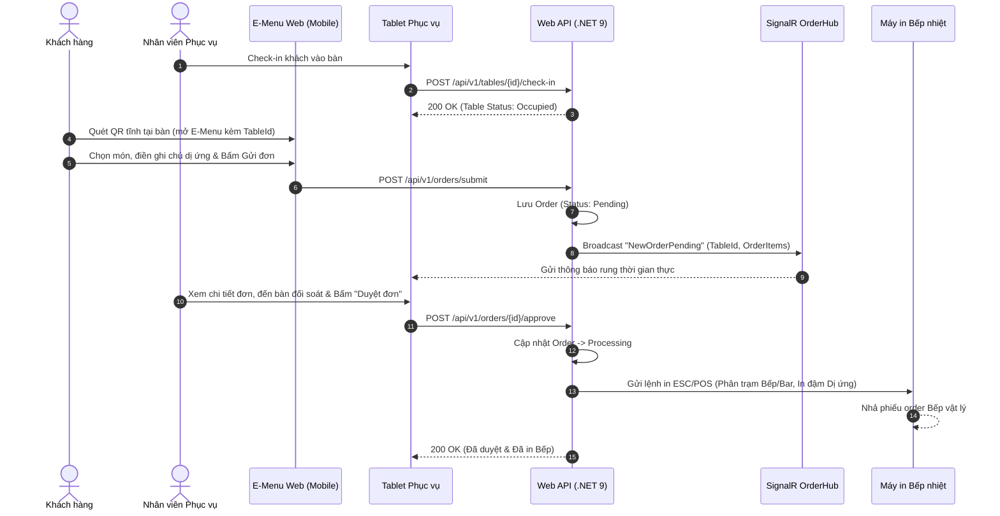
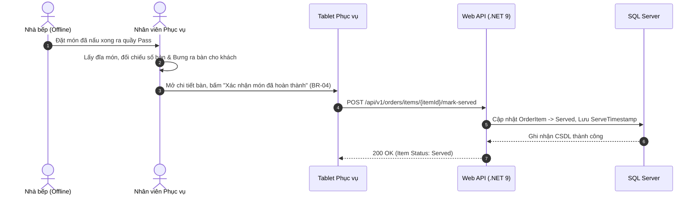
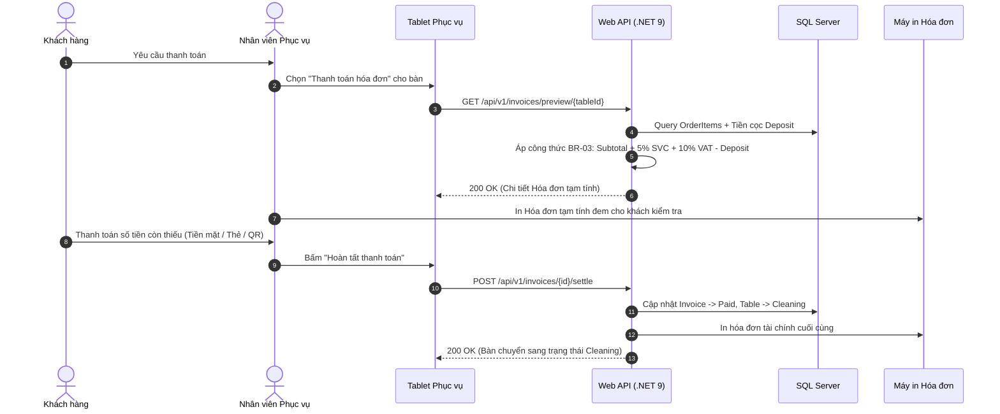

# BÁO CÁO PHÂN TÍCH HỆ THỐNG (SYSTEM ANALYSIS REPORT)
## Dự án: Hệ thống Quản lý và Đặt bàn Nhà hàng Fine Dining (VinDining)

---

### THÔNG TIN TÀI LIỆU
* **Tên tài liệu**: Báo cáo Phân tích Yêu cầu & Mô hình hóa Hệ thống (System Analysis & Modeling Report)
* **Dự án**: VinDining — Fine Dining Restaurant Management & Reservation System
* **Giai đoạn**: Phase 1 (Tuần 1–2) — Proposal & Requirement Analysis
* **Nhóm thực hiện**: Nguyễn Mạnh Quyền, Đặng Quốc Khánh, Nguyễn Thành Đạt
* **Giảng viên hướng dẫn**: ThS. Phạm Hữu Tùng

---

## CHƯƠNG 1: TỔNG QUAN TÁC NHÂN & MA TRẬN PHÂN QUYỀN (STAKEHOLDER & RBAC)

### 1.1 Danh mục Tác nhân Hệ thống (System Actors)

| Tác nhân (Actor) | Phân loại | Thiết bị / Nền tảng | Phạm vi quyền hạn trong hệ thống | Mục tiêu cốt lõi |
| :--- | :--- | :--- | :--- | :--- |
| **Khách hàng (Guest)** | Tác nhân chính (Primary) | Smartphone cá nhân *(Mobile Web Responsive)* | - Tìm kiếm, chọn bàn, đặt bàn trực tuyến. - Thanh toán cọc giữ chỗ qua cổng VNPAY. - Quét mã QR tại bàn để xem E-Menu và gửi đơn gọi món (`Pending`). - Theo dõi trạng thái món và yêu cầu thanh toán. | Đặt chỗ nhanh chóng, minh bạch cọc; tự do gọi món không phải chờ đợi; đảm bảo an toàn tuyệt đối về dị ứng thực phẩm. |
| **Nhân viên Phục vụ (Waitstaff)** | Tác nhân chính (Primary) | Điện thoại / Tablet cầm tay *(Mobile/Tablet Web)* | - Xem sơ đồ bàn ăn và check-in khách đến bàn (`Occupied`). - Tiếp nhận thông báo đơn QR mới, đối soát cảnh báo dị ứng. - Phê duyệt đơn (`Approve`) kích hoạt lệnh in phiếu Bếp tự động. - Bưng món từ quầy Pass ra bàn và bấm xác nhận "Đã phục vụ". - Xuất hóa đơn tạm tính cấn trừ cọc và đóng bàn (`Cleaning`). | Giảm sai sót ghi nhận đơn thủ công; nhận thông báo tức thời qua SignalR; nâng cao tốc độ phục vụ món ăn nóng sốt. |
| **Quản lý (Manager)** | Tác nhân chính (Primary) | Máy tính cá nhân *(Desktop Web Portal)* | - Quản lý thực đơn (Tasting Menu, món lẻ, giá bán). - Thiết lập sơ đồ bàn ăn và sinh/in mã QR tĩnh cho từng bàn. - Xem báo cáo thống kê doanh thu và tỷ lệ lấp đầy bàn thời gian thực. - Thực hiện duyệt hoàn tiền cọc thủ công (*Manual Refund Override*) khi có sự cố bất khả kháng. | Giám sát toàn diện vận hành nhà hàng; kiểm soát doanh thu chặt chẽ; linh hoạt xử lý khiếu nại khách hàng. |
| **Quản trị viên (Admin)** | Tác nhân chính (Primary) | Máy tính cá nhân *(Desktop Web Portal)* | - Quản trị danh sách tài khoản người dùng và gán quyền (RBAC). - Cấu hình tham số hệ thống (thời gian giữ bàn, tỷ lệ VAT, phí dịch vụ). - Giám sát nhật ký hệ thống (System Logs) và sao lưu dữ liệu. | Đảm bảo tính toàn vẹn, bảo mật và sự hoạt động ổn định liên tục của toàn bộ nền tảng. |
| **Cổng thanh toán VNPAY** | Tác nhân phụ (Secondary) | Hệ thống máy chủ VNPAY Gateway | - Tiếp nhận yêu cầu thanh toán cọc trực tuyến. - Xử lý giao dịch thẻ/QR ngân hàng và gửi tín hiệu xác nhận tức thời (IPN callback) về Backend hệ thống. | Đảm bảo giao dịch thanh toán an toàn, chính xác và bảo mật. |
| **Máy in nhiệt Bếp (Kitchen Printer)** | Tác nhân phụ (Secondary) | Máy in nhiệt mạng LAN/Wi-Fi (ESC/POS) | - Tự động nhả phiếu order vật lý tại các trạm Bếp nóng, Bếp lạnh, Bar ngay khi nhận lệnh in từ hệ thống. | Cung cấp phiếu in chế biến rõ ràng, in đậm cảnh báo dị ứng cho đầu bếp thao tác. |

> [!NOTE]
> **Ranh giới nghiệp vụ Nhà bếp (Kitchen)**: Trong mô hình VinDining, **Nhà bếp (Kitchen/Chef) không phải là tác nhân tương tác trực tiếp với giao diện phần mềm**. Đầu bếp nhận lệnh thông qua phiếu in nhiệt tự động và đặt món ra quầy chuyển món (Pass) để nhân viên phục vụ tiếp nhận. Điều này giúp tối ưu hóa thao tác, loại bỏ màn hình cảm ứng dễ bám bẩn trong khu vực bếp.

---

### 1.2 Ma trận phân quyền chức năng (Role-Based Access Control - RBAC)

| Phân hệ chức năng | Chức năng chi tiết | Khách hàng (Guest) | Phục vụ (Waitstaff) | Quản lý (Manager) | Quản trị (Admin) |
| :--- | :--- | :---: | :---: | :---: | :---: |
| **Tài khoản & Hồ sơ** | Đăng ký / Đăng nhập tài khoản | ✓ | ✓ | ✓ | ✓ |
| | Quản lý thông tin cá nhân & Lịch sử | ✓ | ✓ | ✓ | ✓ |
| | Quản trị người dùng & Phân quyền | ✗ | ✗ | ✗ | **✓** |
| **Đặt bàn & Đặt cọc** | Tra cứu sơ đồ bàn & Đặt bàn trực tuyến | **✓** | ✗ | ✗ | ✗ |
| | Thanh toán tiền cọc giữ chỗ (VNPAY) | **✓** | ✗ | ✗ | ✗ |
| | Hủy đặt bàn tự động (Trước >= 4h) | **✓** | ✗ | ✗ | ✗ |
| | Duyệt hoàn cọc thủ công ngoại lệ | ✗ | ✗ | **✓** | **✓** |
| **Sơ đồ bàn & Mã QR** | Theo dõi sơ đồ bàn trực quan Real-time | ✗ | **✓** | **✓** | **✓** |
| | Check-in khách vào bàn (`Occupied`) | ✗ | **✓** | **✓** | ✗ |
| | Sinh và in mã QR tĩnh theo bàn | ✗ | ✗ | **✓** | **✓** |
| | Chuyển trạng thái bàn sau dọn dẹp (`Available`) | ✗ | **✓** | **✓** | ✗ |
| **Gọi món E-Menu & Bếp** | Quét QR xem Menu & Gửi đơn gọi món | **✓** | ✗ | ✗ | ✗ |
| | Phê duyệt đơn QR & Kích hoạt in Bếp | ✗ | **✓** | **✓** | ✗ |
| | Xác nhận "Đã phục vụ món" tại bàn | ✗ | **✓** | **✓** | ✗ |
| **Hóa đơn & Doanh thu** | Yêu cầu tính tiền từ Web E-Menu | **✓** | ✗ | ✗ | ✗ |
| | Xuất hóa đơn tạm tính (Cấn trừ cọc) | ✗ | **✓** | **✓** | ✗ |
| | Xác nhận thanh toán & Đóng bàn | ✗ | **✓** | **✓** | ✗ |
| | Báo cáo thống kê doanh thu & Món bán chạy | ✗ | ✗ | **✓** | **✓** |

---

## CHƯƠNG 2: MÔ HÌNH HÓA USE CASE (USE CASE MODELING)

### 2.1 Sơ đồ Use Case tổng quát toàn hệ thống (Overall Use Case Diagram)

> 📐 **Tệp thiết kế Draw.io**: [`use_case_overall.drawio`](file:///c:/Users/Admin/Documents/antigravity/blissful-hertz/docs/phase1/drawio/use_case_overall.drawio)

---

### 2.2 Sơ đồ Use Case phân rã theo Phân hệ

> 📐 **Tệp thiết kế Draw.io**: [`use_case_subsystems.drawio`](file:///c:/Users/Admin/Documents/antigravity/blissful-hertz/docs/phase1/drawio/use_case_subsystems.drawio)

---

### 2.3 Đặc tả chi tiết 5 Use Case cốt lõi (Use Case Specifications)

#### 📋 UC-01: Đặt bàn trực tuyến & Đặt cọc (Table Reservation & Deposit)
* **Mã Use Case**: `UC-01`
* **Tên Use Case**: Đặt bàn trực tuyến & Đặt cọc giữ chỗ (TableReservationUseCase)
* **Tác nhân**: Khách hàng (Chính), Cổng VNPAY (Phụ), Hệ thống (Phụ).
* **Mức độ ưu tiên**: Trọng yếu (Must Have).
* **Mục tiêu tóm tắt**: Cho phép khách hàng truy cập trang Web, chọn ngày/ca/vị trí bàn và hoàn tất đặt chỗ bằng cách thanh toán khoản tiền cọc cố định qua cổng VNPAY.
* **Điều kiện tiên quyết**: Khách hàng truy cập vào hệ thống Web; sơ đồ bàn đang hoạt động.
* **Điều kiện sau hoàn thành**: Bàn ăn chuyển sang trạng thái `Reserved`; hệ thống ghi nhận khoản cọc thành công và tự động gửi `BookingCode` qua SMS/Email cho khách.
* **Luồng sự kiện chính (Basic Flow)**:
  1. Khách hàng chọn Ngày hẹn, Ca phục vụ (Giờ hẹn), Số lượng khách và Khu vực bàn mong muốn (VIP, Sảnh chính, Ban công).
  2. Hệ thống kiểm tra trạng thái sơ đồ bàn thời gian thực và hiển thị danh sách bàn trống khả dụng.
  3. Khách hàng điền thông tin cá nhân (Họ tên, SĐT, Email), ghi chú các yêu cầu đặc biệt/cảnh báo dị ứng và nhấn "Tiến hành đặt cọc".
  4. Hệ thống khóa giữ tạm thời vị trí bàn đã chọn trong tối đa **15 phút** (`BR-01`), đồng thời chuyển hướng khách sang giao diện thanh toán VNPAY.
  5. Khách hàng thực hiện thanh toán tiền cọc trên cổng VNPAY (quét QR ngân hàng hoặc nhập thẻ).
  6. Cổng VNPAY xử lý giao dịch thành công và gửi tín hiệu xác nhận (IPN) thời gian thực về Backend.
  7. Hệ thống cập nhật trạng thái bàn sang `Reserved`, sinh mã đặt bàn `BookingCode` duy nhất và gửi thông báo xác nhận cho khách.
* **Luồng phụ & Ngoại lệ (Alternative & Exception Flows)**:
  - *5a. Thanh toán thất bại hoặc quá thời hạn 15 phút (`BR-01`)*: Quá 15 phút chưa nhận được kết quả thành công từ VNPAY, hệ thống tự động hủy phiên đặt bàn tạm thời, giải phóng vị trí bàn về trạng thái `Available` trên sơ đồ và hiển thị thông báo mời khách thao tác lại.
  - *2a. Khung giờ hoặc khu vực bàn đã hết chỗ*: Hệ thống thông báo hết bàn và tự động gợi ý các khung giờ hoặc phân khu bàn lân cận còn trống.
  - *Khách hủy đặt bàn trước $\ge$ 4 tiếng (`BR-05`)*: Hệ thống tự động kích hoạt hoàn cọc 100% qua API VNPAY và giải phóng bàn về `Available`.
  - *Khách hủy đặt bàn trong vòng < 4 tiếng (`BR-05`)*: Hệ thống ghi nhận hủy bàn nhưng phạt 100% tiền cọc (không hoàn tiền).

---

#### 📋 UC-02: Quét mã QR tại bàn & Tự gọi món (Table QR Self-Ordering)
* **Mã Use Case**: `UC-02`
* **Tên Use Case**: Quét mã QR tại bàn & Tự gọi món (TableSelfOrderingUseCase)
* **Tác nhân**: Khách hàng (Chính), Hệ thống (Phụ).
* **Mức độ ưu tiên**: Trọng yếu (Must Have).
* **Mục tiêu tóm tắt**: Khách hàng tại bàn dùng camera điện thoại quét mã QR tĩnh dán tại bàn để mở E-Menu, chọn Tasting Menu/Course và gửi đơn gọi món trực tiếp vào hệ thống.
* **Điều kiện tiên quyết**: Khách hàng đã ngồi tại bàn thực tế; bàn đã được nhân viên phục vụ check-in chuyển trạng thái sang `Occupied` (`BR-02`).
* **Điều kiện sau hoàn thành**: Đơn hàng được tạo thành công ở trạng thái `Pending`, gửi tín hiệu thông báo tức thời qua SignalR đến thiết bị của nhân viên phục vụ phân khu.
* **Luồng sự kiện chính (Basic Flow)**:
  1. Khách hàng quét mã QR tĩnh dán tại bàn bằng điện thoại cá nhân.
  2. Trình duyệt di động tự động mở liên kết Web E-Menu có mã hóa tham số `TableId` tương ứng.
  3. Khách hàng duyệt danh mục thực đơn trực quan (các món lẻ, set Tasting Menu, Course và gợi ý Wine Pairing).
  4. Khách hàng thêm món vào giỏ hàng, điền chi tiết lưu ý dị ứng/yêu cầu chế biến và nhấn "Gửi đơn gọi món".
  5. Hệ thống tạo đơn hàng với trạng thái ban đầu là `Pending` gắn với bàn ăn tương ứng.
  6. Hệ thống gửi thông báo rung thời gian thực qua SignalR đến máy tính bảng của Nhân viên phục vụ phụ trách khu vực đó.
* **Luồng phụ & Ngoại lệ (Alternative & Exception Flows)**:
  - *1a. Khách quét mã QR khi bàn chưa được nhân viên check-in (`BR-02`)*: Hệ thống kiểm tra thấy bàn vẫn đang ở trạng thái `Available` hoặc `Reserved` $\rightarrow$ Hiển thị thông báo: *"Bàn chưa được kích hoạt phục vụ. Vui lòng liên hệ nhân viên phục vụ để được hỗ trợ check-in"*, đồng thời khóa tính năng gửi đơn.
  - *4a. Khách muốn gọi món bổ sung khi đang dùng bữa*: Khách tiếp tục thao tác trên E-Menu và nhấn "Gửi món bổ sung". Hệ thống tạo đơn phụ và tự động gom nhóm (Group) vào phiên đơn chính của bàn với trạng thái `Pending`.

---

#### 📋 UC-03: Tiếp nhận, Đối soát & Phê duyệt in phiếu Bếp (Order Dispatching)
* **Mã Use Case**: `UC-03`
* **Tên Use Case**: Tiếp nhận, Kiểm tra & Phê duyệt in phiếu Bếp (OrderDispatchingUseCase)
* **Tác nhân**: Nhân viên Phục vụ (Chính), Máy in nhiệt Bếp (Phụ), Hệ thống (Phụ).
* **Mức độ ưu tiên**: Trọng yếu (Must Have).
* **Mục tiêu tóm tắt**: Nhân viên phục vụ tiếp nhận đơn chờ duyệt (`Pending`) của bàn, kiểm tra chéo các lưu ý dị ứng thực phẩm của khách và bấm duyệt đơn trên thiết bị di động để hệ thống tự động in phiếu Bếp.
* **Điều kiện tiên quyết**: Bàn ăn có đơn hàng ở trạng thái `Pending`.
* **Điều kiện sau hoàn thành**: Đơn hàng chuyển sang trạng thái `Processing`, máy in nhiệt tại các phân khu bếp (Bếp nóng, Bếp lạnh, Bar) tự động nhả phiếu order chuẩn xác.
* **Luồng sự kiện chính (Basic Flow)**:
  1. Nhân viên phục vụ nhận được thông báo rung kèm chuông báo đơn gọi món mới trên thiết bị di động.
  2. Nhân viên phục vụ di chuyển đến bàn ăn để đối soát nhanh các món đã gọi (đặc biệt kiểm tra kỹ các lưu ý dị ứng của khách).
  3. Nhân viên phục vụ nhấn chọn nút "Phê duyệt đơn" trên màn hình thiết bị cầm tay.
  4. Hệ thống cập nhật trạng thái đơn thành `Processing` và ghi nhận mốc thời gian bắt đầu chế biến vào CSDL.
  5. Hệ thống tự động gửi lệnh in nhiệt (ESC/POS) ra các máy in tại phân khu Bếp tương ứng. Phiếu in ghi rõ: Số bàn, Tên món, Course và **bôi đậm cảnh báo dị ứng**.
* **Luồng phụ & Ngoại lệ (Alternative & Exception Flows)**:
  - *2a. Khách muốn thay đổi/hủy món khi nhân viên đến bàn đối soát*: Nhân viên phục vụ thao tác trực tiếp trên giao diện để điều chỉnh số lượng hoặc xóa món theo yêu cầu của khách trước khi bấm "Phê duyệt đơn".

---

#### 📋 UC-04: Phục vụ món & Xác nhận hoàn thành món tại bàn (Serving Confirmation)
* **Mã Use Case**: `UC-04`
* **Tên Use Case**: Phục vụ & Xác nhận hoàn thành món (ServiceConfirmationUseCase)
* **Tác nhân**: Nhân viên Phục vụ (Chính), Hệ thống (Phụ).
* **Mức độ ưu tiên**: Trọng yếu (Must Have).
* **Mục tiêu tóm tắt**: Nhân viên phục vụ lấy món ăn đã nấu xong từ quầy Pass mang ra bàn phục vụ khách và bấm xác nhận "Đã phục vụ" trên thiết bị cầm tay.
* **Điều kiện tiên quyết**: Món ăn đã được nhà bếp hoàn thành và đặt tại quầy Pass.
* **Điều kiện sau hoàn thành**: Trạng thái món ăn chuyển sang `Served`, hệ thống ghi nhận mốc thời gian phục vụ thực tế (`ServeTimestamp`).
* **Luồng sự kiện chính (Basic Flow)**:
  1. Đầu bếp nấu xong đĩa món chuẩn vị, đặt ra quầy chuyển món (Pass).
  2. Nhân viên phục vụ tiếp nhận đĩa món tại quầy Pass, đối chiếu số bàn và bưng phục vụ tận tay khách tại bàn.
  3. Sau khi đặt đĩa món lên bàn cho khách, Nhân viên phục vụ mở chi tiết bàn trên thiết bị và bấm chọn nút "Xác nhận món đã hoàn thành" (`BR-04`).
  4. Hệ thống cập nhật trạng thái món thành `Served` và lưu mốc thời gian phục vụ phục vụ cho việc thống kê hiệu năng.

---

#### 📋 UC-05: Thanh toán, Cấn trừ tiền cọc & Đóng bàn (Checkout & Invoice Settlement)
* **Mã Use Case**: `UC-05` *(Được bổ sung hoàn thiện chuẩn theo RTM)*
* **Tên Use Case**: Thanh toán, Cấn trừ tiền cọc & Đóng bàn (InvoiceSettlementUseCase)
* **Tác nhân**: Nhân viên Phục vụ (Chính), Khách hàng (Chính), Hệ thống (Phụ).
* **Mức độ ưu tiên**: Trọng yếu (Must Have).
* **Mục tiêu tóm tắt**: Tự động tổng hợp toàn bộ tiền món ăn, tính 5% phí dịch vụ, 10% VAT, tự động cấn trừ số tiền cọc (Deposit) đã thanh toán trước đó, xuất hóa đơn tài chính và chuyển trạng thái bàn sang chờ dọn dẹp (`Cleaning`).
* **Điều kiện tiên quyết**: Bàn ăn đang ở trạng thái `Occupied` và toàn bộ các món ăn đã được phục vụ hoàn tất (`Served`).
* **Điều kiện sau hoàn thành**: Hóa đơn được thanh toán thành công, phiên QR tại bàn bị vô hiệu hóa, bàn chuyển trạng thái sang `Cleaning`.
* **Luồng sự kiện chính (Basic Flow)**:
  1. Khách hàng nhấn nút "Yêu cầu thanh toán" trên Web E-Menu hoặc báo miệng với nhân viên phục vụ.
  2. Nhân viên phục vụ chọn chức năng "Thanh toán hóa đơn" cho bàn tương ứng trên thiết bị cầm tay.
  3. Hệ thống tự động truy vấn đơn hàng của bàn, thực thi công thức tính toán tài chính bắt buộc (`BR-03`):
     - $\text{Subtotal} = \sum (\text{Tiền món dùng thực tế})$
     - $\text{Phí dịch vụ (5\%)} = \text{Subtotal} \times 0.05$
     - $\text{Thuế VAT (10\%)} = (\text{Subtotal} + \text{Phí dịch vụ}) \times 0.10$
     - $\text{Số tiền phải trả} = (\text{Subtotal} + \text{Phí dịch vụ} + \text{Thuế VAT}) - \text{Tiền cọc đã trả (Deposit)}$
  4. Hệ thống in phiếu Hóa đơn tạm tính hiển thị minh bạch toàn bộ các dòng tiền và số tiền cọc đã cấn trừ để nhân viên đem ra bàn cho khách kiểm tra.
  5. Khách hàng thực hiện thanh toán số tiền còn thiếu qua tiền mặt, thẻ ngân hàng hoặc quét mã QR chuyển khoản.
  6. Nhân viên phục vụ bấm "Hoàn tất thanh toán" trên thiết bị.
  7. Hệ thống tự động vô hiệu hóa phiên QR, in hóa đơn tài chính cuối cùng và chuyển trạng thái bàn sang `Cleaning`. Sau khi nhân viên dọn bàn xong, bàn chuyển về trạng thái `Available`.
* **Luồng phụ & Ngoại lệ (Alternative & Exception Flows)**:
  - *5a. Khách hàng có thắc mắc về số tiền cọc*: Nhân viên phục vụ tra cứu trực tiếp lịch sử giao dịch cọc gắn với `BookingCode` trên hệ thống để giải thích minh bạch cho khách.

---

## CHƯƠNG 3: MÔ HÌNH HÓA QUY TRÌNH NGHIỆP VỤ (SWIMLANE ACTIVITY DIAGRAMS)

### 3.1 AD-01: Quy trình Đặt bàn trực tuyến & Đặt cọc VNPAY (3 Làn: Khách hàng | Hệ thống | VNPAY)

> 📐 **Tệp thiết kế Draw.io**: [`ad01_reservation_deposit.drawio`](file:///c:/Users/Admin/Documents/antigravity/blissful-hertz/docs/phase1/drawio/ad01_reservation_deposit.drawio)

---

### 3.2 AD-02: Quy trình Quét mã QR tại bàn & Tự gọi món (3 Làn: Phục vụ | Hệ thống | Khách hàng)

> 📐 **Tệp thiết kế Draw.io**: [`ad02_qr_ordering.drawio`](file:///c:/Users/Admin/Documents/antigravity/blissful-hertz/docs/phase1/drawio/ad02_qr_ordering.drawio)

---

### 3.3 AD-03: Quy trình Đối soát dị ứng & Phê duyệt in Bếp (3 Làn: Phục vụ | Hệ thống | Nhà bếp & Máy in)

> 📐 **Tệp thiết kế Draw.io**: [`ad03_order_dispatch.drawio`](file:///c:/Users/Admin/Documents/antigravity/blissful-hertz/docs/phase1/drawio/ad03_order_dispatch.drawio)

---

### 3.4 AD-04: Quy trình Phục vụ món & Xác nhận hoàn thành tại bàn (3 Làn: Nhà bếp | Phục vụ | Hệ thống)

> 📐 **Tệp thiết kế Draw.io**: [`ad04_serving_confirmation.drawio`](file:///c:/Users/Admin/Documents/antigravity/blissful-hertz/docs/phase1/drawio/ad04_serving_confirmation.drawio)

---

### 3.5 AD-05: Quy trình Thanh toán, Cấn trừ tiền cọc & Đóng bàn (3 Làn: Khách hàng | Phục vụ/Thu ngân | Hệ thống)

> 📐 **Tệp thiết kế Draw.io**: [`ad05_invoice_settlement.drawio`](file:///c:/Users/Admin/Documents/antigravity/blissful-hertz/docs/phase1/drawio/ad05_invoice_settlement.drawio)

---

## CHƯƠNG 4: MÔ HÌNH HÓA TƯƠNG TÁC HỆ THỐNG (SEQUENCE DIAGRAMS)

### 4.1 SD-01: Đặt bàn trực tuyến & Thanh toán cọc qua VNPAY

> 📐 **Tệp thiết kế Draw.io**: [`sd01_reservation_vnpay.drawio`](file:///c:/Users/Admin/Documents/antigravity/blissful-hertz/docs/phase1/drawio/sd01_reservation_vnpay.drawio)

---

### 4.2 SD-02: Quét mã QR tại bàn, Gửi đơn món & In phiếu Bếp

> 📐 **Tệp thiết kế Draw.io**: [`sd02_qr_kitchen_print.drawio`](file:///c:/Users/Admin/Documents/antigravity/blissful-hertz/docs/phase1/drawio/sd02_qr_kitchen_print.drawio)

---

### 4.3 SD-03: Bưng món & Xác nhận hoàn thành món tại bàn

> 📐 **Tệp thiết kế Draw.io**: [`sd03_serving_confirmation.drawio`](file:///c:/Users/Admin/Documents/antigravity/blissful-hertz/docs/phase1/drawio/sd03_serving_confirmation.drawio)

---

### 4.4 SD-04: Thanh toán hóa đơn, Cấn trừ cọc & Đóng bàn

> 📐 **Tệp thiết kế Draw.io**: [`sd04_invoice_settlement.drawio`](file:///c:/Users/Admin/Documents/antigravity/blissful-hertz/docs/phase1/drawio/sd04_invoice_settlement.drawio)

---

## CHƯƠNG 5: QUY TẮC NGHIỆP VỤ BẮT BUỘC (BUSINESS RULES MATRIX)

| Mã quy tắc | Tên quy tắc | Mô tả nội dung logic nghiệp vụ bắt buộc | Tầng kiểm soát |
| :--- | :--- | :--- | :--- |
| **BR-01** | **Thời hạn giữ cọc tạm thời (Reservation Lock Timeout)** | Khi khách hàng chọn bàn và bấm đặt cọc, hệ thống khóa giữ chỗ tạm thời trên sơ đồ trong **tối đa 15 phút**. Quá 15 phút không nhận được xác nhận IPN thành công từ VNPAY, hệ thống tự động giải phóng vị trí bàn về trạng thái `Available`. | Backend Background Worker / Hangfire |
| **BR-02** | **Quản lý Phiên QR theo Vòng đời Bàn (QR Session Lifecycle)** | Mã QR tĩnh dán tại bàn chỉ cho phép khách truy cập tính năng gửi đơn gọi món khi bàn đó đã được nhân viên phục vụ check-in sang trạng thái `Occupied`. Phiên QR sẽ tự động đóng và vô hiệu hóa ngay khi hóa đơn được xác nhận thanh toán thành công. | Backend API Middleware & Frontend Router |
| **BR-03** | **Công thức tính Hóa đơn chuẩn (Financial Calculation Formula)** | Công thức tính bắt buộc áp dụng theo trình tự tuần tự: 1. $\text{Subtotal} = \sum (\text{Tiền món dùng thực tế})$ 2. $\text{Phí dịch vụ (5\%)} = \text{Subtotal} \times 0.05$ 3. $\text{Thuế VAT (10\%)} = (\text{Subtotal} + \text{Phí dịch vụ}) \times 0.10$ 4. $\text{Số tiền phải trả} = (\text{Subtotal} + \text{Phí dịch vụ} + \text{Thuế VAT}) - \text{Deposit Paid}$ | Application Service Layer & Domain Entity |
| **BR-04** | **Thẩm quyền xác nhận phục vụ món (Service Confirmation Privilege)** | Chỉ có tài khoản nhân viên phục vụ (Waitstaff) hoặc Quản lý (Manager) mới có quyền bấm nút "Xác nhận món đã hoàn thành" trên thiết bị. Đầu bếp và Khách hàng không có quyền thực hiện thao tác này để tránh lỗi báo khống tiến độ phục vụ. | Backend JWT Role-based Authorization |
| **BR-05** | **Chính sách hủy bàn & Hoàn phạt tiền cọc (Cancellation & Refund Policy)** | - Khách được **hoàn cọc tự động 100%** nếu thực hiện hủy đặt bàn trước giờ hẹn **tối thiểu 04 tiếng**. - Mọi giao dịch hủy **dưới 04 tiếng** sẽ bị phạt 100% tiền cọc (không hoàn tiền). - *Ngoại lệ*: Quản lý (Manager) có quyền sử dụng chức năng `Manual Refund Override` để hoàn cọc thủ công trong các tình huống bất khả kháng. | Application Service Layer & VNPAY API |

---

## CHƯƠNG 6: MA TRẬN TRUY XUẤT NGUỒN GỐC YÊU CẦU (RTM MATRIX)

| Mã yêu cầu | Tên yêu cầu nghiệp vụ cấp cao | Mã Use Case | Mã Activity | Mã Sequence | Quy tắc nghiệp vụ | Mã Test Case kiểm thử |
| :---: | :--- | :---: | :---: | :---: | :---: | :---: |
| **REQ-01** | Đặt bàn trực tuyến & Đặt cọc VNPAY | `UC-01` | `AD-01` | `SD-01` | `BR-01`, `BR-05` | `TC-RES-01`, `TC-RES-02` |
| **REQ-02** | Quản lý sơ đồ bàn & Vòng đời trạng thái bàn | `UC-06` | `AD-01`, `AD-05` | `SD-01`, `SD-04` | `BR-02` | `TC-TBL-01`, `TC-TBL-02` |
| **REQ-03** | Quét mã QR tĩnh tại bàn & Tự gọi món | `UC-02` | `AD-02` | `SD-02` | `BR-02` | `TC-ORD-01`, `TC-ORD-02` |
| **REQ-04** | Tiếp nhận, Đối soát dị ứng & In phiếu Bếp | `UC-03`, `UC-04` | `AD-03`, `AD-04` | `SD-02`, `SD-03` | `BR-04` | `TC-KIT-01`, `TC-KIT-02` |
| **REQ-05** | Xuất hóa đơn, Cấn trừ tiền cọc & Đóng bàn | `UC-05` | `AD-05` | `SD-04` | `BR-03` | `TC-INV-01`, `TC-INV-02` |
| **REQ-06** | Quản trị thực đơn Tasting Menu & Course | `UC-06` | — | — | — | `TC-MNU-01` |
| **REQ-07** | Phân quyền người dùng theo vai trò (RBAC) | `UC-08` | — | — | `BR-04` | `TC-SEC-01`, `TC-SEC-02` |
| **REQ-08** | Duyệt hoàn tiền cọc thủ công ngoại lệ | `UC-07` | — | — | `BR-05` | `TC-REF-01` |

---

## CHƯƠNG 7: DANH MỤC TÀI LIỆU THAM KHẢO (REFERENCES)

1. **Microsoft Corporation** (2026), *ASP.NET Core Web API & SignalR Real-time Communication Documentation*, Microsoft Learn.
2. **Martin Fowler** (2002), *Patterns of Enterprise Application Architecture*, Addison-Wesley Professional.
3. **Robert C. Martin** (2017), *Clean Architecture: A Craftsman's Guide to Software Structure and Design*, Prentice Hall.
4. **VNPAY Payment Gateway** (2025), *VNPAY E-Commerce Merchant Integration Specifications (v2.1.0)*, Vietnam Payment Solution Joint Stock Company.
5. **Epson ESC/POS** (2024), *ESC/POS Application Programming Guide for POS Thermal Printers*, Seiko Epson Corporation.
