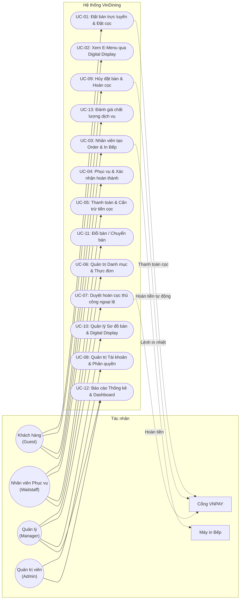
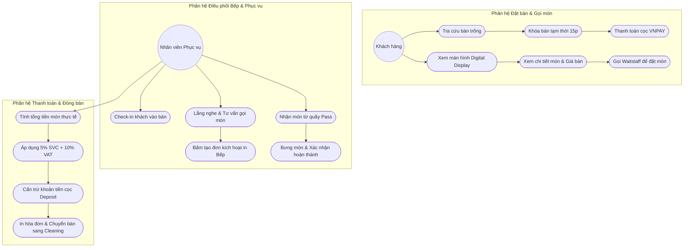
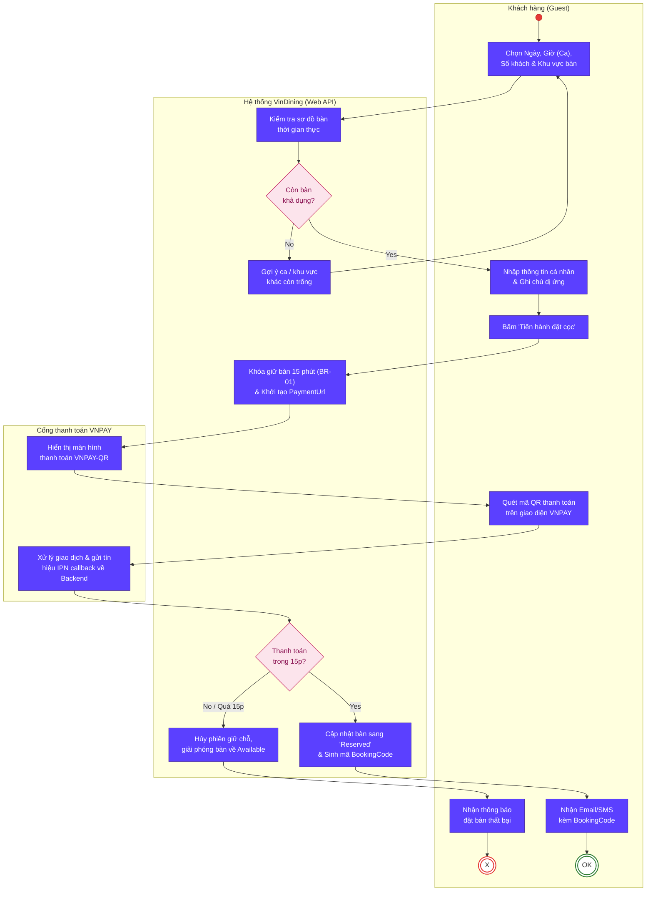
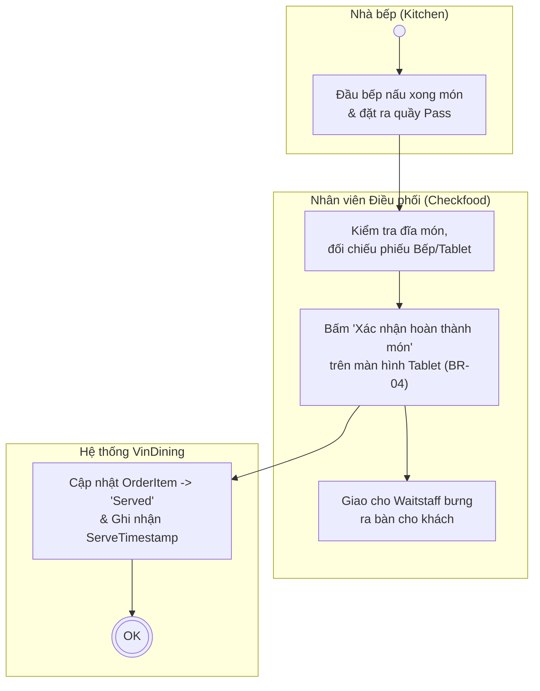
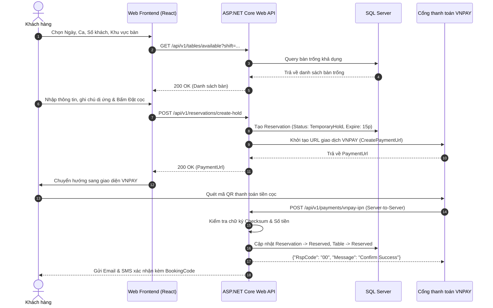
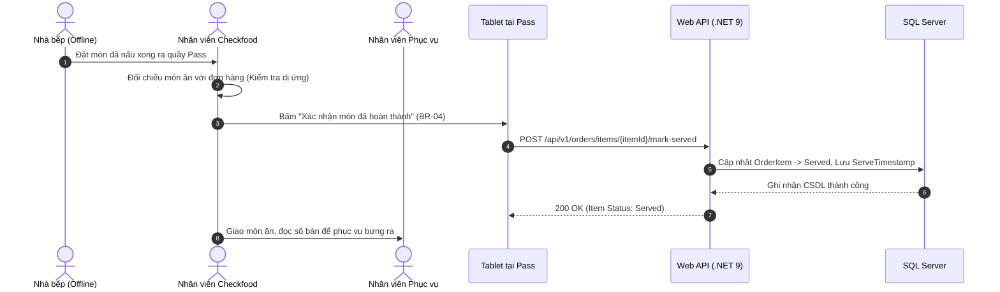
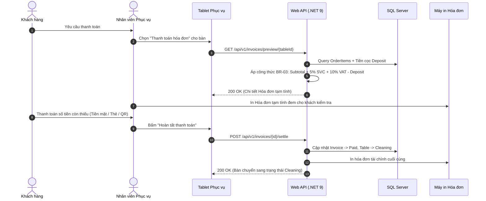

# BÁO CÁO PHÂN TÍCH HỆ THỐNG (SYSTEM ANALYSIS REPORT)
## Dự án: Hệ thống Quản lý và Đặt bàn Nhà hàng Fine Dining (VinDining)

---

### THÔNG TIN TÀI LIỆU
* **Tên tài liệu**: Báo cáo Phân tích Yêu cầu & Mô hình hóa Hệ thống (System Analysis & Modeling Report)
* **Dự án**: VinDining — Fine Dining Restaurant Management & Reservation System
* **Giai đoạn**: Phase 1 (Tuần 1–2) — Proposal & Requirement Analysis
* **Nhóm thực hiện**: Nguyễn Mạnh Quyền, Đặng Quốc Khánh, Nguyễn Hoàng Đạt
* **Giảng viên hướng dẫn**: ThS. Phạm Hữu Tùng

---

## CHƯƠNG 1: TỔNG QUAN TÁC NHÂN & MA TRẬN PHÂN QUYỀN (STAKEHOLDER & RBAC)

### 1.1 Danh mục Tác nhân Hệ thống (System Actors)

| Tác nhân (Actor)                                | Phân loại                | Thiết bị / Nền tảng                               | Phạm vi quyền hạn trong hệ thống                                                                                                                                                                                                                                                                         | Mục tiêu cốt lõi                                                                                                     |
| :------------------------------------------------| :-------------------------| :--------------------------------------------------| :---------------------------------------------------------------------------------------------------------------------------------------------------------------------------------------------------------------------------------------------------------------------------------------------------------| :---------------------------------------------------------------------------------------------------------------------|
| **Khách hàng (Guest)**                          | Tác nhân chính (Primary) | Smartphone cá nhân *(Mobile Web Responsive)*      | - Tìm kiếm, chọn bàn, đặt bàn trực tuyến.<br>- Thanh toán cọc giữ chỗ qua cổng VNPAY.<br>- Xem thực đơn qua màn hình Digital Display tại bàn (chỉ xem).<br>- Theo dõi trạng thái món và yêu cầu thanh toán.                                                                                              | Đặt chỗ nhanh chóng, minh bạch cọc; tự do gọi món không phải chờ đợi; đảm bảo an toàn tuyệt đối về dị ứng thực phẩm. |
| **Nhân viên Phục vụ (Waitstaff)**               | Tác nhân chính (Primary) | Điện thoại / Tablet cầm tay *(Mobile/Tablet Web)* | - Xem sơ đồ bàn ăn và check-in khách đến bàn (`Occupied`).<br>- Tiếp nhận yêu cầu gọi món từ khách, tư vấn dị ứng.<br>- Bấm tạo đơn trực tiếp (Create Order) và kích hoạt lệnh in phiếu Bếp tự động.<br>- Bưng món từ quầy Pass ra bàn.<br>- Xuất hóa đơn tạm tính cấn trừ cọc và đóng bàn (`Cleaning`). | Phục vụ tận tình; giảm sai sót ghi nhận đơn thủ công.                                                                |
| **Nhân viên Điều phối (Expediter / Checkfood)** | Tác nhân chính (Primary) | Tablet cố định tại quầy Pass                      | - Nhận món từ nhà bếp đặt ra quầy Pass.<br>- Đối chiếu phiếu Bếp, kiểm tra chất lượng.<br>- Bấm "Xác nhận hoàn thành món" (Served) trên hệ thống.<br>- Điều phối Waitstaff bưng món ra bàn.                                                                                                              | Đảm bảo 100% món ăn đúng bàn, đúng khách, đúng yêu cầu dị ứng; kiểm soát mốc thời gian ra món chính xác.             |
| **Quản lý (Manager)**                           | Tác nhân chính (Primary) | Máy tính cá nhân *(Desktop Web Portal)*           | - Quản lý thực đơn (Danh mục món ăn, giá bán).<br>- Thiết lập sơ đồ bàn ăn và kết nối thiết bị Digital Display cho từng bàn.<br>- Xem báo cáo thống kê doanh thu và tỷ lệ lấp đầy bàn thời gian thực.<br>- Thực hiện duyệt hoàn tiền cọc thủ công (*Manual Refund Override*) khi có sự cố bất khả kháng. | Giám sát toàn diện vận hành nhà hàng; kiểm soát doanh thu chặt chẽ; linh hoạt xử lý khiếu nại khách hàng.            |
| **Quản trị viên (Admin)**                       | Tác nhân chính (Primary) | Máy tính cá nhân *(Desktop Web Portal)*           | - Quản trị danh sách tài khoản người dùng và gán quyền (RBAC).<br>- Cấu hình tham số hệ thống (thời gian giữ bàn, tỷ lệ VAT, phí dịch vụ).<br>- Giám sát nhật ký hệ thống (System Logs) và sao lưu dữ liệu.                                                                                              | Đảm bảo tính toàn vẹn, bảo mật và sự hoạt động ổn định liên tục của toàn bộ nền tảng.                                |
| **Cổng thanh toán VNPAY**                       | Tác nhân phụ (Secondary) | Hệ thống máy chủ VNPAY Gateway                    | - Tiếp nhận yêu cầu thanh toán cọc trực tuyến.<br>- Xử lý giao dịch thẻ/QR ngân hàng và gửi tín hiệu xác nhận tức thời (IPN callback) về Backend hệ thống.                                                                                                                                               | Đảm bảo giao dịch thanh toán an toàn, chính xác và bảo mật.                                                          |
| **Máy in nhiệt Bếp (Kitchen Printer)**          | Tác nhân phụ (Secondary) | Máy in nhiệt mạng LAN/Wi-Fi (ESC/POS)             | - Tự động nhả phiếu order vật lý tại các trạm Bếp nóng, Bếp lạnh, Bar ngay khi nhận lệnh in từ hệ thống.                                                                                                                                                                                                 | Cung cấp phiếu in chế biến rõ ràng, in đậm cảnh báo dị ứng cho đầu bếp thao tác.                                     |

> [!NOTE]
> **Ranh giới nghiệp vụ Nhà bếp (Kitchen)**: Trong mô hình VinDining, **Nhà bếp (Kitchen/Chef) không phải là tác nhân tương tác trực tiếp với giao diện phần mềm**. Đầu bếp nhận lệnh thông qua phiếu in nhiệt tự động và đặt món ra quầy chuyển món (Pass) để nhân viên phục vụ tiếp nhận. Điều này giúp tối ưu hóa thao tác, loại bỏ màn hình cảm ứng dễ bám bẩn trong khu vực bếp.

---

### 1.2 Ma trận phân quyền chức năng (Role-Based Access Control - RBAC)

| Phân hệ chức năng | Chức năng chi tiết | Khách hàng (Guest) | Phục vụ (Waitstaff) | Quản lý (Manager) | Quản trị (Admin) |
| :--- | :--- | :---: | :---: | :---: | :---: |
| **Tài khoản & Hồ sơ** | Đăng ký / Đăng nhập tài khoản | ✓ | ✓ | ✓ | ✓ |
| | Quản lý thông tin cá nhân & Lịch sử | ✓ | ✓ | ✓ | ✓ |
| | Quản trị người dùng & Phân quyền | ✗ | ✗ | ✗ | **✓** |
| **Đặt bàn & Đặt cọc** | Tra cứu sơ đồ bàn & Đặt bàn trực tuyến | **✓** | ✗ | ✗ | ✗ |
| | Thanh toán tiền cọc giữ chỗ (VNPAY) | **✓** | ✗ | ✗ | ✗ |
| | Hủy đặt bàn tự động (Trước >= 4h) | **✓** | ✗ | ✗ | ✗ |
| | Duyệt hoàn cọc thủ công ngoại lệ | ✗ | ✗ | **✓** | **✓** |
| **Sơ đồ bàn & Digital Display** | Theo dõi sơ đồ bàn trực quan Real-time | ✗ | **✓** | **✓** | **✓** |
| | Check-in khách vào bàn (`Occupied`) | ✗ | **✓** | **✓** | ✗ |
| | Kết nối thiết bị Digital Display theo bàn | ✗ | ✗ | **✓** | **✓** |
| | Chuyển trạng thái bàn sau dọn dẹp (`Available`) | ✗ | **✓** | **✓** | ✗ |
| **Gọi món & Bếp** | Khách xem Menu qua Digital Display | **✓** | ✗ | ✗ | ✗ |
| | Tạo đơn trực tiếp & Kích hoạt in Bếp | ✗ | **✓** | **✓** | ✗ |
| | Bấm xác nhận "Đã phục vụ món" tại Pass | ✗ | ✗ (Expediter: ✓) | **✓** | ✗ |
| **Hóa đơn & Doanh thu** | Yêu cầu tính tiền từ Web E-Menu | **✓** | ✗ | ✗ | ✗ |
| | Xuất hóa đơn tạm tính (Cấn trừ cọc) | ✗ | **✓** | **✓** | ✗ |
| | Xác nhận thanh toán & Đóng bàn | ✗ | **✓** | **✓** | ✗ |
| | Báo cáo thống kê doanh thu & Món bán chạy | ✗ | ✗ | **✓** | **✓** |

---

## CHƯƠNG 2: MÔ HÌNH HÓA USE CASE (USE CASE MODELING)

### 2.1 Sơ đồ Use Case tổng quát toàn hệ thống (Overall Use Case Diagram)

> 📐 **Tệp thiết kế Draw.io**: [`use_case_overall.drawio`](file:///c:/Users/Admin/Documents/antigravity/blissful-hertz/docs/phase1/drawio/use_case_overall.drawio)



---

### 2.2 Sơ đồ Use Case phân rã theo Phân hệ

> 📐 **Tệp thiết kế Draw.io**: [`use_case_subsystems.drawio`](file:///c:/Users/Admin/Documents/antigravity/blissful-hertz/docs/phase1/drawio/use_case_subsystems.drawio)



---

### 2.3 Đặc tả chi tiết các Use Case (Use Case Specifications)

#### 📋 UC-01: Đặt bàn trực tuyến & Đặt cọc (Table Reservation & Deposit)
* **Mã Use Case**: `UC-01`
* **Tên Use Case**: Đặt bàn trực tuyến & Đặt cọc giữ chỗ (TableReservationUseCase)
* **Tác nhân**: Khách hàng (Chính), Cổng VNPAY (Phụ), Hệ thống (Phụ).
* **Mức độ ưu tiên**: Trọng yếu (Must Have).
* **Mục tiêu tóm tắt**: Cho phép khách hàng truy cập trang Web, chọn ngày/ca/vị trí bàn và hoàn tất đặt chỗ bằng cách thanh toán khoản tiền cọc cố định qua cổng VNPAY.
* **Điều kiện tiên quyết**: Khách hàng truy cập vào hệ thống Web; sơ đồ bàn đang hoạt động.
* **Điều kiện sau hoàn thành**: Bàn ăn chuyển sang trạng thái `Reserved`; hệ thống ghi nhận khoản cọc thành công và tự động gửi `BookingCode` qua SMS/Email cho khách.
* **Luồng sự kiện chính (Basic Flow)**:
  1. Khách hàng chọn Ngày hẹn, Ca phục vụ (Giờ hẹn), Số lượng khách và Khu vực bàn mong muốn (VIP, Sảnh chính, Ban công).
  2. Hệ thống kiểm tra trạng thái sơ đồ bàn thời gian thực và hiển thị danh sách bàn trống khả dụng.
  3. Khách hàng điền thông tin cá nhân (Họ tên, SĐT, Email), ghi chú các yêu cầu đặc biệt/cảnh báo dị ứng và nhấn "Tiến hành đặt cọc".
  4. Hệ thống khóa giữ tạm thời vị trí bàn đã chọn trong tối đa **15 phút** (`BR-01`), đồng thời chuyển hướng khách sang giao diện thanh toán VNPAY.
  5. Khách hàng thực hiện thanh toán tiền cọc trên cổng VNPAY (quét QR ngân hàng hoặc nhập thẻ).
  6. Cổng VNPAY xử lý giao dịch thành công và gửi tín hiệu xác nhận (IPN) thời gian thực về Backend.
  7. Hệ thống cập nhật trạng thái bàn sang `Reserved`, sinh mã đặt bàn `BookingCode` duy nhất và gửi thông báo xác nhận cho khách.
* **Luồng phụ & Ngoại lệ (Alternative & Exception Flows)**:
  - *5a. Thanh toán thất bại hoặc quá thời hạn 15 phút (`BR-01`)*: Quá 15 phút chưa nhận được kết quả thành công từ VNPAY, hệ thống tự động hủy phiên đặt bàn tạm thời, giải phóng vị trí bàn về trạng thái `Available` trên sơ đồ và hiển thị thông báo mời khách thao tác lại.
  - *2a. Khung giờ hoặc khu vực bàn đã hết chỗ*: Hệ thống thông báo hết bàn và tự động gợi ý các khung giờ hoặc phân khu bàn lân cận còn trống.
  - *Khách hủy đặt bàn trước $\ge$ 4 tiếng (`BR-05`)*: Hệ thống tự động kích hoạt hoàn cọc 100% qua API VNPAY và giải phóng bàn về `Available`.
  - *Khách hủy đặt bàn trong vòng < 4 tiếng (`BR-05`)*: Hệ thống ghi nhận hủy bàn nhưng phạt 100% tiền cọc (không hoàn tiền).

---

#### 📋 UC-02: Xem E-Menu qua Digital Display (Table Digital Menu)
* **Mã Use Case**: `UC-02`
* **Tên Use Case**: Xem E-Menu qua Digital Display (ViewDigitalMenuUseCase)
* **Tác nhân**: Khách hàng (Chính).
* **Mức độ ưu tiên**: Trọng yếu (Must Have).
* **Mục tiêu tóm tắt**: Khách hàng tại bàn xem danh mục các món ăn (A La Carte) qua thiết bị màn hình Digital Display (chỉ xem, không có tính năng đặt món trực tiếp).
* **Điều kiện tiên quyết**: Khách hàng đã ngồi tại bàn thực tế; thiết bị Digital Display đang hoạt động.
* **Điều kiện sau hoàn thành**: Khách hàng xem xong thực đơn và quyết định gọi món thông qua nhân viên phục vụ.
* **Luồng sự kiện chính (Basic Flow)**:
  1. Khách hàng ngồi tại bàn, màn hình Digital Display đã được tự động hiển thị Menu.
  2. Khách hàng chạm/lướt màn hình để duyệt danh mục món ăn trực quan (Các món khai vị, món chính, đồ uống, giá bán).
  3. Khách hàng thảo luận và quyết định chọn các món ăn.
  4. Khách hàng gọi nhân viên phục vụ để tiến hành đặt món.
* **Luồng phụ & Ngoại lệ (Alternative & Exception Flows)**:
  - *Màn hình tắt hoặc lỗi mạng*: Nhân viên phục vụ khởi động lại thiết bị hoặc đổi thiết bị khác cho khách.

---

#### 📋 UC-03: Nhân viên tạo Order trực tiếp & In phiếu Bếp (Order Creation & Dispatching)
* **Mã Use Case**: `UC-03`
* **Tên Use Case**: Nhân viên tạo Order & In Bếp (OrderCreationUseCase)
* **Tác nhân**: Nhân viên Phục vụ (Chính), Máy in nhiệt Bếp (Phụ), Hệ thống (Phụ).
* **Mức độ ưu tiên**: Trọng yếu (Must Have).
* **Mục tiêu tóm tắt**: Nhân viên phục vụ đứng tại bàn, nhập đơn gọi món trực tiếp vào thiết bị di động theo yêu cầu của khách, hệ thống lưu đơn ở trạng thái `Processing` và tự động in phiếu Bếp.
* **Điều kiện tiên quyết**: Bàn ăn đã được check-in (`Occupied`), khách hàng đã quyết định xong món.
* **Điều kiện sau hoàn thành**: Đơn hàng được tạo (Status: `Processing`), máy in nhiệt tại các phân khu bếp nhả phiếu order chuẩn xác.
* **Luồng sự kiện chính (Basic Flow)**:
  1. Khách hàng đọc danh sách các món muốn gọi.
  2. Nhân viên phục vụ mở ứng dụng trên Tablet, chọn đúng bàn tương ứng đang phục vụ.
  3. Nhân viên thêm các món ăn vào giỏ hàng, đồng thời điền các yêu cầu đặc biệt/cảnh báo dị ứng do khách yêu cầu.
  4. Nhân viên nhấn nút "Tạo đơn & Gửi Bếp" trên màn hình thiết bị cầm tay.
  5. Hệ thống khởi tạo Order với trạng thái `Processing` và lưu mốc thời gian bắt đầu.
  6. Hệ thống tự động gửi lệnh in nhiệt (ESC/POS) ra các máy in tại phân khu Bếp tương ứng. Phiếu in ghi rõ: Số bàn, Tên món, và **bôi đậm cảnh báo dị ứng**.
* **Luồng phụ & Ngoại lệ (Alternative & Exception Flows)**:
  - *3a. Khách hàng muốn gọi thêm món bổ sung sau này*: Nhân viên phục vụ mở lại bàn đó và tạo tiếp một lượt Order mới, hệ thống sẽ gom chung vào hóa đơn tổng của bàn.

---

#### 📋 UC-04: Phục vụ món & Xác nhận hoàn thành món tại quầy Pass (Serving Confirmation)
* **Mã Use Case**: `UC-04`
* **Tên Use Case**: Phục vụ & Xác nhận hoàn thành món (ServiceConfirmationUseCase)
* **Tác nhân**: Nhân viên Điều phối / Checkfood (Chính), Nhân viên Phục vụ (Phụ), Hệ thống (Phụ).
* **Mức độ ưu tiên**: Trọng yếu (Must Have).
* **Mục tiêu tóm tắt**: Nhân viên Checkfood tại quầy Pass nhận món từ bếp, đối chiếu, giao cho Waitstaff bưng đi, và bấm xác nhận "Đã hoàn thành" trên tablet tại quầy.
* **Điều kiện tiên quyết**: Món ăn đã được nhà bếp hoàn thành và đặt tại quầy Pass.
* **Điều kiện sau hoàn thành**: Trạng thái món ăn chuyển sang `Served`, hệ thống ghi nhận mốc thời gian phục vụ thực tế (`ServeTimestamp`).
* **Luồng sự kiện chính (Basic Flow)**:
  1. Đầu bếp nấu xong đĩa món chuẩn vị, đặt ra quầy chuyển món (Pass).
  2. Nhân viên Điều phối (Checkfood) kiểm tra món ăn đối chiếu với thông tin order trên Tablet (kiểm tra dị ứng, hình thức).
  3. Nhân viên Checkfood bấm chọn "Xác nhận hoàn thành món" (`BR-04`) trên thiết bị.
  4. Hệ thống cập nhật trạng thái món thành `Served` và lưu mốc thời gian phục vụ.
  5. Nhân viên Checkfood giao đĩa món cho Nhân viên phục vụ (Waitstaff) cùng số bàn để bưng ra cho khách.
* **Luồng phụ & Ngoại lệ (Alternative & Exception Flows)**:
  - *2a. Món ăn làm sai yêu cầu (VD: Quên loại bỏ đậu phộng)*: Checkfood phát hiện sai sót, trả lại đĩa món cho bếp làm lại và không bấm xác nhận.

---

#### 📋 UC-05: Thanh toán, Cấn trừ tiền cọc & Đóng bàn (Checkout & Invoice Settlement)
* **Mã Use Case**: `UC-05` *(Được bổ sung hoàn thiện chuẩn theo RTM)*
* **Tên Use Case**: Thanh toán, Cấn trừ tiền cọc & Đóng bàn (InvoiceSettlementUseCase)
* **Tác nhân**: Nhân viên Phục vụ (Chính), Khách hàng (Chính), Hệ thống (Phụ).
* **Mức độ ưu tiên**: Trọng yếu (Must Have).
* **Mục tiêu tóm tắt**: Tự động tổng hợp toàn bộ tiền món ăn, tính 5% phí dịch vụ, 10% VAT, tự động cấn trừ số tiền cọc (Deposit) đã thanh toán trước đó, xuất hóa đơn tài chính và chuyển trạng thái bàn sang chờ dọn dẹp (`Cleaning`).
* **Điều kiện tiên quyết**: Bàn ăn đang ở trạng thái `Occupied` và toàn bộ các món ăn đã được phục vụ hoàn tất (`Served`).
* **Điều kiện sau hoàn thành**: Hóa đơn được thanh toán thành công, đơn hàng hoàn tất, bàn chuyển trạng thái sang `Cleaning`.
* **Luồng sự kiện chính (Basic Flow)**:
  1. Khách hàng nhấn nút "Yêu cầu thanh toán" trên Web E-Menu hoặc báo miệng với nhân viên phục vụ.
  2. Nhân viên phục vụ chọn chức năng "Thanh toán hóa đơn" cho bàn tương ứng trên thiết bị cầm tay.
  3. Hệ thống tự động truy vấn đơn hàng của bàn, thực thi công thức tính toán tài chính bắt buộc (`BR-03`):
     - $\text{Subtotal} = \sum (\text{Tiền món dùng thực tế})$
     - $\text{Phí dịch vụ (5\%)} = \text{Subtotal} \times 0.05$
     - $\text{Thuế VAT (10\%)} = (\text{Subtotal} + \text{Phí dịch vụ}) \times 0.10$
     - $\text{Số tiền phải trả} = (\text{Subtotal} + \text{Phí dịch vụ} + \text{Thuế VAT}) - \text{Tiền cọc đã trả (Deposit)}$
  4. Hệ thống in phiếu Hóa đơn tạm tính hiển thị minh bạch toàn bộ các dòng tiền và số tiền cọc đã cấn trừ để nhân viên đem ra bàn cho khách kiểm tra.
  5. Khách hàng thực hiện thanh toán số tiền còn thiếu qua tiền mặt, thẻ ngân hàng hoặc quét mã QR chuyển khoản.
  6. Nhân viên phục vụ bấm "Hoàn tất thanh toán" trên thiết bị.
  7. Hệ thống tự động vô hiệu hóa phiên QR, in hóa đơn tài chính cuối cùng và chuyển trạng thái bàn sang `Cleaning`. Sau khi nhân viên dọn bàn xong, bàn chuyển về trạng thái `Available`.
* **Luồng phụ & Ngoại lệ (Alternative & Exception Flows)**:
  - *5a. Khách hàng có thắc mắc về số tiền cọc*: Nhân viên phục vụ tra cứu trực tiếp lịch sử giao dịch cọc gắn với `BookingCode` trên hệ thống để giải thích minh bạch cho khách.

---

#### 📋 UC-06: Quản trị Danh mục & Thực đơn món ăn (Menu Management)
* **Mã Use Case**: UC-06
* **Tên Use Case**: Quản trị Thực đơn (MenuManagementUseCase)
* **Tác nhân**: Quản lý (Chính), Hệ thống (Phụ).
* **Mức độ ưu tiên**: Quan trọng (Should Have).
* **Mục tiêu tóm tắt**: Cho phép Quản lý (Manager) thêm, sửa, xóa, vô hiệu hóa các món ăn và danh mục món ăn (A La Carte) trên hệ thống.
* **Điều kiện tiên quyết**: Quản lý đã đăng nhập thành công vào hệ thống.
* **Điều kiện sau hoàn thành**: Dữ liệu thực đơn được cập nhật đồng bộ lên CSDL và hiển thị tức thời trên Digital Display/Tablet phục vụ.
* **Luồng sự kiện chính (Basic Flow)**:
  1. Quản lý truy cập trang Quản trị Thực đơn trên Web Portal.
  2. Hệ thống hiển thị danh sách các món ăn hiện có.
  3. Quản lý chọn chức năng 'Thêm món mới'.
  4. Quản lý nhập thông tin món ăn (Tên món, Hình ảnh, Giá bán, Phân loại, Cảnh báo dị ứng).
  5. Quản lý bấm 'Lưu'.
  6. Hệ thống kiểm tra tính hợp lệ của dữ liệu (Validation) và lưu vào CSDL.
  7. Hệ thống cập nhật Menu trên các thiết bị của Khách và Nhân viên phục vụ.

---

#### 📋 UC-07: Duyệt hoàn tiền cọc thủ công ngoại lệ (Manual Refund)
* **Mã Use Case**: UC-07
* **Tên Use Case**: Duyệt hoàn tiền cọc thủ công (ManualRefundUseCase)
* **Tác nhân**: Quản lý / Admin (Chính), Cổng VNPAY (Phụ), Hệ thống (Phụ).
* **Mức độ ưu tiên**: Quan trọng (Should Have).
* **Mục tiêu tóm tắt**: Quản lý xử lý hoàn tiền cọc cho khách hàng trong các trường hợp bất khả kháng (lỗi hệ thống, thiên tai...) mà không tuân theo quy tắc hoàn tự động.
* **Điều kiện tiên quyết**: Đặt bàn có trạng thái Cancelled nhưng tiền cọc chưa được hoàn trả, hoặc có khiếu nại từ khách.
* **Điều kiện sau hoàn thành**: Tiền cọc được hoàn trả qua VNPAY, ghi nhận lịch sử xử lý khiếu nại.
* **Luồng sự kiện chính (Basic Flow)**:
  1. Quản lý tiếp nhận khiếu nại và tra cứu mã BookingCode trên hệ thống.
  2. Quản lý bấm nút 'Hoàn tiền thủ công (Override)' đối với khoản cọc đã thu.
  3. Quản lý nhập lý do hoàn tiền bắt buộc.
  4. Hệ thống gọi API VNPAY (Refund API) để hoàn trả tiền cho khách.
  5. Hệ thống lưu vết (Audit Log) giao dịch hoàn tiền với UserID của người Quản lý đã duyệt.

---

#### 📋 UC-08: Quản trị Tài khoản & Phân quyền (Account & RBAC Management)
* **Mã Use Case**: UC-08
* **Tên Use Case**: Quản trị Tài khoản & Phân quyền (AccountManagementUseCase)
* **Tác nhân**: Quản trị viên - Admin (Chính), Hệ thống (Phụ).
* **Mức độ ưu tiên**: Quan trọng (Should Have).
* **Mục tiêu tóm tắt**: Admin cấp phát, khóa tài khoản và gán vai trò (Role) cho các nhân viên trong nhà hàng (Waitstaff, Checkfood, Manager).
* **Điều kiện tiên quyết**: Admin đăng nhập với tài khoản có quyền cao nhất.
* **Điều kiện sau hoàn thành**: Thông tin tài khoản nhân viên được cập nhật, quyền truy cập thay đổi có hiệu lực trong lần đăng nhập tiếp theo.
* **Luồng sự kiện chính (Basic Flow)**:
  1. Admin truy cập trang Quản lý Nhân viên.
  2. Admin bấm 'Tạo tài khoản mới'.
  3. Admin nhập thông tin nhân sự và chọn Vai trò (Waitstaff / Expediter / Manager).
  4. Hệ thống lưu tài khoản và gửi Email cấp mật khẩu mặc định cho nhân viên.

---

#### 📋 UC-09: Hủy đặt bàn trực tuyến & Hoàn cọc tự động (Cancel Reservation)
* **Mã Use Case**: `UC-09`
* **Tên Use Case**: Hủy đặt bàn trực tuyến & Hoàn cọc (CancelReservationUseCase)
* **Tác nhân**: Khách hàng (Chính), Cổng VNPAY (Phụ), Hệ thống (Phụ).
* **Mức độ ưu tiên**: Trọng yếu (Must Have).
* **Mục tiêu tóm tắt**: Cho phép khách hàng tự chủ động hủy lịch đặt bàn của mình trên Web. Hệ thống kiểm tra điều kiện thời gian để tự động hoàn tiền cọc qua VNPAY hoặc phạt cọc theo chính sách.
* **Điều kiện tiên quyết**: Khách hàng có một mã đặt bàn (`BookingCode`) đang ở trạng thái `Reserved`.
* **Điều kiện sau hoàn thành**: Trạng thái đặt bàn chuyển sang `Cancelled`, bàn ăn được giải phóng về `Available`, ghi nhận giao dịch hoàn tiền hoặc phạt cọc thành công.
* **Luồng sự kiện chính (Basic Flow)**:
  1. Khách hàng truy cập trang Tra cứu đặt bàn, nhập SĐT và `BookingCode`.
  2. Hệ thống hiển thị chi tiết lịch đặt bàn và nút "Hủy đặt bàn".
  3. Khách hàng bấm "Hủy đặt bàn" và xác nhận thao tác.
  4. Hệ thống kiểm tra thời gian hiện tại so với giờ hẹn (`BR-05`). Thời gian cách giờ hẹn $\ge$ 4 tiếng.
  5. Hệ thống gọi API VNPAY (Refund API) để hoàn trả 100% số tiền cọc về tài khoản của khách.
  6. Hệ thống cập nhật trạng thái Reservation -> `Cancelled`, Table -> `Available`.
  7. Gửi thông báo Email/SMS xác nhận hủy và hoàn tiền cho khách.
* **Luồng phụ & Ngoại lệ (Alternative & Exception Flows)**:
  - *4a. Khách hủy bàn khi thời gian cách giờ hẹn < 4 tiếng*: Hệ thống cảnh báo khách sẽ bị mất 100% cọc (không hoàn tiền). Khách đồng ý, hệ thống ghi nhận trạng thái `Cancelled` nhưng giữ lại tiền cọc làm phí phạt. Bàn vẫn được giải phóng về `Available`.

---

#### 📋 UC-11: Đổi bàn / Chuyển bàn (Change & Merge Tables)
* **Mã Use Case**: `UC-11`
* **Tên Use Case**: Đổi bàn / Chuyển bàn (ChangeTableUseCase)
* **Tác nhân**: Nhân viên Phục vụ (Chính), Quản lý (Phụ).
* **Mức độ ưu tiên**: Quan trọng (Should Have).
* **Mục tiêu tóm tắt**: Cho phép nhân viên phục vụ chuyển toàn bộ đơn hàng (Order) và tiền cọc (nếu có) từ bàn hiện tại sang một bàn khác trống trên hệ thống khi khách có nhu cầu đổi chỗ ngồi.
* **Điều kiện tiên quyết**: Khách đang ngồi tại bàn cũ (`Occupied`); bàn mới mục tiêu phải ở trạng thái `Available`.
* **Điều kiện sau hoàn thành**: Bàn cũ chuyển về trạng thái `Cleaning`, bàn mới chuyển sang `Occupied` và kế thừa toàn bộ Order.
* **Luồng sự kiện chính (Basic Flow)**:
  1. Khách hàng yêu cầu đổi sang bàn khác (VD: Từ sảnh trong ra ban công).
  2. Nhân viên phục vụ chọn chức năng "Đổi bàn" trên Tablet đối với bàn hiện tại.
  3. Hệ thống hiển thị sơ đồ các bàn trống (`Available`) để nhân viên chọn.
  4. Nhân viên chọn bàn mới mục tiêu và bấm xác nhận chuyển.
  5. Hệ thống di chuyển toàn bộ Order, OrderItems (cả những món đã phục vụ và đang nấu) sang TableId mới.
  6. Bàn cũ chuyển sang trạng thái `Cleaning`. Bàn mới chuyển sang `Occupied`. Máy in bếp không cần in lại phiếu nhưng hệ thống tự động ghi chú cho bộ phận Checkfood biết bàn đã đổi.
* **Luồng phụ & Ngoại lệ (Alternative & Exception Flows)**:
  - *Khách muốn ghép 2 bàn lại với nhau*: Nhân viên sử dụng tính năng "Ghép bàn" (Merge) để gộp chung 2 TableId thành 1 nhóm và hợp nhất hóa đơn.

---


#### 📋 UC-10: Quản lý Sơ đồ bàn & Cấu hình Digital Display (Floor Plan Management)
* **Mã Use Case**: UC-10
* **Tên Use Case**: Quản lý Sơ đồ bàn (FloorPlanUseCase)
* **Tác nhân**: Quản lý (Chính), Hệ thống (Phụ).
* **Mức độ ưu tiên**: Quan trọng (Should Have).
* **Mục tiêu tóm tắt**: Quản lý thiết lập sơ đồ các bàn, khu vực (VIP, Sảnh) và liên kết các thiết bị Tablet (Digital Display) vật lý với ID bàn tương ứng trên hệ thống.
* **Điều kiện tiên quyết**: Quản lý đăng nhập thành công.
* **Điều kiện sau hoàn thành**: Sơ đồ bàn được cập nhật, Tablet hiển thị đúng ID bàn của mình.
* **Luồng sự kiện chính (Basic Flow)**:
  1. Quản lý mở chức năng Sơ đồ bàn.
  2. Hệ thống hiển thị sơ đồ trực quan (Canvas).
  3. Quản lý thực hiện thêm/xóa/sửa trạng thái (Bảo trì) của bàn.
  4. Để cấu hình Tablet, Quản lý nhập mã kết nối (Pairing Code) sinh ra từ Tablet vào hệ thống.
  5. Hệ thống liên kết (bind) Tablet đó với TableId thành công (BR-02).

---

#### 📋 UC-12: Xem Báo cáo Dashboard & Thống kê (Reporting & Analytics)
* **Mã Use Case**: UC-12
* **Tên Use Case**: Xem Báo cáo Thống kê (ViewReportsUseCase)
* **Tác nhân**: Quản lý / Admin (Chính).
* **Mức độ ưu tiên**: Bổ sung (Could Have).
* **Mục tiêu tóm tắt**: Xem doanh thu, tỷ lệ lấp đầy bàn, thống kê số lượng khách bùng bàn (No-show), món ăn bán chạy nhất.
* **Điều kiện tiên quyết**: Quản lý đăng nhập vào hệ thống.
* **Điều kiện sau hoàn thành**: Hiển thị biểu đồ báo cáo thành công.
* **Luồng sự kiện chính (Basic Flow)**:
  1. Quản lý chọn menu Dashboard Báo cáo.
  2. Chọn mốc thời gian cần xem (Ngày/Tuần/Tháng).
  3. Hệ thống tổng hợp dữ liệu từ CSDL (Invoices, Orders, Reservations).
  4. Hệ thống render biểu đồ đường, biểu đồ tròn và bảng dữ liệu.

---

#### 📋 UC-13: Đánh giá chất lượng dịch vụ (Feedback / Review)
* **Mã Use Case**: UC-13
* **Tên Use Case**: Gửi đánh giá dịch vụ (SubmitFeedbackUseCase)
* **Tác nhân**: Khách hàng (Chính).
* **Mức độ ưu tiên**: Bổ sung (Could Have).
* **Mục tiêu tóm tắt**: Thu thập ý kiến của khách hàng về chất lượng món ăn và dịch vụ ngay sau khi dùng bữa.
* **Điều kiện tiên quyết**: Khách hàng đã thanh toán hóa đơn.
* **Điều kiện sau hoàn thành**: Lưu feedback vào hệ thống.
* **Luồng sự kiện chính (Basic Flow)**:
  1. Khách hàng nhận được Email cảm ơn kèm link đánh giá, hoặc quét mã QR thanh toán tích hợp link đánh giá.
  2. Khách hàng điền mức độ hài lòng (1-5 sao) và ghi chú.
  3. Bấm Gửi.
  4. Hệ thống lưu đánh giá vào CSDL. Quản lý có thể xem lại tại Dashboard.

---
## CHƯƠNG 3: MÔ HÌNH HÓA QUY TRÌNH NGHIỆP VỤ (SWIMLANE ACTIVITY DIAGRAMS)

### 3.1 AD-01: Quy trình Đặt bàn trực tuyến & Đặt cọc VNPAY (3 Làn: Khách hàng | Hệ thống | VNPAY)

> 📐 **Tệp thiết kế Draw.io**: [`ad01_reservation_deposit.drawio`](file:///c:/Users/Admin/Documents/antigravity/blissful-hertz/docs/phase1/drawio/ad01_reservation_deposit.drawio)



---

### 3.2 AD-02: Quy trình Nhân viên Order trực tiếp & In Bếp (3 Làn: Khách hàng | Phục vụ | Hệ thống & Máy in)

> 📐 **Tệp thiết kế Draw.io**: [`ad02_waitstaff_ordering.drawio`](file:///c:/Users/Admin/Documents/antigravity/blissful-hertz/docs/phase1/drawio/ad02_waitstaff_ordering.drawio)

```mermaid
flowchart TD
    subgraph Guest ["Khách hàng (Guest)"]
        direction TB
        G_Start(( ))
        G1["Xem E-Menu qua màn hình<br/>Digital Display tại bàn"]
        G2["Thảo luận và gọi nhân viên<br/>phục vụ để order món"]
    end

    subgraph Waitstaff ["Nhân viên Phục vụ (Waitstaff)"]
        direction TB
        W1["Có mặt tại bàn, mở ứng dụng<br/>trên Tablet di động"]
        W2["Thêm món vào giỏ hàng<br/>& Nhập ghi chú dị ứng"]
        W3["Bấm nút 'Tạo đơn & Gửi Bếp'"]
    end

    subgraph System ["Hệ thống VinDining & Máy in"]
        direction TB
        S1["Lưu Order vào Database<br/>(Status: Processing)"]
        S2["Tự động điều phối lệnh in<br/>ra máy in ESC/POS khu vực bếp"]
        S3["Máy in nhả phiếu Order vật lý<br/>cho đầu bếp (In đậm dị ứng)"]
        S_End(((OK)))
    end

    G_Start --> G1
    G1 --> G2
    G2 --> W1
    W1 --> W2
    W2 --> W3
    W3 --> S1
    S1 --> S2
    S2 --> S3
    S3 --> S_End
```mermaid
flowchart TD
    subgraph Waitstaff ["Nhân viên Phục vụ (Waitstaff)"]
        direction TB
        W_Start(( ))
        W1["Dẫn khách vào bàn & Check-in<br/>trên Tablet di động"]
        W2["Nhận thông báo rung SignalR<br/>có đơn gọi món mới"]
        W_End(((OK)))
    end

    subgraph System ["Hệ thống VinDining (Web App & API)"]
        direction TB
        S1["Cập nhật trạng thái bàn sang<br/>'Occupied' (Đang phục vụ)"]
        S2["Mở liên kết Web E-Menu<br/>theo TableId gắn trên mã QR"]
        S_Dec{"Bàn có trạng thái<br/>'Occupied'? (BR-02)"}
        S_Lock["Khóa tính năng gọi món & Báo<br/>khách liên hệ phục vụ check-in"]
        S_Order["Tạo Order trạng thái 'Pending'<br/>& Phát tín hiệu SignalR tức thời"]
    end

    subgraph Guest ["Khách hàng (Guest)"]
        direction TB
        G1["Dùng camera điện thoại<br/>quét mã QR tĩnh tại bàn"]
        G_Lock["Hiển thị thông báo<br/>bàn chưa kích hoạt"]
        G_EndLock(((X)))
        G2["Xem Menu, chọn món/Course<br/>& Nhập ghi chú dị ứng"]
        G3["Nhấn nút<br/>'Gửi đơn gọi món'"]
    end

    W_Start --> W1
    W1 --> S1
    S1 --> G1
    G1 --> S2
    S2 --> S_Dec
    S_Dec -->|No| S_Lock
    S_Lock --> G_Lock
    G_Lock --> G_EndLock
    S_Dec -->|Yes| G2
    G2 --> G3
    G3 --> S_Order
    S_Order --> W2
    W2 --> W_End

    style W_Start fill:#e53935,stroke:#b71c1c
    style W_End fill:#ffffff,stroke:#2e7d32,stroke-width:2px
    style G_EndLock fill:#ffffff,stroke:#e53935,stroke-width:2px
    style S_Dec fill:#fce4ec,stroke:#c2185b,color:#880e4f
    style W1 fill:#5b40ff,stroke:#4527a0,color:#ffffff
    style W2 fill:#5b40ff,stroke:#4527a0,color:#ffffff
    style S1 fill:#5b40ff,stroke:#4527a0,color:#ffffff
    style S2 fill:#5b40ff,stroke:#4527a0,color:#ffffff
    style S_Lock fill:#5b40ff,stroke:#4527a0,color:#ffffff
    style S_Order fill:#5b40ff,stroke:#4527a0,color:#ffffff
    style G1 fill:#5b40ff,stroke:#4527a0,color:#ffffff
    style G_Lock fill:#5b40ff,stroke:#4527a0,color:#ffffff
    style G2 fill:#5b40ff,stroke:#4527a0,color:#ffffff
    style G3 fill:#5b40ff,stroke:#4527a0,color:#ffffff
```

---

### 3.4 AD-04: Quy trình Kiểm đồ (Checkfood) & Xác nhận hoàn thành món (3 Làn: Nhà bếp | Expediter | Hệ thống)

> 📐 **Tệp thiết kế Draw.io**: [`ad04_serving_confirmation.drawio`](file:///c:/Users/Admin/Documents/antigravity/blissful-hertz/docs/phase1/drawio/ad04_serving_confirmation.drawio)



---

### 3.5 AD-05: Quy trình Thanh toán, Cấn trừ tiền cọc & Đóng bàn (3 Làn: Khách hàng | Phục vụ/Thu ngân | Hệ thống)

> 📐 **Tệp thiết kế Draw.io**: [`ad05_invoice_settlement.drawio`](file:///c:/Users/Admin/Documents/antigravity/blissful-hertz/docs/phase1/drawio/ad05_invoice_settlement.drawio)


---

## CHƯƠNG 4: MÔ HÌNH HÓA TƯƠNG TÁC HỆ THỐNG (SEQUENCE DIAGRAMS)

### 4.1 SD-01: Đặt bàn trực tuyến & Thanh toán cọc qua VNPAY

> 📐 **Tệp thiết kế Draw.io**: [`sd01_reservation_vnpay.drawio`](file:///c:/Users/Admin/Documents/antigravity/blissful-hertz/docs/phase1/drawio/sd01_reservation_vnpay.drawio)



---

### 4.2 SD-02: Nhân viên tạo Order trực tiếp & In phiếu Bếp

> 📐 **Tệp thiết kế Draw.io**: [`sd02_waitstaff_ordering.drawio`](file:///c:/Users/Admin/Documents/antigravity/blissful-hertz/docs/phase1/drawio/sd02_waitstaff_ordering.drawio)

```mermaid
sequenceDiagram
    autonumber
    actor Guest as Khách hàng
    actor Waitstaff as Nhân viên Phục vụ
    participant Display as Màn hình Digital Display
    participant Tablet as Tablet Phục vụ
    participant API as Web API (.NET 9)
    participant Printer as Máy in Bếp nhiệt

    Guest->>Display: Xem danh mục món ăn (A La Carte)
    Guest->>Waitstaff: Gọi nhân viên để đặt món
    Waitstaff->>Tablet: Chọn bàn & Thêm các món ăn vào giỏ hàng
    Waitstaff->>Tablet: Điền ghi chú dị ứng (Nếu có)
    Waitstaff->>Tablet: Bấm nút "Tạo đơn & Gửi Bếp"
    Tablet->>API: POST /api/v1/orders/create-direct
    API->>API: Lưu Order (Status: Processing)
    API->>Printer: Gửi lệnh in ESC/POS (Phân trạm Bếp/Bar, In đậm Dị ứng)
    Printer-->>Printer: Nhả phiếu order Bếp vật lý
    API-->>Tablet: 200 OK (Đã gửi Bếp thành công)
```mermaid
sequenceDiagram
    autonumber
    actor Guest as Khách hàng
    actor Waitstaff as Nhân viên Phục vụ
    participant QRWeb as E-Menu Web (Mobile)
    participant Tablet as Tablet Phục vụ
    participant API as Web API (.NET 9)
    participant Hub as SignalR OrderHub
    participant Printer as Máy in Bếp nhiệt

    Waitstaff->>Tablet: Check-in khách vào bàn
    Tablet->>API: POST /api/v1/tables/{id}/check-in
    API-->>Tablet: 200 OK (Table Status: Occupied)
    Guest->>QRWeb: Quét QR tĩnh tại bàn (mở E-Menu kèm TableId)
    Guest->>QRWeb: Chọn món, điền ghi chú dị ứng & Bấm Gửi đơn
    QRWeb->>API: POST /api/v1/orders/submit
    API->>API: Lưu Order (Status: Pending)
    API->>Hub: Broadcast "NewOrderPending" (TableId, OrderItems)
    Hub-->>Tablet: Gửi thông báo rung thời gian thực
    Waitstaff->>Tablet: Xem chi tiết đơn, đến bàn đối soát & Bấm "Duyệt đơn"
    Tablet->>API: POST /api/v1/orders/{id}/approve
    API->>API: Cập nhật Order -> Processing
    API->>Printer: Gửi lệnh in ESC/POS (Phân trạm Bếp/Bar, In đậm Dị ứng)
    Printer-->>Printer: Nhả phiếu order Bếp vật lý
    API-->>Tablet: 200 OK (Đã duyệt & Đã in Bếp)
```

---

### 4.3 SD-03: Kiểm đồ (Checkfood) & Xác nhận hoàn thành món tại quầy Pass

> 📐 **Tệp thiết kế Draw.io**: [`sd03_serving_confirmation.drawio`](file:///c:/Users/Admin/Documents/antigravity/blissful-hertz/docs/phase1/drawio/sd03_serving_confirmation.drawio)



---

### 4.4 SD-04: Thanh toán hóa đơn, Cấn trừ cọc & Đóng bàn

> 📐 **Tệp thiết kế Draw.io**: [`sd04_invoice_settlement.drawio`](file:///c:/Users/Admin/Documents/antigravity/blissful-hertz/docs/phase1/drawio/sd04_invoice_settlement.drawio)



---

## CHƯƠNG 5: QUY TẮC NGHIỆP VỤ BẮT BUỘC (BUSINESS RULES MATRIX)

| Mã quy tắc | Tên quy tắc | Mô tả nội dung logic nghiệp vụ bắt buộc | Tầng kiểm soát |
| :--- | :--- | :--- | :--- |
| **BR-01** | **Thời hạn giữ cọc tạm thời (Reservation Lock Timeout)** | Khi khách hàng chọn bàn và bấm đặt cọc, hệ thống khóa giữ chỗ tạm thời trên sơ đồ trong **tối đa 15 phút**. Quá 15 phút không nhận được xác nhận IPN thành công từ VNPAY, hệ thống tự động giải phóng vị trí bàn về trạng thái `Available`. | Backend Background Worker / Hangfire |
| **BR-02** | **Quản lý thiết bị Digital Display theo Bàn (Digital Display Association)** | Mỗi bàn ăn vật lý được liên kết với một thiết bị Digital Display (Tablet) có cài đặt ID cố định. Thiết bị này chỉ hoạt động với vai trò hiển thị (View-only E-Menu) và không cấp quyền gửi API đặt món vào hệ thống. | Backend API Middleware & Frontend Router |
| **BR-03** | **Công thức tính Hóa đơn chuẩn (Financial Calculation Formula)** | Công thức tính bắt buộc áp dụng theo trình tự tuần tự:<br>1. $\text{Subtotal} = \sum (\text{Tiền món dùng thực tế})$<br>2. $\text{Phí dịch vụ (5\%)} = \text{Subtotal} \times 0.05$<br>3. $\text{Thuế VAT (10\%)} = (\text{Subtotal} + \text{Phí dịch vụ}) \times 0.10$<br>4. $\text{Số tiền phải trả} = (\text{Subtotal} + \text{Phí dịch vụ} + \text{Thuế VAT}) - \text{Deposit Paid}$ | Application Service Layer & Domain Entity |
| **BR-04** | **Thẩm quyền xác nhận phục vụ món (Service Confirmation Privilege)** | Chỉ có tài khoản Nhân viên Điều phối (Expediter/Checkfood) hoặc Quản lý (Manager) mới có quyền bấm nút "Xác nhận món đã hoàn thành" trên thiết bị tại quầy Pass. Đầu bếp và Khách hàng không có quyền thực hiện thao tác này để tránh lỗi báo khống tiến độ phục vụ. | Backend JWT Role-based Authorization |
| **BR-05** | **Chính sách hủy bàn & Hoàn phạt tiền cọc (Cancellation & Refund Policy)** | - Khách được **hoàn cọc tự động 100%** nếu thực hiện hủy đặt bàn trước giờ hẹn **tối thiểu 04 tiếng**.<br>- Mọi giao dịch hủy **dưới 04 tiếng** sẽ bị phạt 100% tiền cọc (không hoàn tiền).<br>- *Ngoại lệ*: Quản lý (Manager) có quyền sử dụng chức năng `Manual Refund Override` để hoàn cọc thủ công trong các tình huống bất khả kháng. | Application Service Layer & VNPAY API |

---

## CHƯƠNG 6: MA TRẬN TRUY XUẤT NGUỒN GỐC YÊU CẦU (RTM MATRIX)

| Mã yêu cầu | Tên yêu cầu nghiệp vụ cấp cao | Mã Use Case | Mã Activity | Mã Sequence | Quy tắc nghiệp vụ | Mã Test Case kiểm thử |
| :---: | :--- | :---: | :---: | :---: | :---: | :---: |
| **REQ-01** | Đặt bàn trực tuyến & Đặt cọc VNPAY | `UC-01` | `AD-01` | `SD-01` | `BR-01`, `BR-05` | `TC-RES-01`, `TC-RES-02` |
| **REQ-02** | Quản lý sơ đồ bàn & Vòng đời trạng thái bàn | `UC-10` | `AD-01`, `AD-05` | `SD-01`, `SD-04` | `BR-02` | `TC-TBL-01`, `TC-TBL-02` |
| **REQ-03** | Xem E-Menu qua Digital Display | `UC-02` | `AD-02` | `SD-02` | `BR-02` | `TC-ORD-01`, `TC-ORD-02` |
| **REQ-04** | Nhân viên tạo Order trực tiếp & In Bếp | `UC-03`, `UC-04` | `AD-02`, `AD-04` | `SD-02`, `SD-03` | `BR-04` | `TC-KIT-01`, `TC-KIT-02` |
| **REQ-05** | Xuất hóa đơn, Cấn trừ tiền cọc & Đóng bàn | `UC-05` | `AD-05` | `SD-04` | `BR-03` | `TC-INV-01`, `TC-INV-02` |
| **REQ-06** | Quản trị danh mục và thực đơn món ăn | `UC-06` | — | — | — | `TC-MNU-01` |
| **REQ-07** | Phân quyền người dùng theo vai trò (RBAC) | `UC-08` | — | — | `BR-04` | `TC-SEC-01`, `TC-SEC-02` |
| **REQ-08** | Duyệt hoàn tiền cọc thủ công ngoại lệ | `UC-07` | — | — | `BR-05` | `TC-REF-01` |
| **REQ-09** | Khách hàng đánh giá chất lượng dịch vụ | `UC-13` | — | — | — | `TC-FB-01` |
| **REQ-10** | Xem Báo cáo Dashboard & Thống kê | `UC-12` | — | — | — | `TC-REP-01` |
| **REQ-N/A**| Hủy đặt bàn trực tuyến & Hoàn cọc tự động | `UC-09` | — | — | `BR-05` | `TC-RES-03` |
| **REQ-N/A**| Chuyển bàn / Đổi bàn | `UC-11` | — | — | — | `TC-TBL-03` |

---

## CHƯƠNG 7: DANH MỤC TÀI LIỆU THAM KHẢO (REFERENCES)

1. **Microsoft Corporation** (2026), *ASP.NET Core Web API & SignalR Real-time Communication Documentation*, Microsoft Learn.
2. **Martin Fowler** (2002), *Patterns of Enterprise Application Architecture*, Addison-Wesley Professional.
3. **Robert C. Martin** (2017), *Clean Architecture: A Craftsman's Guide to Software Structure and Design*, Prentice Hall.
4. **VNPAY Payment Gateway** (2025), *VNPAY E-Commerce Merchant Integration Specifications (v2.1.0)*, Vietnam Payment Solution Joint Stock Company.
5. **Epson ESC/POS** (2024), *ESC/POS Application Programming Guide for POS Thermal Printers*, Seiko Epson Corporation.
