# BÁO CÁO TỔNG HỢP GIAI ĐOẠN 1 (PHASE 1 CONSOLIDATED REPORT)
## ĐỒ ÁN CHUYÊN NGÀNH / TỐT NGHIỆP: HỆ THỐNG QUẢN LÝ VÀ ĐẶT BÀN NHÀ HÀNG FINE DINING (VINDINING)

---

### THÔNG TIN CHUNG
* **Dự án**: VinDining — Fine Dining Restaurant Management & Reservation System
* **Học phần**: Đồ án Chuyên ngành Kỹ thuật Phần mềm (CDTH)
* **Giảng viên hướng dẫn**: ThS. Phạm Hữu Tùng
* **Nhóm sinh viên thực hiện**:
  1. **Nguyễn Mạnh Quyền** — MSSV: `0023168` *(Trưởng nhóm)*
  2. **Đặng Quốc Khánh** — MSSV: `0023145` *(Thành viên)*
  3. **Nguyễn Hoàng Đạt** — MSSV: `0023120` *(Thành viên)*
* **Thời gian thực hiện**: Tuần 1–2 (Phase 1: Proposal, Survey & Requirement Analysis)

---

### MỤC LỤC TỔNG THỂ HỒ SƠ
* **PHẦN I: ĐỀ ÁN PHÁT TRIỂN HỆ THỐNG (PROJECT PROPOSAL)**
  - Chương 1: Tổng quan & Bối cảnh dự án
  - Chương 2: Mục tiêu dự án & Tiêu chí thành công (KPIs & MoSCoW)
  - Chương 3: Mô tả giải pháp & Kiến trúc kỹ thuật (Clean Architecture & Tech Stack)
  - Chương 4: Danh mục phân hệ chức năng cốt lõi (4 Phân hệ Use Case)
  - Chương 5: Kết quả dự kiến & Tiêu chí đánh giá
* **PHẦN II: BÁO CÁO KHẢO SÁT HIỆN TRẠNG & ĐÁNH GIÁ TÍNH KHẢ THI (SYSTEM SURVEY REPORT - TÓM LƯỢC)**
  - Chương 1: Khảo sát hiện trạng quy trình vận hành Fine Dining thực tế
  - Chương 2: Khảo sát & Đánh giá các giải pháp phần mềm hiện có (Ma trận tính năng)
  - Chương 3: Khảo sát nhu cầu người dùng (5 Nhóm Stakeholders)
  - Chương 4: Báo cáo nghiên cứu tính khả thi (Kỹ thuật, Vận hành, Kinh tế, Lộ trình)
  - Chương 5: Kết luận & Đề xuất hướng triển khai
* **PHẦN III: BÁO CÁO PHÂN TÍCH YÊU CẦU & MÔ HÌNH HÓA HỆ THỐNG (SYSTEM ANALYSIS REPORT - CHI TIẾT ĐẦY ĐỦ)**
  - Chương 1: Tổng quan tác nhân & Ma trận phân quyền (Stakeholders & RBAC Matrix)
  - Chương 2: Mô hình hóa Use Case (Sơ đồ tổng quan, Phân rã, và Đặc tả 15 Use Case chi tiết)
  - Chương 3: Mô hình hóa quy trình nghiệp vụ (5 Swimlane Activity Diagrams AD-01..AD-05)
  - Chương 4: Mô hình hóa tương tác hệ thống (5 Sequence Diagrams SD-01..SD-05)
  - Chương 5: Quy tắc nghiệp vụ bắt buộc (Business Rules Matrix BR-01..BR-05)
  - Chương 6: Ma trận truy xuất nguồn gốc yêu cầu (RTM Matrix REQ-01..REQ-15)
  - Chương 7: Danh mục tài liệu tham khảo

================================================================================

# PHẦN I: ĐỀ ÁN PHÁT TRIỂN HỆ THỐNG (PROJECT PROPOSAL)

# ĐỀ ÁN PHÁT TRIỂN HỆ THỐNG (PROJECT PROPOSAL)
## Hệ thống Quản lý và Đặt bàn Nhà hàng Fine Dining (VinDining)

---

### THÔNG TIN CHUNG DỰ ÁN
* **Tên đề tài**: Hệ thống Quản lý và Đặt bàn Nhà hàng Fine Dining (**VinDining**)
* **Loại hình**: Đồ án Chuyên ngành / Đồ án Tốt nghiệp Kỹ thuật Phần mềm
* **Giảng viên hướng dẫn**: ThS. Phạm Hữu Tùng
* **Nhóm sinh viên thực hiện**:
  1. **Nguyễn Mạnh Quyền** — MSSV: `0023168` *(Trưởng nhóm)*
  2. **Đặng Quốc Khánh** — MSSV: `0023145` *(Thành viên)*
  3. **Nguyễn Hoàng Đạt** — MSSV: `0023120` *(Thành viên)*
* **Thời gian thực hiện**: 10 Tuần (Kỳ học 2026)

---

## CHƯƠNG 1: TỔNG QUAN & BỐI CẢNH DỰ ÁN

### 1.1 Bài toán thực tế của nhà hàng Fine Dining
Mô hình ẩm thực cao cấp (**Fine Dining**) là phân khúc nhà hàng đặc thù hướng tới sự sang trọng, đẳng cấp và tính cá nhân hóa tối đa cho thực khách. Thực đơn của nhà hàng Fine Dining thường được thiết kế theo dạng các set ăn cố định, công phu (**Tasting Menu**, phân chia theo các **Course**: Khai vị, Món chính, Tráng miệng) kết hợp với các dòng đồ uống/rượu vang tuyển chọn (**Wine Pairing**).

Tuy nhiên, việc vận hành thủ công thông thường đang kìm hãm hiệu suất và làm suy giảm sự đẳng cấp mà phân khúc này hướng tới. Sự ngắt quãng thông tin giữa Khách hàng, Phục vụ, Nhà bếp và Quản lý tạo ra những rào cản nghiêm trọng trong hoạt động vận hành thời gian thực.

### 1.2 Các "Nỗi đau" vận hành cốt lõi (Core Pain Points)
1. **Rủi ro bùng bàn (No-show)**: Khách hàng đặt trước các vị trí đẹp (bàn VIP, ban công) hoặc yêu cầu chuẩn bị các set Tasting Menu đắt tiền nhưng không xuất hiện, gây tổn thất lớn về chi phí chuẩn bị nguyên vật liệu cao cấp nhập khẩu của nhà hàng.
2. **Sai sót thông tin đặc biệt & Cảnh báo dị ứng**: Các yêu cầu về dị ứng thực phẩm nhạy cảm (hải sản, đậu phộng, gluten) hoặc sở thích vị giác của thực khách dễ bị thất lạc hoặc chuyển đạt sai sót từ phục vụ xuống nhà bếp do quy trình ghi chép giấy tờ thủ công.
3. **Trễ điều phối ra món giữa Phục vụ và Bếp**: Mỗi món ăn trong Course cần được bưng ra bàn ở nhiệt độ và trạng thái hoàn hảo nhất ngay khi bếp nấu xong. Quy trình thủ công làm chậm trễ truyền tin, dẫn đến đĩa ăn bị giảm chất lượng tại quầy ra món (Pass).
4. **Cấn trừ tiền cọc (Deposit) phức tạp**: Việc quản lý, đối chiếu thủ công các khoản tiền đặt cọc đã thu trực tuyến khi xuất hóa đơn thanh toán cuối bữa ăn thường xuyên xảy ra nhầm lẫn, gây mất thời gian của bộ phận thu ngân và giảm sự hài lòng của khách.

### 1.3 Giải pháp hệ thống đề xuất
Xây dựng **Hệ thống Quản lý và Đặt bàn Nhà hàng Fine Dining (VinDining)** dưới dạng một ứng dụng Web Responsive đa nền tảng kết hợp Backend RESTful Web API hiện đại, tập trung 100% vào mô hình **Phục vụ tại chỗ (In-House Dining)**:
* **Khách hàng (Guest)**: Truy cập Web đặt bàn trực tuyến, đặt cọc giữ chỗ qua cổng VNPAY (khóa bàn tạm 17 phút theo `BR-01`); khi đến nhà hàng, xem thực đơn qua thiết bị Digital Display (màn hình hiển thị) tại bàn. Thực khách **hoàn toàn không cần đăng ký tài khoản**, chỉ lưu thông tin liên lạc nhận diện theo lượt đặt bàn.
* **Nhân viên Phục vụ (Waitstaff)**: Sử dụng thiết bị di động/tablet cầm tay để check-in bàn, tiếp nhận yêu cầu gọi món từ khách, tư vấn dị ứng và tạo đơn trực tiếp trên phần mềm (kích hoạt in phiếu bếp tự động), nhận món từ quầy Pass bưng ra bàn.
* **Nhân viên Điều phối (Expediter / Checkfood)**: Túc trực cố định tại quầy Pass, đối chiếu chất lượng đĩa món và bấm "Xác nhận hoàn thành món" (`Served`) trên hệ thống theo quy tắc `BR-04`.
* **Nhà bếp (Kitchen Operations)**: Tiếp nhận order thông qua hệ thống máy in nhiệt phân khu (Hot kitchen, Cold kitchen, Bar) tự động nhả phiếu ngay khi nhân viên gửi đơn, phiếu in làm nổi bật các lưu ý dị ứng và phân nhóm món rõ ràng.
* **Quản lý & Admin (Manager & Admin)**: Sử dụng máy tính quản trị toàn diện danh mục thực đơn, cấu hình sơ đồ bàn ăn trực quan (`BR-02`), gán quyền nhân sự RBAC, theo dõi doanh thu thời gian thực và xử lý duyệt hoàn cọc ngoại lệ (`BR-05`).

---

## CHƯƠNG 2: MỤC TIÊU DỰ ÁN & TIÊU CHÍ THÀNH CÔNG

### 2.1 Chỉ số đo lường hiệu quả (Success Metrics / KPIs)

| Phân loại | Mục tiêu & Chỉ số (KPIs) | Phương pháp kiểm chứng & Đo lường |
| :--- | :--- | :--- |
| **Mục tiêu định lượng** | **Giảm tỷ lệ bùng bàn (No-show)** | Dưới **2%** trong vòng 3 tháng áp dụng hệ thống nhờ cơ chế bắt buộc đặt cọc giữ chỗ (Deposit) qua cổng VNPAY. |
| **Mục tiêu định lượng** | **Thời gian truyền tải & in phiếu order** | Dưới **30 giây** kể từ khi nhân viên phục vụ bấm duyệt đơn trên tablet đến khi máy in bếp nhả phiếu order tự động qua kết nối thời gian thực. |
| **Mục tiêu định lượng** | **Nâng cao hiệu suất xoay vòng bàn** | Tăng từ **15% đến 20%** vào các khung giờ cao điểm nhờ quy trình ra món nhịp nhàng và thông báo trạng thái bàn dọn dẹp tức thời. |
| **Mục tiêu định tính** | **Đạt tỷ lệ an toàn sai sót phục vụ** | Đạt tỷ lệ tuyệt đối **0%** sai sót liên quan đến dị ứng nguyên liệu của khách nhờ cơ chế hiển thị và in đậm cảnh báo dị ứng trên phiếu bếp. |
| **Mục tiêu định tính** | **Chuẩn hóa trải nghiệm dịch vụ cao cấp** | Số hóa quy trình xem thực đơn qua Digital Display, chuyên nghiệp hóa tương tác phục vụ và minh bạch 100% dòng tiền cấn trừ cọc trên hóa đơn. |

### 2.2 Phân loại mức độ ưu tiên yêu cầu (MoSCoW Prioritization)

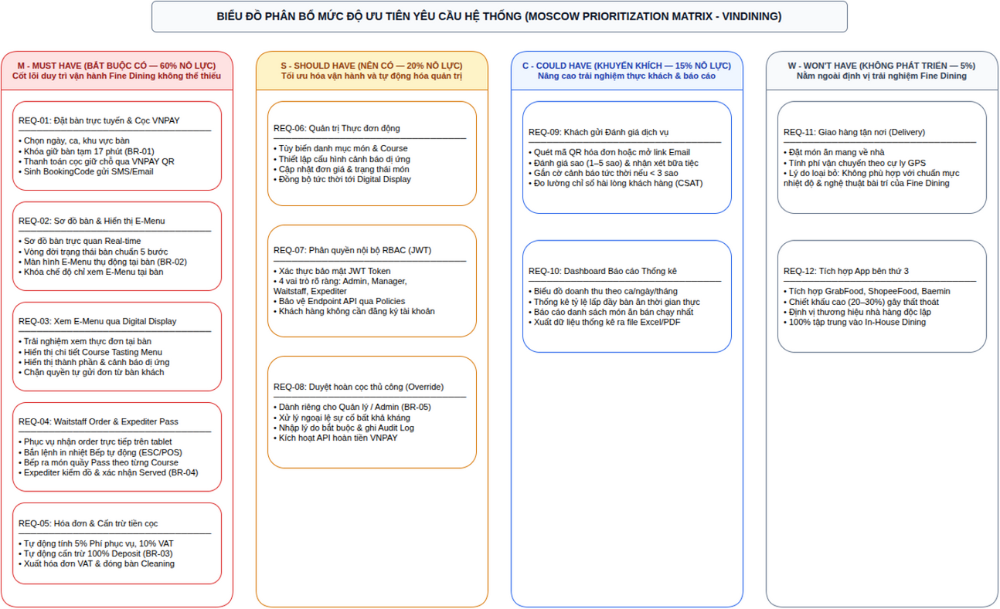
> 📐 **Tệp thiết kế Draw.io**: [`moscow_prioritization.drawio`](./drawio/moscow_prioritization.drawio)

#### M - Must Have (Bắt buộc phải có trong phiên bản hiện tại):
* **REQ-01**: Đặt bàn trực tuyến, lựa chọn ngày/ca/vị trí bàn và thực hiện thanh toán đặt cọc giữ chỗ (Deposit) qua cổng VNPAY (khóa giữ chỗ tạm 17 phút theo `BR-01`).
* **REQ-02**: Quản lý sơ đồ bàn trực quan, quản lý vòng đời trạng thái bàn (`Available` $\rightarrow$ `LockedForPayment` $\rightarrow$ `Reserved` $\rightarrow$ `Occupied` $\rightarrow$ `Cleaning`) và ghép nối thiết bị Digital Display theo từng bàn (`BR-02`).
* **REQ-03**: Khách xem thực đơn qua màn hình Digital Display tại bàn (chỉ xem E-Menu, nhân viên phục vụ nhận order trực tiếp).
* **REQ-04**: Nhân viên phục vụ tiếp nhận yêu cầu, tạo đơn trực tiếp trên thiết bị di động và kích hoạt in Bếp; Nhân viên Checkfood tại quầy Pass đối chiếu món và xác nhận hoàn thành (`BR-04`).
* **REQ-05**: Lập hóa đơn thanh toán tự động cấn trừ tiền cọc đặt trước, tính phí dịch vụ 5%, VAT 10% theo công thức `BR-03` và đóng bàn chuyển sang `Cleaning`.

#### S - Should Have (Quan trọng cần có để tối ưu vận hành):
* **REQ-06**: Quản trị danh mục thực đơn động tùy biến cao (A La Carte, Category món ăn, cảnh báo dị ứng thực phẩm).
* **REQ-07**: Cơ chế phân quyền tài khoản nội bộ Role-Based Access Control (Admin, Manager, Waitstaff, Expediter) xác thực bằng JWT Bearer Token. Khách hàng không duy trì tài khoản.
* **REQ-08**: Cơ chế duyệt hoàn tiền cọc thủ công ngoại lệ (Manual Refund Override) dành riêng cho cấp Quản lý khi khách gặp sự cố bất khả kháng (`BR-05`).

#### C - Could Have (Khuyến khích có nếu đủ thời gian):
* **REQ-09**: Khách hàng gửi đánh giá sao (1–5 sao) và phản hồi trực tiếp về chất lượng dịch vụ trên Web sau bữa ăn.
* **REQ-10**: Dashboard báo cáo thống kê trực quan doanh thu theo ca/ngày/tháng và các món ăn bán chạy nhất.

#### W - Won't Have (Không phát triển trong khuôn khổ đồ án hiện tại):
* **REQ-11**: Module Giao hàng tận nơi (Online Delivery) và tính phí vận chuyển theo khoảng cách (không phù hợp với định vị Fine Dining).
* **REQ-12**: Tích hợp API với các hãng giao nhận thức ăn bên thứ ba (GrabFood, ShopeeFood).

---

## CHƯƠNG 3: MÔ TẢ GIẢI PHÁP & KIẾN TRÚC KỸ THUẬT

### 3.1 Kiến trúc tổng thể hệ thống (Clean Architecture & 3-Layer)
Hệ thống được thiết kế theo mô hình **Client-Server phân tách hoàn toàn**, tầng Backend áp dụng chuẩn **Clean Architecture** kết hợp mô hình **CQRS** với **MediatR** nhằm đảm bảo nguyên tắc **SOLID**, khả năng mở rộng và kiểm thử độc lập:

> 📐 **Tệp thiết kế Draw.io**: [`architecture_clean_arch.drawio`](./drawio/architecture_clean_arch.drawio)

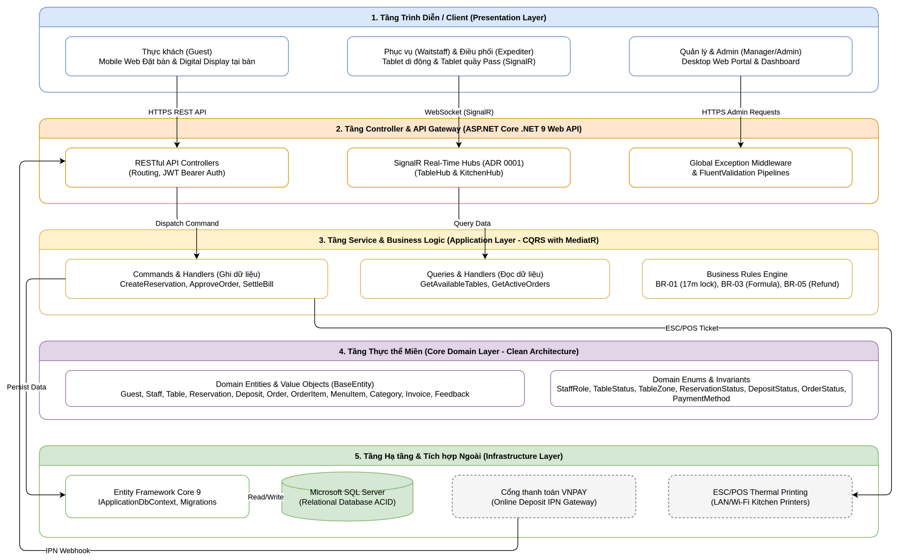
> 📐 **Tệp thiết kế Draw.io**: [`architecture_clean_arch.drawio`](./drawio/architecture_clean_arch.drawio)
> *(Tệp thiết kế tương ứng: `./drawio/architecture_clean_arch.drawio`)*

### 3.2 Bảng công nghệ sử dụng (Technology Stack)

| Phân tầng (Layer) | Công nghệ / Thư viện | Vai trò & Lý do lựa chọn |
| :--- | :--- | :--- |
| **Frontend Framework** | **React 18 + TypeScript (Vite)** | Đảm bảo tốc độ render nhanh, type-safe, Single Page Application tối ưu trải nghiệm người dùng. |
| **UI & Styling** | **Tailwind CSS + Lucide Icons** | Thiết kế giao diện sang trọng chuẩn Fine Dining, Responsive mượt mà trên Mobile/Tablet/Desktop. |
| **Frontend State & Cache** | **TanStack Query + Zustand** | Quản lý Server Cache và Client State nhẹ nhàng, hạn chế tối đa re-render thừa. |
| **Backend Framework** | **ASP.NET Core (.NET 9) Web API** | Hiệu năng xử lý cao, kiến trúc chuẩn Enterprise, hỗ trợ DI và async/await mạnh mẽ. |
| **Architectural Pattern** | **Clean Architecture + CQRS (MediatR)** | Tách biệt nghiệp vụ đọc/ghi, tuân thủ nguyên tắc SOLID, dễ mở rộng và bảo trì. |
| **Database & ORM** | **Microsoft SQL Server + EF Core 9** | Hệ CSDL quan hệ vững chắc, hỗ trợ Transaction ACID, Code-First Migrations chuẩn hóa. |
| **Real-time Protocol** | **ASP.NET Core SignalR Client/Server** | Truyền phát thông báo đơn mới, đồng bộ trạng thái sơ đồ bàn tức thời với độ trễ < 100ms. |
| **Thanh toán trực tuyến** | **Cổng thanh toán VNPAY (Sandbox API)** | Xử lý thanh toán cọc trực tuyến an toàn với cơ chế IPN xác thực giao dịch thời gian thực. |
| **In ấn hóa đơn & Bếp** | **ESC/POS Web Printing / LAN Printer** | Gửi lệnh in trực tiếp ra máy in nhiệt tại các phân khu bếp và quầy thu ngân. |

---

## CHƯƠNG 4: DANH MỤC PHÂN HỆ CHỨC NĂNG CỐT LÕI

Hệ thống được tổ chức nhất quán thành **4 Phân hệ chức năng** bám sát 15 Use Case chuẩn hóa:

1. **Phân hệ 1: Khách hàng (Guest / Public Subsystem — `UC-U1` $\rightarrow$ `UC-U4`)**:
   - Đặt bàn trực tuyến, chọn khu vực bàn, ca hẹn và thanh toán tiền cọc giữ chỗ cố định qua cổng VNPAY (khóa bàn tạm 17 phút theo `BR-01`). Khách không cần tài khoản.
   - Xem danh mục thực đơn A La Carte và cảnh báo dị ứng trên thiết bị Digital Display tại bàn (`BR-02`).
   - Tự động hoàn cọc 100% khi khách hủy bàn trước giờ hẹn $\ge$ 4 tiếng (`BR-05`).
   - Gửi đánh giá sao và phản hồi chất lượng dịch vụ sau khi dùng bữa.

2. **Phân hệ 2: Nghiệp vụ Nhân viên Nội bộ (Employee Subsystem — `UC-E1` $\rightarrow$ `UC-E5`)**:
   - Đăng nhập an toàn bằng tài khoản nhân sự với JWT Bearer Token (`UC-E5`).
   - Nhân viên phục vụ (Waitstaff) theo dõi sơ đồ bàn real-time, check-in khách vào bàn (`Occupied`), tạo đơn gọi món trực tiếp tại bàn và tự động kích hoạt in phiếu Bếp (`UC-E1`).
   - Nhân viên Điều phối (Expediter) tại quầy Pass kiểm tra món và bấm xác nhận "Đã phục vụ" (`Served`) theo quy tắc `BR-04` (`UC-E2`).
   - Tự động tính toán hóa đơn cấn trừ tiền cọc (`BR-03`), đóng bàn và chuyển trạng thái sang `Cleaning` (`UC-E3`).
   - Hỗ trợ đổi bàn hoặc ghép nhiều bàn ăn theo yêu cầu thực tế của khách (`UC-E4`).

3. **Phân hệ 3: Quản lý & Quản trị (Admin & Manager Subsystem — `UC-A1` $\rightarrow$ `UC-A5`)**:
   - Quản trị danh mục thực đơn, cập nhật giá, quản lý trạng thái còn/hết món và thông tin dị ứng (`UC-A1`).
   - Thiết lập và cấu hình sơ đồ bàn ăn trực quan 2D theo từng khu vực (`UC-A2`, `BR-02`).
   - Quản lý duyệt hoàn tiền cọc thủ công (Manual Refund Override) khi có sự cố bất khả kháng (`UC-A3`, `BR-05`).
   - Quản trị tài khoản nhân viên nội bộ và phân quyền RBAC (`UC-A4`).
   - Báo cáo thống kê trực quan doanh thu, tỷ lệ lấp đầy bàn và món ăn bán chạy (`UC-A5`).

4. **Phân hệ 4: Tự động Hệ thống (System Background Subsystem — `UC-S1`)**:
   - Tác vụ nền ngầm (Background Worker) định kỳ mỗi 60 giây quét và tự động giải phóng các vị trí bàn giữ cọc quá 17 phút (`BR-01`) mà chưa nhận được xác nhận IPN thanh toán, đưa bàn về trạng thái `Available` và bắn thông báo SignalR Hub.

---

---

## CHƯƠNG 5: KẾT QUẢ DỰ KIẾN & TIÊU CHÍ ĐÁNH GIÁ

1. **Sản phẩm Phần mềm**:
   - Backend ASP.NET Core Web API .NET 9 hoàn chỉnh, bảo mật JWT, kết nối SQL Server và tích hợp cổng VNPAY Sandbox.
   - Frontend React SPA chuẩn Responsive chạy mượt mà trên Mobile/Tablet (E-Menu Digital Display), Tablet (Nhân viên phục vụ) và Desktop (Quản trị viên).
   - Tín hiệu Real-time qua SignalR đồng bộ tức thời trạng thái bàn và đơn gọi món mới.
2. **Bộ Tài liệu Đồ án**:
   - Bộ hồ sơ phân tích và thiết kế phần mềm hoàn chỉnh: BRS, Báo cáo khảo sát, Báo cáo phân tích hệ thống (Use Case, Activity, Sequence Diagrams), Thiết kế CSDL (ERD) và Tài liệu thiết kế kiến trúc (SDD).
   - Mã nguồn chuẩn Clean Architecture được quản lý phiên bản rõ ràng trên Git/GitHub.

================================================================================

# PHẦN II: BÁO CÁO KHẢO SÁT HIỆN TRẠNG & ĐÁNH GIÁ TÍNH KHẢ THI (TÓM LƯỢC)

# BÁO CÁO KHẢO SÁT HỆ THỐNG & ĐÁNH GIÁ TÍNH KHẢ THI
## Dự án: Hệ thống Quản lý và Đặt bàn Nhà hàng Fine Dining (VinDining)

---

### THÔNG TIN TÀI LIỆU
* **Tên tài liệu**: Báo cáo Khảo sát Hiện trạng & Đánh giá Tính khả thi (System Survey & Feasibility Study Report)
* **Dự án**: VinDining — Fine Dining Restaurant Management & Reservation System
* **Giai đoạn**: Phase 1 (Tuần 1–2) — Proposal & Requirement Analysis
* **Nhóm thực hiện**: Nguyễn Mạnh Quyền, Đặng Quốc Khánh, Nguyễn Hoàng Đạt
* **Giảng viên hướng dẫn**: ThS. Phạm Hữu Tùng

---

## CHƯƠNG 1: KHẢO SÁT HIỆN TRẠNG QUY TRÌNH VẬN HÀNH FINE DINING THỰC TẾ

### 1.1 Khảo sát quy trình Đặt bàn & Thu cọc thủ công
Trong các nhà hàng Fine Dining truyền thống hiện nay tại Việt Nam, quy trình đặt bàn chủ yếu diễn ra qua điện thoại (Hotline), Fanpage Facebook/Instagram hoặc ứng dụng nhắn tin (Zalo):

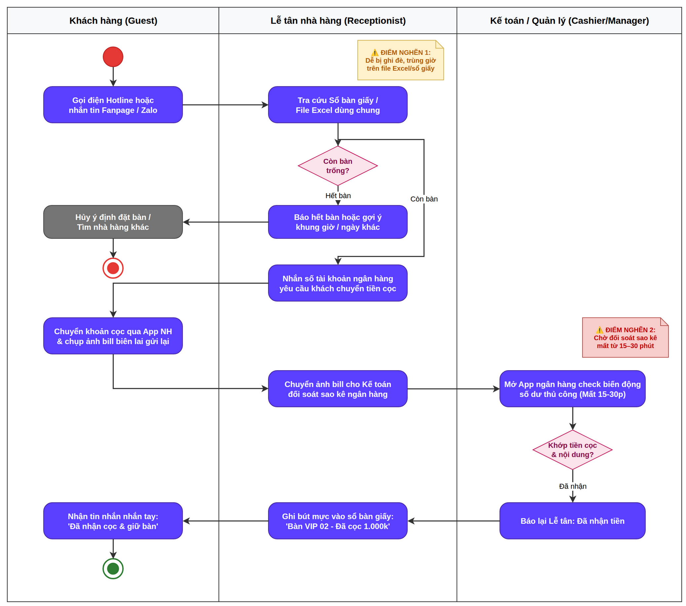
> 📐 **Tệp thiết kế Draw.io**: [`asis01_survey_reservation.drawio`](./drawio/asis01_survey_reservation.drawio)
> *(Tệp thiết kế tương ứng: `./drawio/asis01_survey_reservation.drawio`)*

#### Các hạn chế và điểm nghẽn phát hiện qua khảo sát:
* **Tốn kém thời gian đối soát**: Mất từ 15–30 phút để xác minh biên lai chuyển khoản ngân hàng; vào các khung giờ ngoài giờ hành chính, việc kiểm tra sao kê thường bị gián đoạn.
* **Nguy cơ nhầm lẫn thông tin**: Sổ bàn bằng giấy hoặc file Excel dùng chung giữa các nhân viên dễ bị ghi đè, trùng lặp khung giờ hoặc thất lạc ghi chú yêu cầu bàn tiệc (kỷ niệm ngày cưới, tiếp đối tác VIP).

---

### 1.2 Khảo sát quy trình Gọi món & Điều phối Bếp truyền thống
Đặc thù của ẩm thực Fine Dining là các set ăn công phu (**Tasting Menu**) phân chia theo các nhóm món (**Course**: Khai vị $\rightarrow$ Món chính $\rightarrow$ Tráng miệng) và kết hợp đồ uống/rượu vang (**Wine Pairing**):

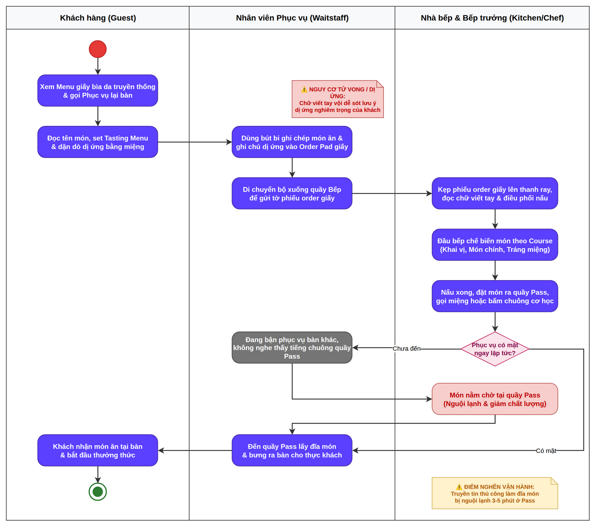
> 📐 **Tệp thiết kế Draw.io**: [`asis02_survey_ordering.drawio`](./drawio/asis02_survey_ordering.drawio)
> *(Tệp thiết kế tương ứng: `./drawio/asis02_survey_ordering.drawio`)*

#### Các hạn chế và điểm nghẽn phát hiện qua khảo sát:
* **Thất lạc hoặc ghi sai cảnh báo dị ứng thực phẩm**: Đây là rủi ro y tế và uy tín nghiêm trọng nhất. Chữ viết tay vội vã của nhân viên trên phiếu order giấy dễ khiến đầu bếp bỏ sót ghi chú dị ứng nghiêm trọng (dị ứng hải sản, hạt, bơ sữa, gluten).
* **Nguội lạnh món ăn do trễ truyền tin**: Khi bếp nấu xong và đặt ra quầy Pass, nếu nhân viên phục vụ đang bận ở khu vực khác mà không nghe thấy tiếng chuông/tiếng gọi miệng, đĩa ăn sẽ bị giảm nhiệt độ và hương vị chuẩn mực của ẩm thực cao cấp.

---

### 1.3 Khảo sát quy trình Thanh toán & Cấn trừ cọc cuối bữa
Khi khách kết thúc bữa ăn, quy trình thanh toán diễn ra như sau:

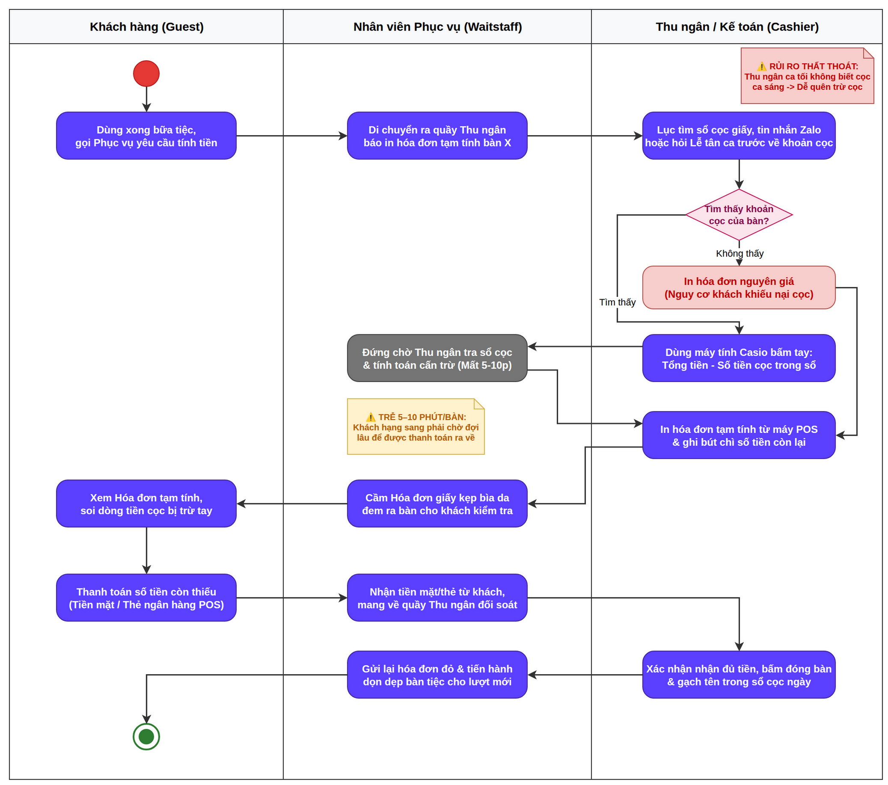
> 📐 **Tệp thiết kế Draw.io**: [`asis03_survey_billing.drawio`](./drawio/asis03_survey_billing.drawio)
> *(Tệp thiết kế tương ứng: `./drawio/asis03_survey_billing.drawio`)*

#### Các hạn chế và điểm nghẽn phát hiện qua khảo sát:
* **Thất thoát hoặc quên cấn trừ tiền cọc**: Thu ngân ca tối có thể không nắm được khoản tiền cọc khách đã chuyển khoản cho ca sáng, dẫn đến tính thừa tiền của khách hoặc phải mất thời gian tra soát lại lịch sử giao dịch.
* **Thời gian chờ đợi kéo dài**: Thời gian trung bình để xuất một hóa đơn cấn cọc thủ công mất từ 5–10 phút, gây cảm giác khó chịu cho khách hàng ở phân khúc cao cấp.

---

### 1.4 Ma trận phân tích điểm nghẽn & Tổn thất vận hành (Pain Points Matrix)

| Nhóm điểm nghẽn | Biểu hiện thực tế | Tác động định lượng & Rủi ro | Mức độ nghiêm trọng |
| :--- | :--- | :--- | :---: |
| **No-show (Bùng bàn)** | Khách đặt bàn đẹp nhưng không đến và không báo trước. | Chi phí hủy nguyên liệu cao cấp nhập khẩu (bò Wagyu, gan ngỗng, nấm Truffle) ước tính tổn thất **10–15% doanh thu ngày**. | **Rất cao (Critical)** |
| **Sai sót dị ứng** | Bếp nấu lẫn nguyên liệu khách bị dị ứng do phiếu ghi tay bị nhòe/sót. | Nguy cơ sốc phản vệ cho khách hàng, tổn hại nghiêm trọng uy tín thương hiệu nhà hàng. | **Nguy cấp (Fatal)** |
| **Trễ nhiệt độ món ăn** | Món chín nằm tại quầy Pass quá 3–5 phút trước khi được bưng ra bàn. | Giảm chất lượng món ăn cao cấp, trải nghiệm ẩm thực không xứng đáng với mức giá. | **Cao (Major)** |
| **Sai sót cấn trừ cọc** | Thu ngân tính nhầm hoặc quên trừ khoản cọc ban đầu của khách. | Gây tranh cãi với khách hàng tại quầy, mất trung bình **7–10 phút/bàn** để đối soát. | **Trung bình (Moderate)** |

---

## CHƯƠNG 2: KHẢO SÁT & ĐÁNH GIÁ CÁC GIẢI PHÁP PHẦN MỀM HIỆN CÓ

### 2.1 Khảo sát các giải pháp phần mềm tại thị trường Việt Nam

#### 1. iPOS.vn (iPOS POS & iPOS Booking):
* **Ưu điểm**: Phổ biến rộng rãi tại thị trường F&B Việt Nam, hỗ trợ in hóa đơn, in bếp và quản lý kho nguyên vật liệu mạnh mẽ.
* **Nhược điểm đối với Fine Dining**:
  - Giao diện đặt bàn và menu QR thiên về mô hình quán ăn nhanh / cà phê / buffet bình dân; thiếu tính thẩm mỹ sang trọng của Fine Dining.
  - Tính năng đặt cọc giữ bàn trực tuyến qua cổng thanh toán chưa được tối ưu mượt mà và thiếu cơ chế tự động cấn trừ đa điều kiện trên hóa đơn.

#### 2. CukCuk (MISA):
* **Ưu điểm**: Quản trị chuỗi nhà hàng tốt, báo cáo tài chính kế toán chuyên sâu.
* **Nhược điểm đối với Fine Dining**:
  - Giao diện người dùng trên thiết bị di động phức tạp, nhiều thao tác dư thừa đối với khách hàng quét mã QR.
  - Chưa hỗ trợ chuyên biệt quy trình phân loại Course Tasting Menu và cảnh báo dị ứng trực quan thời gian thực.

---

### 2.2 Khảo sát các giải pháp phần mềm quốc tế

#### 1. OpenTable / SevenRooms:
* **Ưu điểm**: Tiêu chuẩn vàng toàn cầu cho nhà hàng cao cấp (Fine Dining); quản lý đặt bàn trực tuyến, thu cọc bằng thẻ tín dụng (Stripe) và lưu trữ hồ sơ sở thích khách hàng (Guest Profile) rất chi tiết.
* **Nhược điểm**:
  - Chi phí bản quyền và phí duy trì hàng tháng cực kỳ đắt đỏ (\$249 – \$700+/tháng kèm phí commission trên mỗi lượt đặt chỗ).
  - Chưa tích hợp nội địa hóa các cổng thanh toán Việt Nam (như VNPAY, MoMo, VietQR) và ngôn ngữ tiếng Việt còn hạn chế.

#### 2. Toast POS:
* **Ưu điểm**: Tích hợp phần cứng POS, máy in nhiệt và phần mềm đám mây rất mượt mà.
* **Nhược điểm**: Chỉ triển khai tại thị trường Bắc Mỹ, bắt buộc sử dụng phần cứng độc quyền của hãng, không khả thi áp dụng tại Việt Nam.

---

### 2.3 Bảng so sánh ma trận tính năng (Feature Comparison Matrix)

| Tiêu chí so sánh | iPOS.vn | CukCuk | OpenTable | SevenRooms | **VinDining (Đề xuất)** |
| :--- | :---: | :---: | :---: | :---: | :---: |
| **Phù hợp phân khúc Fine Dining** | Trung bình | Thấp | Rất cao | Rất cao | **Rất cao (Chuyên biệt)** |
| **Đặt cọc trực tuyến cổng VN (VNPAY)** | Hạn chế | Không | Không (Chỉ Stripe) | Không (Chỉ Stripe) | **Có (VNPAY IPN tự động)** |
| **Tự động cấn trừ cọc trên Hóa đơn** | Thủ công | Thủ công | Tự động | Tự động | **Tự động 100% (BR-03)** |
| **E-Menu Digital Display gắn theo Bàn** | Hạn chế | Không | Không | Hạn chế | **Có (Màn hình Tablet hiển thị tại bàn - BR-02)** |
| **In Bếp tự động & Nổi bật cảnh báo dị ứng** | Có | Có | Hạn chế | Hạn chế | **Có (In nhiệt ESC/POS)** |
| **Đồng bộ thời gian thực (SignalR / WebSocket)** | Polling | Polling | WebSocket | WebSocket | **SignalR (Độ trễ < 100ms)** |
| **Chi phí triển khai & Tự chủ công nghệ** | Thuê bao tháng | Thuê bao tháng | Rất đắt | Rất đắt | **Mã nguồn mở / Tự chủ 100%** |

---

### 2.4 Gap Analysis & Động lực xây dựng hệ thống VinDining
Từ kết quả khảo sát trên, nhóm nhận thấy một khoảng trống thị trường rõ rệt: **Thị trường Việt Nam đang thiếu một giải pháp chuyên biệt cho nhà hàng Fine Dining vừa đáp ứng tiêu chuẩn trải nghiệm dịch vụ cao cấp, vừa tích hợp liền mạch cổng thanh toán nội địa VNPAY để giải quyết triệt để bài toán No-show và Cấn trừ cọc tự động.**

Do đó, việc phát triển **Hệ thống VinDining** là hoàn toàn cấp thiết, mang tính ứng dụng thực tiễn cao và lấp đầy khoảng trống của các phần mềm hiện hành.

---

## CHƯƠNG 3: KHẢO SÁT NHU CẦU NGƯỜI DÙNG (STAKEHOLDER NEEDS ASSESSMENT)

Nhóm đã tiến hành khảo sát và tổng hợp yêu cầu từ 5 nhóm tác nhân chính trong chu trình vận hành:

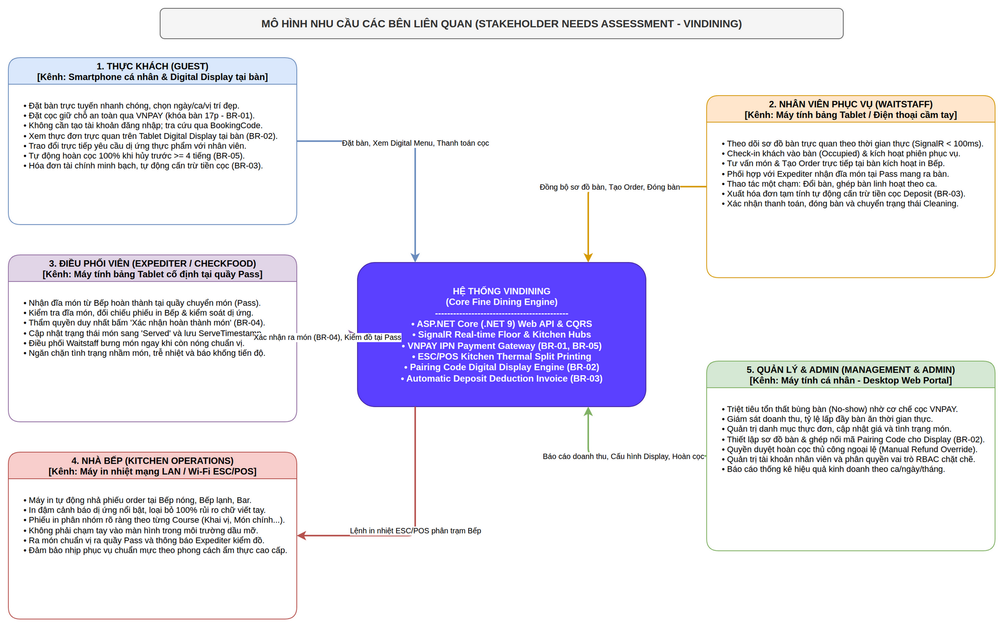
> 📐 **Tệp thiết kế Draw.io**: [`stakeholder_needs.drawio`](./drawio/stakeholder_needs.drawio)
> *(Tệp thiết kế tương ứng: `./drawio/stakeholder_needs.drawio`)*

### Bảng tổng hợp nhu cầu & Kỳ vọng chi tiết:

| Nhóm đối tượng | Kênh tương tác | Nhu cầu & Kỳ vọng cốt lõi | Yêu cầu hệ thống đáp ứng |
| :--- | :--- | :--- | :--- |
| **Thực khách (Guest)** | Smartphone cá nhân & Digital Display tại bàn | Đặt bàn nhanh chóng; thanh toán cọc an toàn; xem thực đơn hình ảnh bắt mắt tại bàn; ghi chú dị ứng chuẩn xác; hóa đơn minh bạch. Khách không cần tạo tài khoản. | Web Responsive mượt mà, tích hợp VNPAY, ứng dụng Digital Display tại bàn chỉ xem (`BR-02`). |
| **Nhân viên Phục vụ (Waitstaff)** | Tablet / Điện thoại cầm tay | Nắm bắt sơ đồ bàn trực quan; check-in khách; tạo order trực tiếp tại bàn kích hoạt in Bếp; bưng món; xuất hóa đơn cấn trừ cọc tức thời. | SignalR Hub truyền nhận tín hiệu < 100ms, giao diện một chạm (One-touch action) tối ưu trên tablet. |
| **Nhân viên Điều phối (Expediter)** | Tablet cố định tại quầy Pass | Kiểm tra món ăn từ Bếp ra, đối chiếu phiếu in, bấm xác nhận hoàn thành món (`BR-04`) và điều phối Waitstaff bưng ra bàn. | Giao diện điều phối trực quan tại Pass, nút xác nhận `Served` thời gian thực. |
| **Nhà bếp (Kitchen Operations)** | Máy in nhiệt phân khu (Bếp nóng, Bếp lạnh, Bar) | Nhận phiếu order in rõ ràng số bàn, tên món, Course và in đậm ghi chú dị ứng nguy hiểm; không phải thao tác màn hình cảm ứng trong môi trường dầu mỡ. | Lệnh in ESC/POS tự động phân loại trạm in (Station split printing) ngay khi phục vụ gửi order. |
| **Quản lý & Admin (Manager/Admin)** | Máy tính cá nhân (Desktop Web) | Giám sát tỷ lệ lấp đầy bàn ăn; theo dõi doanh thu theo ca/ngày; quản trị danh mục thực đơn; ghép nối thiết bị Digital Display; phân quyền RBAC và duyệt hoàn cọc ngoại lệ. | Web Portal trang bị biểu đồ thống kê, phân quyền RBAC chặt chẽ và tính năng Manual Refund Override (`BR-05`). |

---

## CHƯƠNG 4: BÁO CÁO NGHIÊN CỨU TÍNH KHẢ THI (FEASIBILITY STUDY)

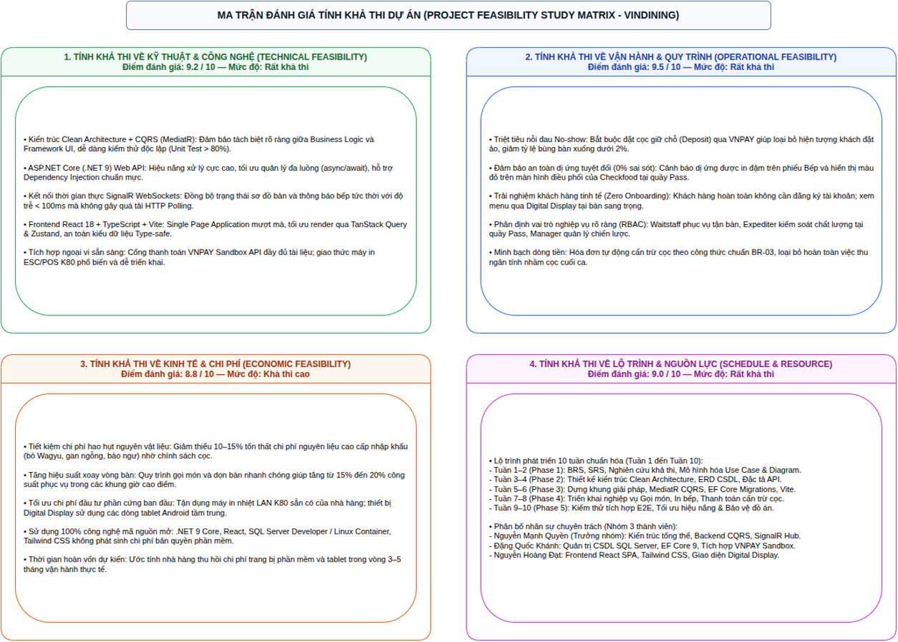
> 📐 **Tệp thiết kế Draw.io**: [`feasibility_matrix.drawio`](./drawio/feasibility_matrix.drawio)

### 4.1 Tính khả thi về mặt Kỹ thuật (Technical Feasibility)
* **Backend (.NET 9 + ASP.NET Core Web API)**: Cung cấp nền tảng xử lý đa luồng mạnh mẽ, hỗ trợ Dependency Injection, Entity Framework Core 9 tối ưu truy vấn SQL Server, và SignalR Hub tích hợp sẵn cho giao tiếp WebSocket hai chiều.
* **Frontend (React + Vite + Tailwind CSS)**: Đảm bảo thời gian tải trang ban đầu dưới 1.5 giây, tương thích hoàn hảo với mọi trình duyệt di động (iOS Safari, Android Chrome) mà không gặp rào cản phân mảnh hệ điều hành.
* **Tích hợp bên ngoài (VNPAY Sandbox & Web Printing)**:
  - Cổng VNPAY cung cấp tài liệu API chuẩn và môi trường Sandbox kiểm thử giao dịch thanh toán IPN đầy đủ.
  - Giao thức in ấn qua mạng LAN/Wi-Fi sử dụng chuẩn ESC/POS thông dụng, dễ dàng kiểm thử và triển khai trên các thiết bị máy in nhiệt K80/K57 tiêu chuẩn.
* $\rightarrow$ **Kết luận kỹ thuật**: **Khả thi 100%**.

### 4.2 Tính khả thi về mặt Vận hành (Operational Feasibility)
* Hệ thống được thiết kế theo tư duy tối giản thao tác:
  - Khách hàng hoàn toàn không cần đăng ký tài khoản; xem thực đơn trực quan qua Digital Display tại bàn và được nhân viên phục vụ tận tình theo chuẩn Fine Dining.
  - Nhân viên phục vụ thao tác trên màn hình cảm ứng với các nút bấm trực quan, giảm thiểu thời gian đào tạo nhân sự mới xuống dưới 30 phút.
  - Nhà bếp giữ nguyên thói quen nhìn phiếu in truyền thống nhưng phiếu in giờ đây chuẩn xác, rõ ràng và không thể thất lạc.
* $\rightarrow$ **Kết luận vận hành**: **Rất thuận tiện và dễ tiếp nhận**.

### 4.3 Tính khả thi về mặt Kinh tế (Economic Feasibility)
* **Cắt giảm tổn thất No-show**: Bắt buộc đặt cọc giữ bàn giúp giảm tỷ lệ bùng bàn từ 15% xuống dưới 2%, bảo vệ doanh thu nguyên liệu đắt đỏ cho nhà hàng.
* **Tăng hiệu suất xoay vòng bàn**: Giảm thời gian trễ trong khâu gọi món, in bếp và thanh toán từ 25 phút/bàn xuống dưới 5 phút/bàn, giúp nhà hàng phục vụ thêm từ 15% – 20% lượt khách trong giờ cao điểm.
* $\rightarrow$ **Kết luận kinh tế**: **Hiệu quả đầu tư (ROI) rất cao**.

### 4.4 Tính khả thi về mặt Thời gian & Lộ trình (Schedule Feasibility)
* Dự án được phân rã thành 5 giai đoạn rõ ràng trong 10 tuần, với sự tham gia của 3 thành viên kỹ thuật.
* Các công nghệ cốt lõi đều nằm trong phạm vi kiến thức chuyên ngành và được hỗ trợ bởi các thư viện tiêu chuẩn của hệ sinh thái Microsoft & React.
* $\rightarrow$ **Kết luận thời gian**: **Khả thi hoàn thành đúng hạn 10 tuần**.

---

## CHƯƠNG 5: KẾT LUẬN & ĐỀ XUẤT HƯỚNG TRIỂN KHAI

Báo cáo khảo sát đã chứng minh rõ ràng tính cấp thiết, tính mới và tính khả thi toàn diện của Dự án **Hệ thống Quản lý và Đặt bàn Nhà hàng Fine Dining (VinDining)**.

Nhóm đề xuất chuyển ngay sang **Báo cáo Phân tích Hệ thống (System Analysis Report)** để chi tiết hóa các mô hình Use Case, sơ đồ Activity, sơ đồ Sequence và ma trận quy tắc nghiệp vụ làm cơ sở vững chắc cho giai đoạn Thiết kế Kiến trúc (Design) ở Tuần 3–4.

================================================================================

# PHẦN III: BÁO CÁO PHÂN TÍCH YÊU CẦU & MÔ HÌNH HÓA HỆ THỐNG (CHI TIẾT ĐẦY ĐỦ)

# BÁO CÁO PHÂN TÍCH HỆ THỐNG (SYSTEM ANALYSIS REPORT)
## Dự án: Hệ thống Quản lý và Đặt bàn Nhà hàng Fine Dining (VinDining)

---

### THÔNG TIN TÀI LIỆU
* **Tên tài liệu**: Báo cáo Phân tích Yêu cầu & Mô hình hóa Hệ thống (System Analysis & Modeling Report)
* **Dự án**: VinDining — Fine Dining Restaurant Management & Reservation System
* **Giai đoạn**: Phase 1 (Tuần 1–2) — Proposal & Requirement Analysis
* **Nhóm thực hiện**: Nguyễn Mạnh Quyền, Đặng Quốc Khánh, Nguyễn Hoàng Đạt
* **Giảng viên hướng dẫn**: ThS. Phạm Hữu Tùng

---

## CHƯƠNG 1: TỔNG QUAN TÁC NHÂN & MA TRẬN PHÂN QUYỀN (STAKEHOLDER & RBAC)

### 1.1 Danh mục Tác nhân Hệ thống (System Actors)

| Tác nhân (Actor)                                | Phân loại                | Thiết bị / Nền tảng                               | Phạm vi quyền hạn trong hệ thống                                                                                                                                                                                                                                                                         | Mục tiêu cốt lõi                                                                                                     |
| :------------------------------------------------| :-------------------------| :--------------------------------------------------| :---------------------------------------------------------------------------------------------------------------------------------------------------------------------------------------------------------------------------------------------------------------------------------------------------------| :---------------------------------------------------------------------------------------------------------------------|
| **Khách hàng (Guest)**                          | Tác nhân chính (Primary) | Smartphone cá nhân *(Mobile Web Responsive)*      | - Tìm kiếm, chọn bàn, đặt bàn trực tuyến. - Thanh toán cọc giữ chỗ qua cổng VNPAY. - Xem thực đơn qua màn hình Digital Display tại bàn (chỉ xem). - Theo dõi trạng thái món và yêu cầu thanh toán.                                                                                              | Đặt chỗ nhanh chóng, minh bạch cọc; tự do gọi món không phải chờ đợi; đảm bảo an toàn tuyệt đối về dị ứng thực phẩm. |
| **Nhân viên Phục vụ (Waitstaff)**               | Tác nhân chính (Primary) | Điện thoại / Tablet cầm tay *(Mobile/Tablet Web)* | - Xem sơ đồ bàn ăn và check-in khách đến bàn (`Occupied`). - Tiếp nhận yêu cầu gọi món từ khách, tư vấn dị ứng. - Bấm tạo đơn trực tiếp (Create Order) và kích hoạt lệnh in phiếu Bếp tự động. - Bưng món từ quầy Pass ra bàn. - Xuất hóa đơn tạm tính cấn trừ cọc và đóng bàn (`Cleaning`). | Phục vụ tận tình; giảm sai sót ghi nhận đơn thủ công.                                                                |
| **Nhân viên Điều phối (Expediter / Checkfood)** | Tác nhân chính (Primary) | Tablet cố định tại quầy Pass                      | - Nhận món từ nhà bếp đặt ra quầy Pass. - Đối chiếu phiếu Bếp, kiểm tra chất lượng. - Bấm "Xác nhận hoàn thành món" (Served) trên hệ thống. - Điều phối Waitstaff bưng món ra bàn.                                                                                                              | Đảm bảo 100% món ăn đúng bàn, đúng khách, đúng yêu cầu dị ứng; kiểm soát mốc thời gian ra món chính xác.             |
| **Quản lý (Manager)**                           | Tác nhân chính (Primary) | Máy tính cá nhân *(Desktop Web Portal)*           | - Quản lý thực đơn (Danh mục món ăn, giá bán). - Thiết lập sơ đồ bàn ăn và kết nối thiết bị Digital Display cho từng bàn. - Xem báo cáo thống kê doanh thu và tỷ lệ lấp đầy bàn thời gian thực. - Thực hiện duyệt hoàn tiền cọc thủ công (*Manual Refund Override*) khi có sự cố bất khả kháng. | Giám sát toàn diện vận hành nhà hàng; kiểm soát doanh thu chặt chẽ; linh hoạt xử lý khiếu nại khách hàng.            |
| **Quản trị viên (Admin)**                       | Tác nhân chính (Primary) | Máy tính cá nhân *(Desktop Web Portal)*           | - Quản trị danh sách tài khoản người dùng và gán quyền (RBAC). - Cấu hình tham số hệ thống (thời gian giữ bàn, tỷ lệ VAT, phí dịch vụ). - Giám sát nhật ký hệ thống (System Logs) và sao lưu dữ liệu.                                                                                              | Đảm bảo tính toàn vẹn, bảo mật và sự hoạt động ổn định liên tục của toàn bộ nền tảng.                                |
| **Cổng thanh toán VNPAY**                       | Tác nhân phụ (Secondary) | Hệ thống máy chủ VNPAY Gateway                    | - Tiếp nhận yêu cầu thanh toán cọc trực tuyến. - Xử lý giao dịch thẻ/QR ngân hàng và gửi tín hiệu xác nhận tức thời (IPN callback) về Backend hệ thống.                                                                                                                                               | Đảm bảo giao dịch thanh toán an toàn, chính xác và bảo mật.                                                          |
| **Máy in nhiệt Bếp (Kitchen Printer)**          | Tác nhân phụ (Secondary) | Máy in nhiệt mạng LAN/Wi-Fi (ESC/POS)             | - Tự động nhả phiếu order vật lý tại các trạm Bếp nóng, Bếp lạnh, Bar ngay khi nhận lệnh in từ hệ thống.                                                                                                                                                                                                 | Cung cấp phiếu in chế biến rõ ràng, in đậm cảnh báo dị ứng cho đầu bếp thao tác.                                     |

> [!NOTE]
> **Ranh giới nghiệp vụ Nhà bếp (Kitchen)**: Trong mô hình VinDining, **Nhà bếp (Kitchen/Chef) không phải là tác nhân tương tác trực tiếp với giao diện phần mềm**. Đầu bếp nhận lệnh thông qua phiếu in nhiệt tự động và đặt món ra quầy chuyển món (Pass) để nhân viên phục vụ tiếp nhận. Điều này giúp tối ưu hóa thao tác, loại bỏ màn hình cảm ứng dễ bám bẩn trong khu vực bếp.

---

### 1.2 Ma trận phân quyền chức năng (Role-Based Access Control - RBAC)

| Phân hệ chức năng               | Chức năng chi tiết                              | Khách hàng (Guest) | Phục vụ (Waitstaff) | Quản lý (Manager) | Quản trị (Admin) |
| :--------------------------------| :------------------------------------------------| :------------------:| :-------------------:| :-----------------:| :----------------:|
| **Tài khoản & Hồ sơ**           | Đăng nhập hệ thống (Nội bộ)                     | ✗                  | ✓                   | ✓                 | ✓                |
|                                 | Quản lý hồ sơ nhân sự                           | ✗                  | ✓                   | ✓                 | ✓                |
|                                 | Quản trị người dùng & Phân quyền                | ✗                  | ✗                   | ✗                 | **✓**            |
| **Đặt bàn & Đặt cọc**           | Tra cứu sơ đồ bàn & Đặt bàn trực tuyến          | **✓**              | ✗                   | ✗                 | ✗                |
|                                 | Thanh toán tiền cọc giữ chỗ (VNPAY)             | **✓**              | ✗                   | ✗                 | ✗                |
|                                 | Hủy đặt bàn tự động (Trước >= 4h)               | **✓**              | ✗                   | ✗                 | ✗                |
|                                 | Duyệt hoàn cọc thủ công ngoại lệ                | ✗                  | ✗                   | **✓**             | **✓**            |
| **Sơ đồ bàn & Digital Display** | Theo dõi sơ đồ bàn trực quan Real-time          | ✗                  | **✓**               | **✓**             | **✓**            |
|                                 | Check-in khách vào bàn (`Occupied`)             | ✗                  | **✓**               | **✓**             | ✗                |
|                                 | Kết nối thiết bị Digital Display theo bàn       | ✗                  | ✗                   | **✓**             | **✓**            |
|                                 | Chuyển trạng thái bàn sau dọn dẹp (`Available`) | ✗                  | **✓**               | **✓**             | ✗                |
| **Gọi món & Bếp**               | Khách xem Menu qua Digital Display              | **✓**              | ✗                   | ✗                 | ✗                |
|                                 | Tạo đơn trực tiếp & Kích hoạt in Bếp            | ✗                  | **✓**               | **✓**             | ✗                |
|                                 | Bấm xác nhận "Đã phục vụ món" tại Pass          | ✗                  | ✗ (Expediter: ✓)    | **✓**             | ✗                |
| **Hóa đơn & Doanh thu**         | Yêu cầu tính tiền từ Web E-Menu                 | **✓**              | ✗                   | ✗                 | ✗                |
|                                 | Xuất hóa đơn tạm tính (Cấn trừ cọc)             | ✗                  | **✓**               | **✓**             | ✗                |
|                                 | Xác nhận thanh toán & Đóng bàn                  | ✗                  | **✓**               | **✓**             | ✗                |
|                                 | Báo cáo thống kê doanh thu & Món bán chạy       | ✗                  | ✗                   | **✓**             | **✓**            |

---

## CHƯƠNG 2: MÔ HÌNH HÓA USE CASE (USE CASE MODELING)

### 2.1 Sơ đồ Use Case tổng quát toàn hệ thống (Overall Use Case Diagram)

> 📐 **Tệp thiết kế Draw.io**: [`use_case_overall.drawio`](./drawio/use_case_overall.drawio)

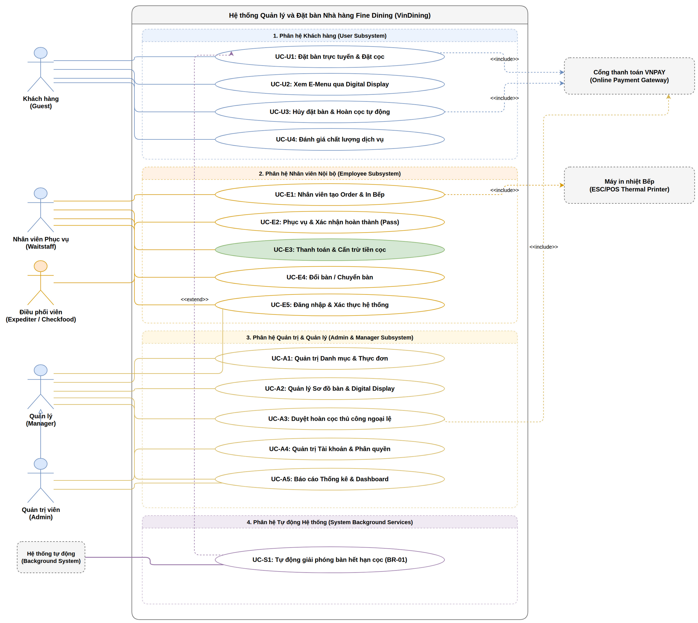
> 📐 **Tệp thiết kế Draw.io**: [`use_case_overall.drawio`](./drawio/use_case_overall.drawio)
> *(Tệp thiết kế tương ứng: `./drawio/use_case_overall.drawio`)*

---

### 2.2 Sơ đồ Use Case phân rã theo Phân hệ

> 📐 **Tệp thiết kế Draw.io**: [`use_case_subsystems.drawio`](./drawio/use_case_subsystems.drawio)

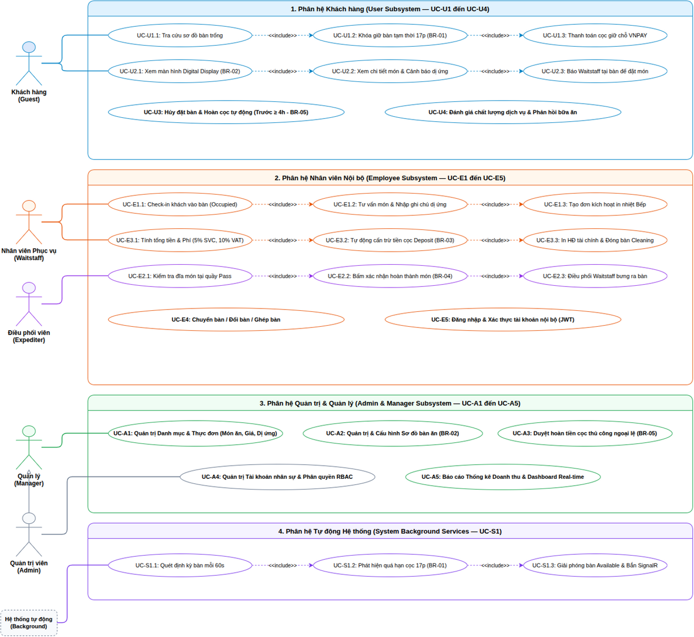
> 📐 **Tệp thiết kế Draw.io**: [`use_case_subsystems.drawio`](./drawio/use_case_subsystems.drawio)
> *(Tệp thiết kế tương ứng: `./drawio/use_case_subsystems.drawio`)*

---

### 2.3 Đặc tả chi tiết các Use Case (Use Case Specifications)

> 💡 **Quy ước mã định danh & Cấu trúc phân nhóm Use Case**:
> - **Nhóm Khách hàng (User - `UC-U`)**: Các chức năng trực tiếp của thực khách trải nghiệm trên Smartphone & Digital Display tại bàn.
> - **Nhóm Nhân viên (Employee - `UC-E`)**: Các chức năng thao tác nghiệp vụ tại bàn, quầy Pass và thanh toán của Phục vụ & Điều phối.
> - **Nhóm Quản lý & Quản trị (Admin & Manager - `UC-A`)**: Các chức năng quản trị danh mục, sơ đồ bàn, duyệt hoàn cọc và thống kê báo cáo.
> - **Nhóm Tự động Hệ thống (System - `UC-S`)**: Các tác vụ nền chạy ngầm tự động bảo toàn trạng thái dữ liệu và giải phóng tài nguyên.

---

#### 2.3.1 Nhóm Use Case Khách hàng (User / Guest Use Cases)

#### 📋 UC-U1: Đặt bàn trực tuyến & Đặt cọc (Table Reservation & Deposit)
* **Mã Use Case**: `UC-U1`
* **Tên Use Case**: Đặt bàn trực tuyến & Đặt cọc giữ chỗ (TableReservationUseCase)
* **Tác nhân**: Khách hàng (Chính), Cổng VNPAY (Phụ), Hệ thống (Phụ).
* **Mức độ ưu tiên**: Trọng yếu (Must Have).
* **Quan hệ (Relationships)**: <<include>> Cổng VNPAY (Xử lý giao dịch cọc trực tuyến); <<extend>> UC-S1 (Hệ thống tự động giải phóng bàn khi quá hạn cọc 17 phút).
* **Mục tiêu tóm tắt**: Cho phép khách hàng truy cập trang Web, chọn ngày/ca/vị trí bàn và hoàn tất đặt chỗ bằng cách thanh toán khoản tiền cọc cố định qua cổng VNPAY.
* **Điều kiện tiên quyết**: Khách hàng truy cập vào hệ thống Web; sơ đồ bàn đang hoạt động.
* **Điều kiện sau hoàn thành**: Bàn ăn chuyển sang trạng thái `Reserved`; hệ thống ghi nhận khoản cọc thành công và tự động gửi `BookingCode` qua SMS/Email cho khách.
* **Luồng sự kiện chính (Basic Flow)**:
  1. Khách hàng chọn Ngày hẹn, Ca phục vụ (Giờ hẹn), Số lượng khách và Khu vực bàn mong muốn (VIP, Sảnh chính, Ban công).
  2. Hệ thống kiểm tra trạng thái sơ đồ bàn thời gian thực và hiển thị danh sách bàn trống khả dụng.
  3. Khách hàng điền thông tin cá nhân (Họ tên, SĐT, Email), ghi chú các yêu cầu đặc biệt/cảnh báo dị ứng và nhấn "Tiến hành đặt cọc".
  4. Hệ thống khóa giữ tạm thời vị trí bàn đã chọn trong tối đa **17 phút** (`BR-01` - gồm 15 phút VNPAY + 2 phút Grace Period), đồng thời chuyển hướng khách sang giao diện thanh toán VNPAY (QR code có thời hạn 15 phút).
  5. Khách hàng thực hiện thanh toán tiền cọc trên cổng VNPAY (quét QR ngân hàng hoặc nhập thẻ).
  6. Cổng VNPAY xử lý giao dịch thành công và gửi tín hiệu xác nhận (IPN) thời gian thực về Backend.
  7. Hệ thống cập nhật trạng thái bàn sang `Reserved`, sinh mã đặt bàn `BookingCode` duy nhất và gửi thông báo xác nhận cho khách.
* **Luồng phụ & Ngoại lệ (Alternative & Exception Flows)**:
  - *5a. Khách hủy thanh toán hoặc giao dịch VNPAY thất bại*: Cổng VNPAY trả về mã lỗi giao dịch hoặc khách chủ động hủy, hệ thống ghi nhận thất bại và hiển thị thông báo mời khách thao tác lại. (Trường hợp khách không thanh toán, Background Worker `UC-S1` sẽ tự động quét giải phóng bàn về `Available` sau 17 phút theo `BR-01`).
  - *5b. Giao dịch mồ côi (Late IPN > 17 phút)*: Tín hiệu IPN báo thành công nhưng gửi về trễ sau 17 phút và bàn cũ đã được giải phóng theo `BR-01`. Hệ thống tự động quét tìm bàn trống tương đương (cùng khu vực, sức chứa) để gán cho khách. Nếu hết sạch bàn tương đương, lưu trạng thái `Paid_TableLost` và báo động đỏ cho Quản lý (CSKH) gọi điện trực tiếp để xử lý ngoại lệ (đổi ngày/hoàn tiền thủ công).
  - *2a. Khung giờ hoặc khu vực bàn đã hết chỗ*: Hệ thống thông báo hết bàn và tự động gợi ý các khung giờ hoặc phân khu bàn lân cận còn trống.
  - *Khách hủy đặt bàn trước $\ge$ 4 tiếng (`BR-05`)*: Hệ thống tự động kích hoạt hoàn cọc 100% qua API VNPAY và giải phóng bàn về `Available`.
  - *Khách hủy đặt bàn trong vòng < 4 tiếng (`BR-05`)*: Hệ thống ghi nhận hủy bàn nhưng phạt 100% tiền cọc (không hoàn tiền).

---

#### 📋 UC-U2: Xem E-Menu qua Digital Display (Table Digital Menu)
* **Mã Use Case**: `UC-U2`
* **Tên Use Case**: Xem E-Menu qua Digital Display (ViewDigitalMenuUseCase)
* **Tác nhân**: Khách hàng (Chính).
* **Mức độ ưu tiên**: Trọng yếu (Must Have).
* **Quan hệ (Relationships)**: Độc lập (Chỉ hiển thị dữ liệu danh mục thực đơn tại bàn).
* **Mục tiêu tóm tắt**: Khách hàng tại bàn xem danh mục các món ăn (A La Carte) qua thiết bị màn hình Digital Display (chỉ xem, không có tính năng đặt món trực tiếp).
* **Điều kiện tiên quyết**: Khách hàng đã ngồi tại bàn thực tế; thiết bị Digital Display đang hoạt động.
* **Điều kiện sau hoàn thành**: Khách hàng xem xong thực đơn và quyết định gọi món thông qua nhân viên phục vụ.
* **Luồng sự kiện chính (Basic Flow)**:
  1. Khách hàng ngồi tại bàn, màn hình Digital Display đã được tự động hiển thị Menu.
  2. Khách hàng chạm/lướt màn hình để duyệt danh mục món ăn trực quan (Các món khai vị, món chính, đồ uống, giá bán).
  3. Khách hàng thảo luận và quyết định chọn các món ăn.
  4. Khách hàng gọi nhân viên phục vụ để tiến hành đặt món.
* **Luồng phụ & Ngoại lệ (Alternative & Exception Flows)**:
  - *Màn hình tắt hoặc lỗi mạng*: Nhân viên phục vụ khởi động lại thiết bị hoặc đổi thiết bị khác cho khách.

---

#### 📋 UC-U3: Hủy đặt bàn trực tuyến & Hoàn cọc tự động (Cancel Reservation)
* **Mã Use Case**: `UC-U3`
* **Tên Use Case**: Hủy đặt bàn trực tuyến & Hoàn cọc (CancelReservationUseCase)
* **Tác nhân**: Khách hàng (Chính), Cổng VNPAY (Phụ), Hệ thống (Phụ).
* **Mức độ ưu tiên**: Trọng yếu (Must Have).
* **Quan hệ (Relationships)**: <<include>> Cổng VNPAY (Xử lý API hoàn trả tiền cọc tự động 100% khi hủy trước >= 4h theo BR-05).
* **Mục tiêu tóm tắt**: Cho phép khách hàng tự chủ động hủy lịch đặt bàn của mình trên Web. Hệ thống kiểm tra điều kiện thời gian để tự động hoàn tiền cọc qua VNPAY hoặc phạt cọc theo chính sách.
* **Điều kiện tiên quyết**: Khách hàng có một mã đặt bàn (`BookingCode`) đang ở trạng thái `Reserved`.
* **Điều kiện sau hoàn thành**: Trạng thái đặt bàn chuyển sang `Cancelled`, bàn ăn được giải phóng về `Available`, ghi nhận giao dịch hoàn tiền hoặc phạt cọc thành công.
* **Luồng sự kiện chính (Basic Flow)**:
  1. Khách hàng truy cập trang Tra cứu đặt bàn, nhập SĐT và `BookingCode`.
  2. Hệ thống hiển thị chi tiết lịch đặt bàn và nút "Hủy đặt bàn".
  3. Khách hàng bấm "Hủy đặt bàn" và xác nhận thao tác.
  4. Hệ thống kiểm tra thời gian hiện tại so với giờ hẹn (`BR-05`). Thời gian cách giờ hẹn $\ge$ 4 tiếng.
  5. Hệ thống gọi API VNPAY (Refund API) để hoàn trả 100% số tiền cọc về tài khoản của khách.
  6. Hệ thống cập nhật trạng thái Reservation -> `Cancelled`, Table -> `Available`.
  7. Gửi thông báo Email/SMS xác nhận hủy và hoàn tiền cho khách.
* **Luồng phụ & Ngoại lệ (Alternative & Exception Flows)**:
  - *4a. Khách hủy bàn khi thời gian cách giờ hẹn < 4 tiếng*: Hệ thống cảnh báo khách sẽ bị mất 100% cọc (không hoàn tiền). Khách đồng ý, hệ thống ghi nhận trạng thái `Cancelled` nhưng giữ lại tiền cọc làm phí phạt. Bàn vẫn được giải phóng về `Available`.

---

#### 📋 UC-U4: Đánh giá chất lượng dịch vụ (Feedback / Review)
* **Mã Use Case**: `UC-U4`
* **Tên Use Case**: Gửi đánh giá dịch vụ (SubmitFeedbackUseCase)
* **Tác nhân**: Khách hàng (Chính).
* **Mức độ ưu tiên**: Bổ sung (Could Have).
* **Quan hệ (Relationships)**: Độc lập (Thu thập khảo sát phản hồi của khách hàng sau bữa ăn).
* **Mục tiêu tóm tắt**: Thu thập ý kiến của khách hàng về chất lượng món ăn và dịch vụ ngay sau khi dùng bữa.
* **Điều kiện tiên quyết**: Khách hàng đã thanh toán hóa đơn.
* **Điều kiện sau hoàn thành**: Lưu feedback vào hệ thống.
* **Luồng sự kiện chính (Basic Flow)**:
  1. Khách hàng nhận được Email cảm ơn kèm link đánh giá, hoặc quét mã QR thanh toán tích hợp link đánh giá.
  2. Khách hàng điền mức độ hài lòng (1-5 sao) và ghi chú.
  3. Bấm Gửi.
  4. Hệ thống lưu đánh giá vào CSDL. Quản lý có thể xem lại tại Dashboard.

---

#### 2.3.2 Nhóm Use Case Nhân viên Nội bộ (Employee Use Cases)

#### 📋 UC-E1: Nhân viên tạo Order trực tiếp & In phiếu Bếp (Order Creation & Dispatching)
* **Mã Use Case**: `UC-E1`
* **Tên Use Case**: Nhân viên tạo Order & In Bếp (OrderCreationUseCase)
* **Tác nhân**: Nhân viên Phục vụ (Chính), Máy in nhiệt Bếp (Phụ), Hệ thống (Phụ).
* **Mức độ ưu tiên**: Trọng yếu (Must Have).
* **Quan hệ (Relationships)**: <<include>> UC-E5 (Đăng nhập & Xác thực hệ thống); <<include>> Máy in nhiệt Bếp (Tự động in phiếu order ESC/POS theo phân khu).
* **Mục tiêu tóm tắt**: Nhân viên phục vụ đứng tại bàn, nhập đơn gọi món trực tiếp vào thiết bị di động theo yêu cầu của khách, hệ thống lưu đơn ở trạng thái `Processing` và tự động in phiếu Bếp.
* **Điều kiện tiên quyết**: Bàn ăn đã được check-in (`Occupied`), khách hàng đã quyết định xong món.
* **Điều kiện sau hoàn thành**: Đơn hàng được tạo (Status: `Processing`), máy in nhiệt tại các phân khu bếp nhả phiếu order chuẩn xác.
* **Luồng sự kiện chính (Basic Flow)**:
  1. Khách hàng đọc danh sách các món muốn gọi.
  2. Nhân viên phục vụ mở ứng dụng trên Tablet, chọn đúng bàn tương ứng đang phục vụ.
  3. Nhân viên thêm các món ăn vào giỏ hàng, đồng thời điền các yêu cầu đặc biệt/cảnh báo dị ứng do khách yêu cầu.
  4. Nhân viên nhấn nút "Tạo đơn & Gửi Bếp" trên màn hình thiết bị cầm tay.
  5. Hệ thống khởi tạo Order với trạng thái `Processing` và lưu mốc thời gian bắt đầu.
  6. Hệ thống tự động gửi lệnh in nhiệt (ESC/POS) ra các máy in tại phân khu Bếp tương ứng. Phiếu in ghi rõ: Số bàn, Tên món, và **bôi đậm cảnh báo dị ứng**.
* **Luồng phụ & Ngoại lệ (Alternative & Exception Flows)**:
  - *3a. Khách hàng muốn gọi thêm món bổ sung sau này*: Nhân viên phục vụ mở lại bàn đó và tạo tiếp một lượt Order mới, hệ thống sẽ gom chung vào hóa đơn tổng của bàn.

---

#### 📋 UC-E2: Phục vụ món & Xác nhận hoàn thành món tại quầy Pass (Serving Confirmation)
* **Mã Use Case**: `UC-E2`
* **Tên Use Case**: Phục vụ & Xác nhận hoàn thành món (ServiceConfirmationUseCase)
* **Tác nhân**: Nhân viên Điều phối / Checkfood (Chính), Nhân viên Phục vụ (Phụ), Hệ thống (Phụ).
* **Mức độ ưu tiên**: Trọng yếu (Must Have).
* **Quan hệ (Relationships)**: <<include>> UC-E5 (Đăng nhập & Xác thực hệ thống).
* **Mục tiêu tóm tắt**: Nhân viên Checkfood tại quầy Pass nhận món từ bếp, đối chiếu, giao cho Waitstaff bưng đi, và bấm xác nhận "Đã hoàn thành" trên tablet tại quầy.
* **Điều kiện tiên quyết**: Món ăn đã được nhà bếp hoàn thành và đặt tại quầy Pass.
* **Điều kiện sau hoàn thành**: Trạng thái món ăn chuyển sang `Served`, hệ thống ghi nhận mốc thời gian phục vụ thực tế (`ServeTimestamp`).
* **Luồng sự kiện chính (Basic Flow)**:
  1. Đầu bếp nấu xong đĩa món chuẩn vị, đặt ra quầy chuyển món (Pass).
  2. Nhân viên Điều phối (Checkfood) kiểm tra món ăn đối chiếu với thông tin order trên Tablet (kiểm tra dị ứng, hình thức).
  3. Nhân viên Checkfood bấm chọn "Xác nhận hoàn thành món" (`BR-04`) trên thiết bị.
  4. Hệ thống cập nhật trạng thái món thành `Served` và lưu mốc thời gian phục vụ.
  5. Nhân viên Checkfood giao đĩa món cho Nhân viên phục vụ (Waitstaff) cùng số bàn để bưng ra cho khách.
* **Luồng phụ & Ngoại lệ (Alternative & Exception Flows)**:
  - *2a. Món ăn làm sai yêu cầu (VD: Quên loại bỏ đậu phộng)*: Checkfood phát hiện sai sót, trả lại đĩa món cho bếp làm lại và không bấm xác nhận.

---

#### 📋 UC-E3: Thanh toán, Cấn trừ tiền cọc & Đóng bàn (Checkout & Invoice Settlement)
* **Mã Use Case**: `UC-E3`
* **Tên Use Case**: Thanh toán, Cấn trừ tiền cọc & Đóng bàn (InvoiceSettlementUseCase)
* **Tác nhân**: Nhân viên Phục vụ (Chính), Khách hàng (Chính), Hệ thống (Phụ).
* **Mức độ ưu tiên**: Trọng yếu (Must Have).
* **Quan hệ (Relationships)**: <<include>> UC-E5 (Đăng nhập & Xác thực hệ thống); <<include>> Tự động cấn trừ tiền cọc theo công thức tài chính (BR-03).
* **Mục tiêu tóm tắt**: Tự động tổng hợp toàn bộ tiền món ăn, tính 5% phí dịch vụ, 10% VAT, tự động cấn trừ số tiền cọc (Deposit) đã thanh toán trước đó, xuất hóa đơn tài chính và chuyển trạng thái bàn sang chờ dọn dẹp (`Cleaning`).
* **Điều kiện tiên quyết**: Bàn ăn đang ở trạng thái `Occupied` và toàn bộ các món ăn đã được phục vụ hoàn tất (`Served`).
* **Điều kiện sau hoàn thành**: Hóa đơn được thanh toán thành công, đơn hàng hoàn tất, bàn chuyển trạng thái sang `Cleaning`.
* **Luồng sự kiện chính (Basic Flow)**:
  1. Khách hàng nhấn nút "Yêu cầu thanh toán" trên Web E-Menu hoặc báo miệng với nhân viên phục vụ.
  2. Nhân viên phục vụ chọn chức năng "Thanh toán hóa đơn" cho bàn tương ứng trên thiết bị cầm tay.
  3. Hệ thống tự động truy vấn đơn hàng của bàn, thực thi công thức tính toán tài chính bắt buộc (`BR-03`):
     - $\text{Subtotal} = \sum (\text{Tiền món dùng thực tế})$
     - $\text{Phí dịch vụ (5\%)} = \text{Subtotal} \times 0.05$
     - $\text{Thuế VAT (10\%)} = (\text{Subtotal} + \text{Phí dịch vụ}) \times 0.10$
     - $\text{Số tiền phải trả} = \max(0, (\text{Subtotal} + \text{Phí dịch vụ} + \text{Thuế VAT}) - \text{Tiền cọc đã trả (Deposit)})$
  4. Hệ thống in phiếu Hóa đơn tạm tính hiển thị minh bạch toàn bộ các dòng tiền và số tiền cọc đã cấn trừ để nhân viên đem ra bàn cho khách kiểm tra.
  5. Khách hàng thực hiện thanh toán số tiền còn thiếu qua tiền mặt, thẻ ngân hàng hoặc quét mã QR chuyển khoản.
  6. Nhân viên phục vụ bấm "Hoàn tất thanh toán" trên thiết bị.
  7. Hệ thống tự động vô hiệu hóa phiên QR, in hóa đơn tài chính cuối cùng và chuyển trạng thái bàn sang `Cleaning`. Sau khi nhân viên dọn bàn xong, bàn chuyển về trạng thái `Available`.
* **Luồng phụ & Ngoại lệ (Alternative & Exception Flows)**:
  - *3a. Hóa đơn âm (Tổng tiền < Tiền cọc)*: Theo chính sách Deposit = Minimum Spend, hệ thống tự động làm tròn Số tiền phải trả = 0 VNĐ (không thối lại tiền thừa). Hệ thống hiển thị cảnh báo đỏ trên Tablet để Waitstaff biết và ra bàn nhắc nhở khách nên gọi thêm đồ uống hoặc mang về để tận dụng tối đa số tiền cọc.
  - *5a. Khách hàng có thắc mắc về số tiền cọc*: Nhân viên phục vụ tra cứu trực tiếp lịch sử giao dịch cọc gắn với `BookingCode` trên hệ thống để giải thích minh bạch cho khách.

---

#### 📋 UC-E4: Đổi bàn / Chuyển bàn (Change & Merge Tables)
* **Mã Use Case**: `UC-E4`
* **Tên Use Case**: Đổi bàn / Chuyển bàn (ChangeTableUseCase)
* **Tác nhân**: Nhân viên Phục vụ (Chính), Quản lý (Phụ).
* **Mức độ ưu tiên**: Quan trọng (Should Have).
* **Quan hệ (Relationships)**: <<include>> UC-E5 (Đăng nhập & Xác thực hệ thống); <<extend>> Ghép bàn (Merge Tables - mở rộng khi khách có nhu cầu gộp nhóm bàn).
* **Mục tiêu tóm tắt**: Cho phép nhân viên phục vụ chuyển toàn bộ đơn hàng (Order) và tiền cọc (nếu có) từ bàn hiện tại sang một bàn khác trống trên hệ thống khi khách có nhu cầu đổi chỗ ngồi.
* **Điều kiện tiên quyết**: Khách đang ngồi tại bàn cũ (`Occupied`); bàn mới mục tiêu phải ở trạng thái `Available`.
* **Điều kiện sau hoàn thành**: Bàn cũ chuyển về trạng thái `Cleaning`, bàn mới chuyển sang `Occupied` và kế thừa toàn bộ Order.
* **Luồng sự kiện chính (Basic Flow)**:
  1. Khách hàng yêu cầu đổi sang bàn khác (VD: Từ sảnh trong ra ban công).
  2. Nhân viên phục vụ chọn chức năng "Đổi bàn" trên Tablet đối với bàn hiện tại.
  3. Hệ thống hiển thị sơ đồ các bàn trống (`Available`) để nhân viên chọn.
  4. Nhân viên chọn bàn mới mục tiêu và bấm xác nhận chuyển.
  5. Hệ thống di chuyển toàn bộ Order, OrderItems (cả những món đã phục vụ và đang nấu) sang TableId mới.
  6. Bàn cũ chuyển sang trạng thái `Cleaning`. Bàn mới chuyển sang `Occupied`. Máy in bếp không cần in lại phiếu nhưng hệ thống tự động ghi chú cho bộ phận Checkfood biết bàn đã đổi.
* **Luồng phụ & Ngoại lệ (Alternative & Exception Flows)**:
  - *Khách muốn ghép 2 bàn lại với nhau*: Nhân viên sử dụng tính năng "Ghép bàn" (Merge) để gộp chung 2 TableId thành 1 nhóm và hợp nhất hóa đơn.

---

#### 📋 UC-E5: Đăng nhập & Xác thực hệ thống (Authentication)
* **Mã Use Case**: `UC-E5`
* **Tên Use Case**: Đăng nhập hệ thống nội bộ (LoginUseCase)
* **Tác nhân**: Nhân viên Phục vụ, Quản lý, Admin (Chính).
* **Mức độ ưu tiên**: Trọng yếu (Must Have).
* **Quan hệ (Relationships)**: Use Case cơ sở (Base Use Case) được <<include>> bởi toàn bộ các Use Case nghiệp vụ nội bộ của Phục vụ, Điều phối, Quản lý và Quản trị viên.
* **Mục tiêu tóm tắt**: Cung cấp cơ chế đăng nhập an toàn để nhân viên truy cập vào các chức năng nghiệp vụ tương ứng với quyền hạn (Role).
* **Điều kiện tiên quyết**: Tài khoản đã được cấp phát bởi Admin.
* **Điều kiện sau hoàn thành**: Người dùng được cấp phiên đăng nhập (JWT token) và chuyển hướng tới Dashboard/Sơ đồ bàn theo quyền.
* **Luồng sự kiện chính (Basic Flow)**:
  1. Người dùng truy cập trang Đăng nhập hệ thống.
  2. Người dùng nhập Username / Email và Password.
  3. Bấm "Đăng nhập".
  4. Hệ thống kiểm tra thông tin định danh và quyền hạn.
  5. Hệ thống cấp JWT token và chuyển hướng tới màn hình tương ứng (Tablet Order cho Waitstaff, Dashboard cho Manager).

---

#### 2.3.3 Nhóm Use Case Quản trị & Quản lý (Admin & Manager Use Cases)

#### 📋 UC-A1: Quản trị Danh mục & Thực đơn món ăn (Menu Management)
* **Mã Use Case**: `UC-A1`
* **Tên Use Case**: Quản trị Thực đơn (MenuManagementUseCase)
* **Tác nhân**: Quản lý (Chính), Hệ thống (Phụ).
* **Mức độ ưu tiên**: Quan trọng (Should Have).
* **Quan hệ (Relationships)**: <<include>> UC-E5 (Đăng nhập & Xác thực hệ thống).
* **Mục tiêu tóm tắt**: Cho phép Quản lý (Manager) thêm, sửa, xóa, vô hiệu hóa các món ăn và danh mục món ăn (A La Carte) trên hệ thống.
* **Điều kiện tiên quyết**: Quản lý đã đăng nhập thành công vào hệ thống.
* **Điều kiện sau hoàn thành**: Dữ liệu thực đơn được cập nhật đồng bộ lên CSDL và hiển thị tức thời trên Digital Display/Tablet phục vụ.
* **Luồng sự kiện chính (Basic Flow)**:
  1. Quản lý truy cập trang Quản trị Thực đơn trên Web Portal.
  2. Hệ thống hiển thị danh sách các món ăn hiện có.
  3. Quản lý chọn chức năng 'Thêm món mới'.
  4. Quản lý nhập thông tin món ăn (Tên món, Hình ảnh, Giá bán, Phân loại, Cảnh báo dị ứng).
  5. Quản lý bấm 'Lưu'.
  6. Hệ thống kiểm tra tính hợp lệ của dữ liệu (Validation) và lưu vào CSDL.
  7. Hệ thống cập nhật Menu trên các thiết bị của Khách và Nhân viên phục vụ.

---

#### 📋 UC-A2: Quản trị & Cấu hình Sơ đồ bàn ăn (Floor Plan Management)
* **Mã Use Case**: `UC-A2`
* **Tên Use Case**: Quản trị Sơ đồ bàn (FloorPlanUseCase)
* **Tác nhân**: Quản lý / Admin (Chính), Hệ thống (Phụ).
* **Mức độ ưu tiên**: Quan trọng (Should Have).
* **Quan hệ (Relationships)**: <<include>> UC-E5 (Đăng nhập & Xác thực hệ thống).
* **Mục tiêu tóm tắt**: Quản lý/Admin thiết lập và cấu hình bố cục không gian bàn ăn theo từng khu vực (Sảnh chính, Phòng VIP, Ban công), định vị tọa độ hiển thị trực quan 2D và đồng bộ thời gian thực cho nhân viên phục vụ qua SignalR.
* **Điều kiện tiên quyết**: Quản lý / Admin đăng nhập thành công.
* **Điều kiện sau hoàn thành**: Sơ đồ bàn được lưu vào CSDL và tự động đồng bộ xuống thiết bị cầm tay của toàn bộ nhân viên phục vụ.
* **Luồng sự kiện chính (Basic Flow)**:
  1. Quản lý mở chức năng Quản trị Sơ đồ bàn trên Web Portal.
  2. Hệ thống hiển thị giao diện sơ đồ bố trí trực quan 2D (Floor Plan Canvas).
  3. Quản lý chọn khu vực hoặc thêm mới khu vực, sau đó thêm/xóa/sửa vị trí, tên bàn, sức chứa (Capacity) và trạng thái hoạt động của bàn.
  4. Quản lý sắp xếp lại vị trí tọa độ các bàn ăn khớp với không gian thực tế của nhà hàng.
  5. Quản lý bấm 'Lưu thay đổi Sơ đồ bàn'.
  6. Hệ thống kiểm tra hợp lệ (mã bàn không trùng lặp, bàn đang phục vụ không bị đổi sức chứa), lưu CSDL qua UnitOfWork và phát sự kiện SignalR cập nhật tức thời xuống app của nhân viên phục vụ.

---

#### 📋 UC-A3: Duyệt hoàn tiền cọc thủ công ngoại lệ (Manual Refund)
* **Mã Use Case**: `UC-A3`
* **Tên Use Case**: Duyệt hoàn tiền cọc thủ công (ManualRefundUseCase)
* **Tác nhân**: Quản lý / Admin (Chính), Cổng VNPAY (Phụ), Hệ thống (Phụ).
* **Mức độ ưu tiên**: Quan trọng (Should Have).
* **Quan hệ (Relationships)**: <<include>> UC-E5 (Đăng nhập & Xác thực hệ thống); <<include>> Cổng VNPAY (Xử lý API hoàn tiền cọc thủ công ngoại lệ).
* **Mục tiêu tóm tắt**: Quản lý xử lý hoàn tiền cọc cho khách hàng trong các trường hợp bất khả kháng (lỗi hệ thống, thiên tai...) mà không tuân theo quy tắc hoàn tự động.
* **Điều kiện tiên quyết**: Đặt bàn có trạng thái Cancelled nhưng tiền cọc chưa được hoàn trả, hoặc có khiếu nại từ khách.
* **Điều kiện sau hoàn thành**: Tiền cọc được hoàn trả qua VNPAY, ghi nhận lịch sử xử lý khiếu nại.
* **Luồng sự kiện chính (Basic Flow)**:
  1. Quản lý tiếp nhận khiếu nại và tra cứu mã BookingCode trên hệ thống.
  2. Quản lý bấm nút 'Hoàn tiền thủ công (Override)' đối với khoản cọc đã thu.
  3. Quản lý nhập lý do hoàn tiền bắt buộc.
  4. Hệ thống gọi API VNPAY (Refund API) để hoàn trả tiền cho khách.
  5. Hệ thống lưu vết (Audit Log) giao dịch hoàn tiền với UserID của người Quản lý đã duyệt.

---

#### 📋 UC-A4: Quản trị Tài khoản & Phân quyền (Account & RBAC Management)
* **Mã Use Case**: `UC-A4`
* **Tên Use Case**: Quản trị Tài khoản & Phân quyền (AccountManagementUseCase)
* **Tác nhân**: Quản trị viên - Admin (Chính), Hệ thống (Phụ).
* **Mức độ ưu tiên**: Quan trọng (Should Have).
* **Quan hệ (Relationships)**: <<include>> UC-E5 (Đăng nhập & Xác thực hệ thống).
* **Mục tiêu tóm tắt**: Admin cấp phát, khóa tài khoản và gán vai trò (Role) cho các nhân viên trong nhà hàng (Waitstaff, Checkfood, Manager).
* **Điều kiện tiên quyết**: Admin đăng nhập với tài khoản có quyền cao nhất.
* **Điều kiện sau hoàn thành**: Thông tin tài khoản nhân viên được cập nhật, quyền truy cập thay đổi có hiệu lực trong lần đăng nhập tiếp theo.
* **Luồng sự kiện chính (Basic Flow)**:
  1. Admin truy cập trang Quản lý Nhân viên.
  2. Admin bấm 'Tạo tài khoản mới'.
  3. Admin nhập thông tin nhân sự và chọn Vai trò (Waitstaff / Expediter / Manager).
  4. Hệ thống lưu tài khoản và gửi Email cấp mật khẩu mặc định cho nhân viên.

---

#### 📋 UC-A5: Xem Báo cáo Dashboard & Thống kê (Reporting & Analytics)
* **Mã Use Case**: `UC-A5`
* **Tên Use Case**: Xem Báo cáo Thống kê (ViewReportsUseCase)
* **Tác nhân**: Quản lý / Admin (Chính).
* **Mức độ ưu tiên**: Bổ sung (Could Have).
* **Quan hệ (Relationships)**: <<include>> UC-E5 (Đăng nhập & Xác thực hệ thống).
* **Mục tiêu tóm tắt**: Xem doanh thu, tỷ lệ lấp đầy bàn, thống kê số lượng khách bùng bàn (No-show), món ăn bán chạy nhất.
* **Điều kiện tiên quyết**: Quản lý đăng nhập vào hệ thống.
* **Điều kiện sau hoàn thành**: Hiển thị biểu đồ báo cáo thành công.
* **Luồng sự kiện chính (Basic Flow)**:
  1. Quản lý chọn menu Dashboard Báo cáo.
  2. Chọn mốc thời gian cần xem (Ngày/Tuần/Tháng).
  3. Hệ thống tổng hợp dữ liệu từ CSDL (Invoices, Orders, Reservations).
  4. Hệ thống render biểu đồ đường, biểu đồ tròn và bảng dữ liệu.

---

#### 2.3.4 Nhóm Use Case Hệ thống Tự động (System Background Use Cases)

#### 📋 UC-S1: Tự động giải phóng bàn hết hạn giữ cọc (Auto-Release Expired Reservation Lock)
* **Mã Use Case**: `UC-S1`
* **Tên Use Case**: Tự động giải phóng bàn hết hạn giữ cọc (AutoReleaseExpiredLockUseCase)
* **Tác nhân**: Hệ thống tự động (Background Service / Cron Worker - Chính).
* **Mức độ ưu tiên**: Trọng yếu (Must Have).
* **Quan hệ (Relationships)**: <<extend>> Mở rộng từ UC-U1 (Kích hoạt tự động bởi Background Service khi phiên giữ cọc vượt quá thời hạn 17 phút - BR-01).
* **Mục tiêu tóm tắt**: Hệ thống chạy ngầm định kỳ mỗi 60 giây, tự động phát hiện và hủy các phiên đặt bàn tạm thời quá 17 phút (15 phút hạn QR VNPAY + 2 phút Grace Period theo BR-01) mà chưa nhận được xác nhận IPN thanh toán, giải phóng bàn ăn về trạng thái `Available` và gửi thông báo real-time qua SignalR tới Sơ đồ bàn của Nhân viên & Quản lý.
* **Điều kiện tiên quyết**: Bản ghi đặt bàn đang ở trạng thái giữ tạm (`PendingPayment/Locked`) có thời gian tạo vượt quá 17 phút.
* **Điều kiện sau hoàn thành**: Bàn ăn được giải phóng về trạng thái `Available`, phiên đặt bàn chuyển sang `Expired_Cancelled`, sự kiện SignalR cập nhật tức thì trên sơ đồ bàn trực quan.
* **Luồng sự kiện chính (Basic Flow)**:
  1. Hệ thống chạy tác vụ nền (Background Worker / Hangfire Job) định kỳ mỗi 60 giây.
  2. Truy vấn cơ sở dữ liệu tìm các đơn đặt bàn có trạng thái `PendingPayment` và thời điểm tạo đã quá 17 phút (`BR-01`).
  3. Cập nhật trạng thái phiên đặt bàn thành `Expired_Cancelled`.
  4. Cập nhật trạng thái vị trí bàn ăn tương ứng từ `Locked` về `Available`.
  5. Phát thông điệp qua SignalR Hub (`TableStatusChanged`) để đổi màu trạng thái bàn thành xanh lá (Available) trên màn hình của Waitstaff và Quản lý.
  6. Ghi nhật ký kiểm toán hệ thống (System Audit Log) lưu vết thời điểm giải phóng bàn tự động.
* **Luồng phụ & Ngoại lệ (Alternative & Exception Flows)**:
  - *Xung đột IPN trễ (Late IPN > 17 phút)*: Cổng VNPAY gửi tín hiệu IPN thành công nhưng trễ sau 17 phút và bàn cũ đã được giải phóng cho khách khác đặt. Hệ thống tự động kích hoạt logic gán bàn tương đương cùng khu vực và sức chứa. Nếu hết bàn tương đương, đánh dấu `Paid_TableLost` và bắn cảnh báo đỏ ưu tiên tới Dashboard của Quản lý để gọi điện hỗ trợ đổi lịch hẹn hoặc hoàn tiền thủ công (`UC-A3`).

---

## CHƯƠNG 3: MÔ HÌNH HÓA QUY TRÌNH NGHIỆP VỤ (SWIMLANE ACTIVITY DIAGRAMS)

### 3.1 AD-01: Quy trình Đặt bàn trực tuyến & Đặt cọc VNPAY (3 Làn: Khách hàng | Hệ thống | VNPAY)

> 📐 **Tệp thiết kế Draw.io**: [`ad01_reservation_deposit.drawio`](./drawio/ad01_reservation_deposit.drawio)

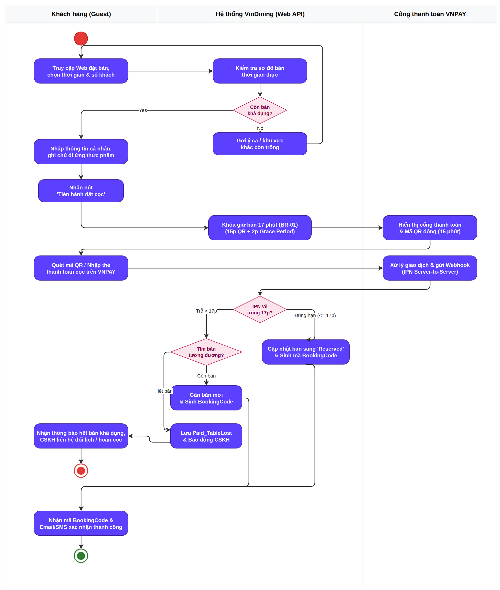

---

### 3.2 AD-02: Quy trình Nhân viên Order trực tiếp & In Bếp (3 Làn: Khách hàng | Phục vụ | Hệ thống & Máy in)

> 📐 **Tệp thiết kế Draw.io**: [`ad02_waitstaff_ordering.drawio`](./drawio/ad02_waitstaff_ordering.drawio)

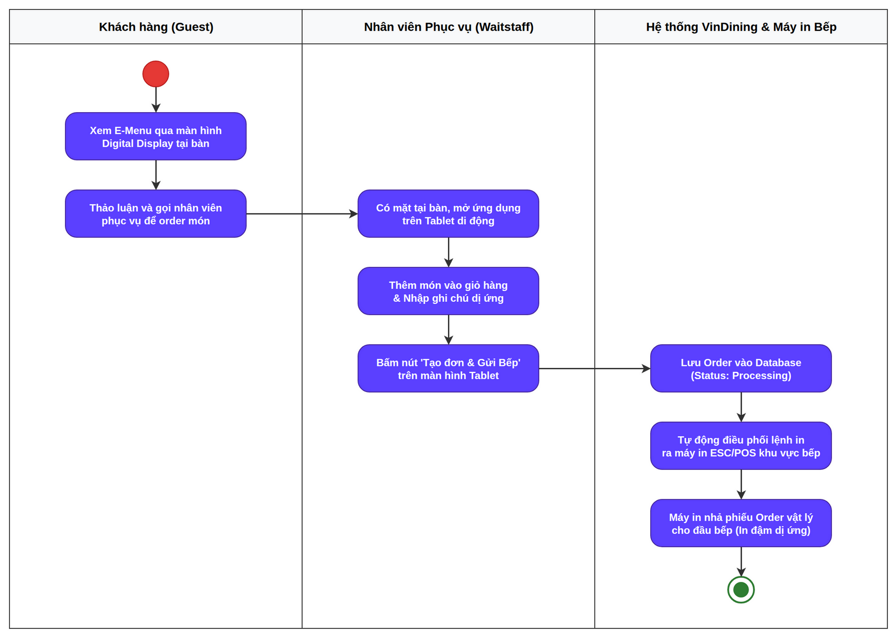

---

### 3.3 AD-03: Quy trình Kiểm đồ (Checkfood) & Xác nhận hoàn thành món (3 Làn: Nhà bếp | Expediter | Hệ thống)

> 📐 **Tệp thiết kế Draw.io**: [`ad03_serving_confirmation.drawio`](./drawio/ad03_serving_confirmation.drawio)

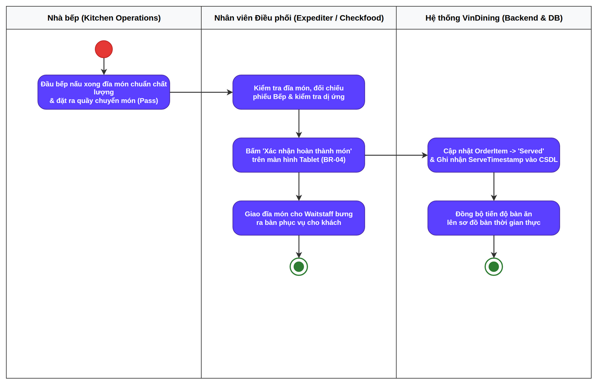

---

### 3.4 AD-04: Quy trình Thanh toán, Cấn trừ tiền cọc & Đóng bàn (3 Làn: Khách hàng | Phục vụ/Thu ngân | Hệ thống)

> 📐 **Tệp thiết kế Draw.io**: [`ad04_invoice_settlement.drawio`](./drawio/ad04_invoice_settlement.drawio)

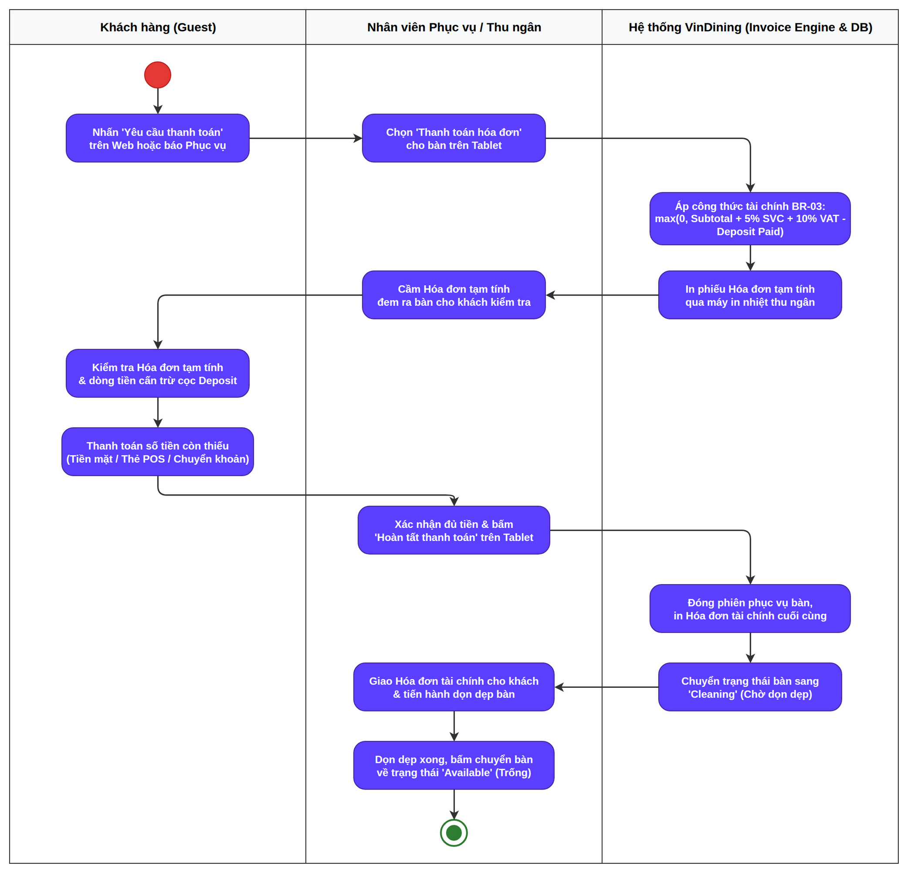

---

### 3.5 AD-05: Quy trình Hủy đặt bàn & Hoàn phạt tiền cọc VNPAY (3 Làn: Khách/Quản lý | Hệ thống | Cổng VNPAY)

> 📐 **Tệp thiết kế Draw.io**: [`ad05_cancellation_refund.drawio`](./drawio/ad05_cancellation_refund.drawio)

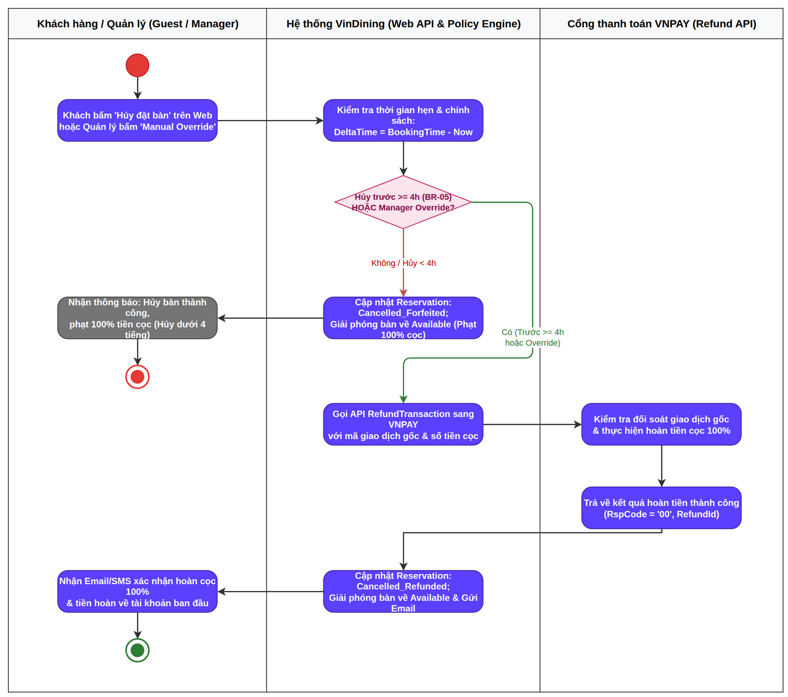

---

### 3.6 AD-06: Quy trình Đăng nhập & Xác thực nhân viên nội bộ (3 Làn: Nhân viên | Trình duyệt / Web POS | ASP.NET Core API & DB)

> 📐 **Tệp thiết kế Draw.io**: [`ad06_staff_login.drawio`](./drawio/ad06_staff_login.drawio)

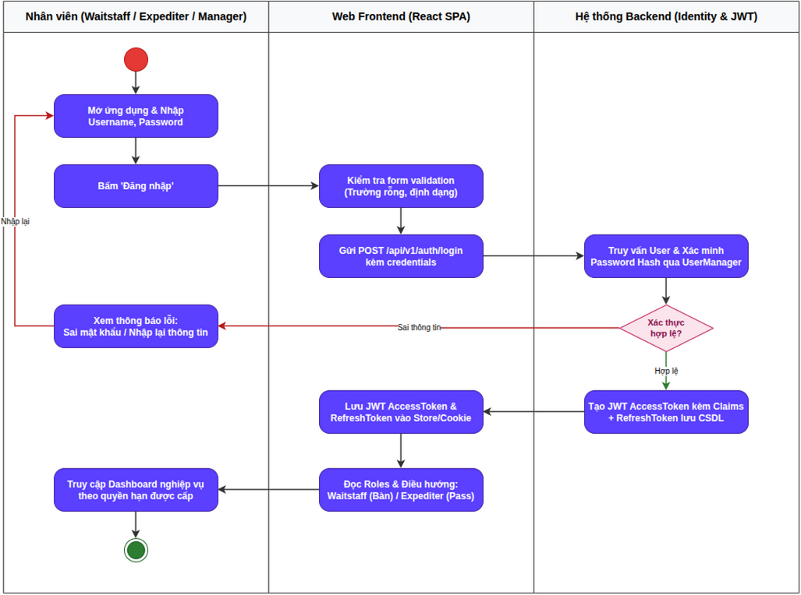

---

### 3.7 AD-07: Quy trình Chuyển bàn / Đổi bàn phục vụ (3 Làn: Phục vụ | Hệ thống & UnitOfWork | Màn hình Khách & Bếp)

> 📐 **Tệp thiết kế Draw.io**: [`ad07_change_table.drawio`](./drawio/ad07_change_table.drawio)

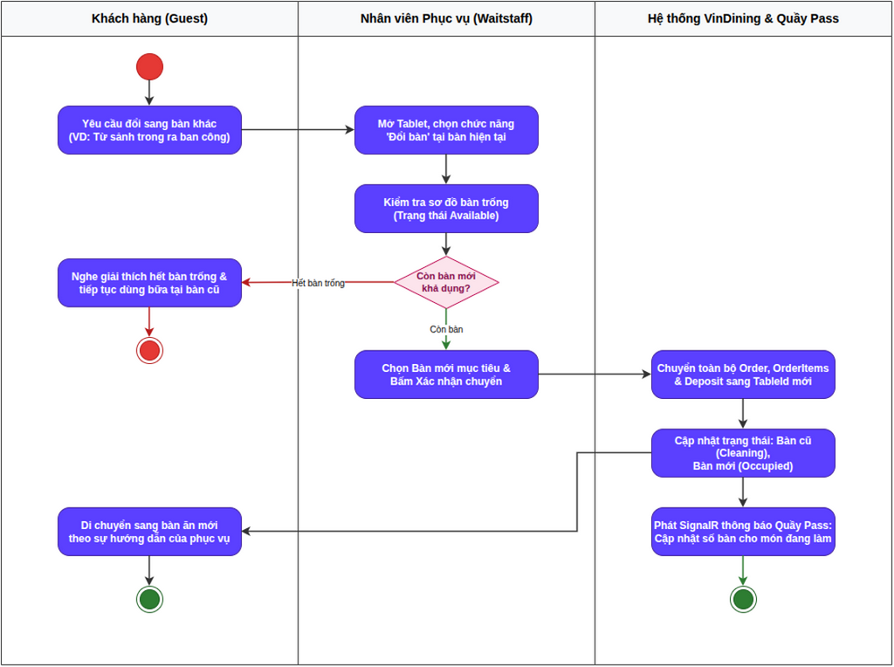

---

### 3.8 AD-08: Quy trình Quản trị & Cấu hình Sơ đồ bàn ăn (3 Làn: Quản lý | Hệ thống API & DB | Ứng dụng Phục vụ)

> 📐 **Tệp thiết kế Draw.io**: [`ad08_floor_plan_pairing.drawio`](./drawio/ad08_floor_plan_pairing.drawio)

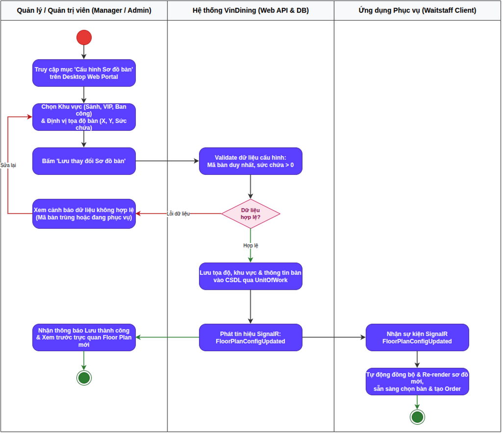

---

### 3.9 AD-09: Quy trình Duyệt hoàn cọc thủ công ngoại lệ (3 Làn: Quản lý / Thu ngân | Hệ thống API & DB | Cổng VNPAY)

> 📐 **Tệp thiết kế Draw.io**: [`ad09_manual_refund.drawio`](./drawio/ad09_manual_refund.drawio)

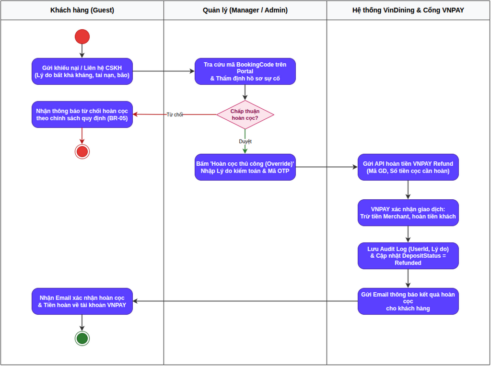

---

### 3.10 AD-10: Quy trình Tự động quét & Giải phóng bàn hết hạn giữ cọc (3 Làn: Hangfire Background Job | Cơ sở dữ liệu | SignalR Hub)

> 📐 **Tệp thiết kế Draw.io**: [`ad10_auto_release_timeout.drawio`](./drawio/ad10_auto_release_timeout.drawio)

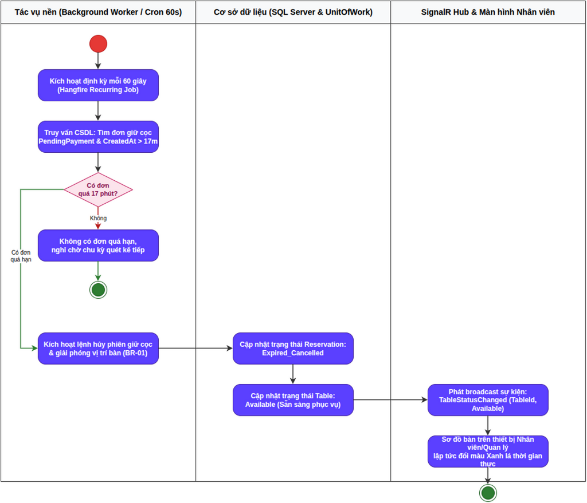

---

### 3.11 AD-11: Quy trình Quản trị Thực đơn & Trạng thái món (3 Làn: Quản lý Bếp / Admin | Hệ thống API | POS Phục vụ & Digital Display)

> 📐 **Tệp thiết kế Draw.io**: [`ad11_menu_management.drawio`](./drawio/ad11_menu_management.drawio)

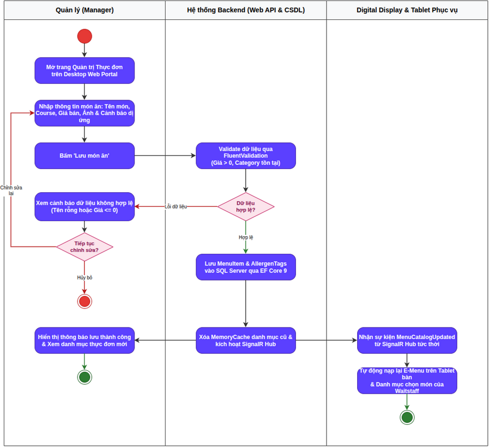

---

### 3.12 AD-12: Quy trình Khách hàng đánh giá & Phản hồi dịch vụ CSAT (3 Làn: Khách hàng | Hệ thống API | Dashboard Quản trị)

> 📐 **Tệp thiết kế Draw.io**: [`ad12_guest_feedback.drawio`](./drawio/ad12_guest_feedback.drawio)

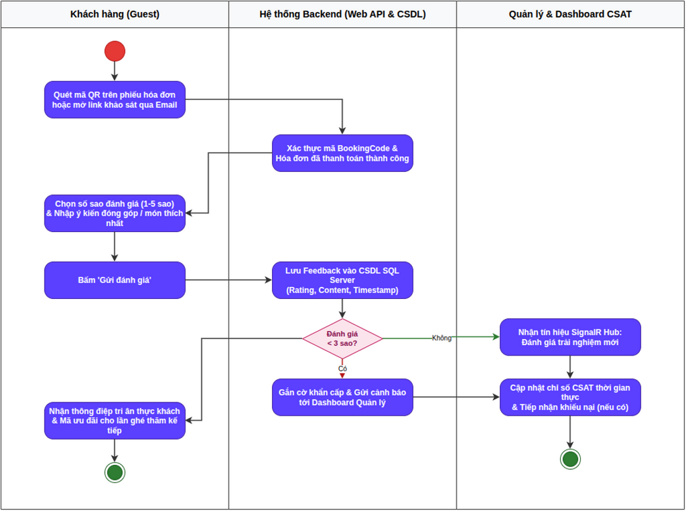

---

## CHƯƠNG 4: MÔ HÌNH HÓA TƯƠNG TÁC HỆ THỐNG (SEQUENCE DIAGRAMS)

### 4.1 SD-01: Đặt bàn trực tuyến & Thanh toán cọc qua VNPAY

> 📐 **Tệp thiết kế Draw.io**: [`sd01_reservation_vnpay.drawio`](./drawio/sd01_reservation_vnpay.drawio)

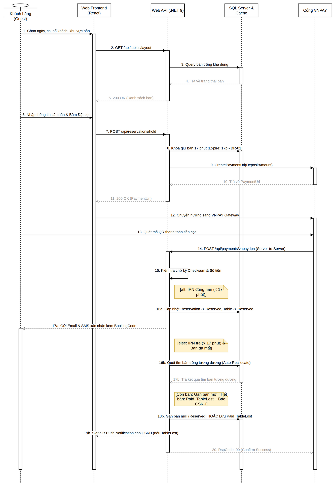

---

### 4.2 SD-02: Nhân viên tạo Order trực tiếp & In phiếu Bếp

> 📐 **Tệp thiết kế Draw.io**: [`sd02_waitstaff_ordering.drawio`](./drawio/sd02_waitstaff_ordering.drawio)

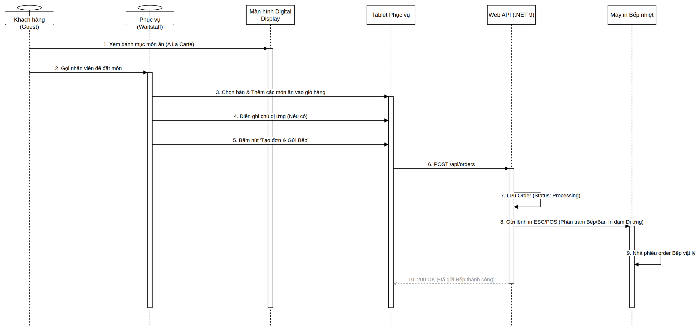

---

### 4.3 SD-03: Kiểm đồ (Checkfood) & Xác nhận hoàn thành món tại quầy Pass

> 📐 **Tệp thiết kế Draw.io**: [`sd03_serving_confirmation.drawio`](./drawio/sd03_serving_confirmation.drawio)

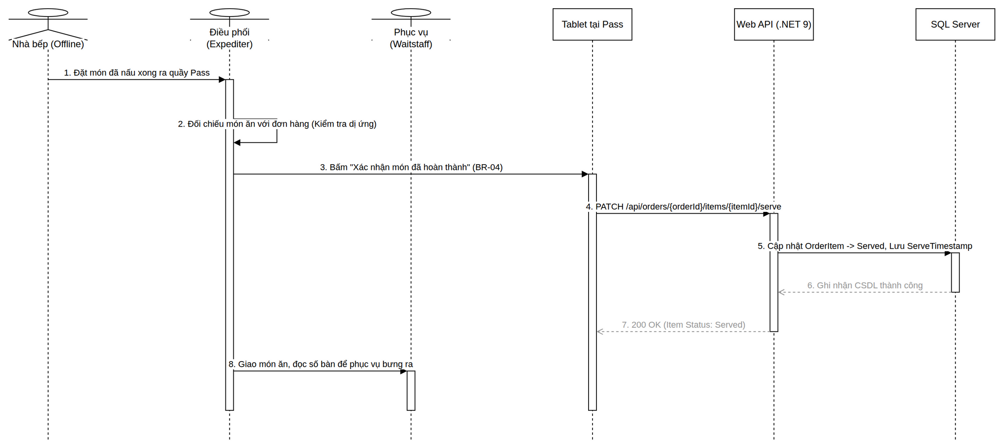

---

### 4.4 SD-04: Thanh toán hóa đơn, Cấn trừ cọc & Đóng bàn

> 📐 **Tệp thiết kế Draw.io**: [`sd04_invoice_settlement.drawio`](./drawio/sd04_invoice_settlement.drawio)

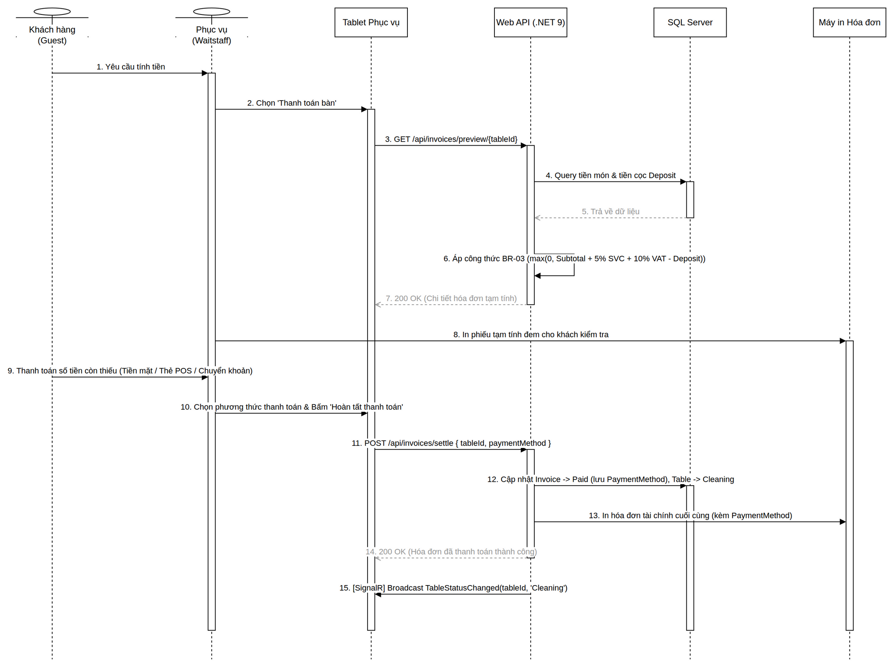

---

### 4.5 SD-05: Hủy đặt bàn & Hoàn tiền cọc VNPAY

> 📐 **Tệp thiết kế Draw.io**: [`sd05_cancellation_refund.drawio`](./drawio/sd05_cancellation_refund.drawio)

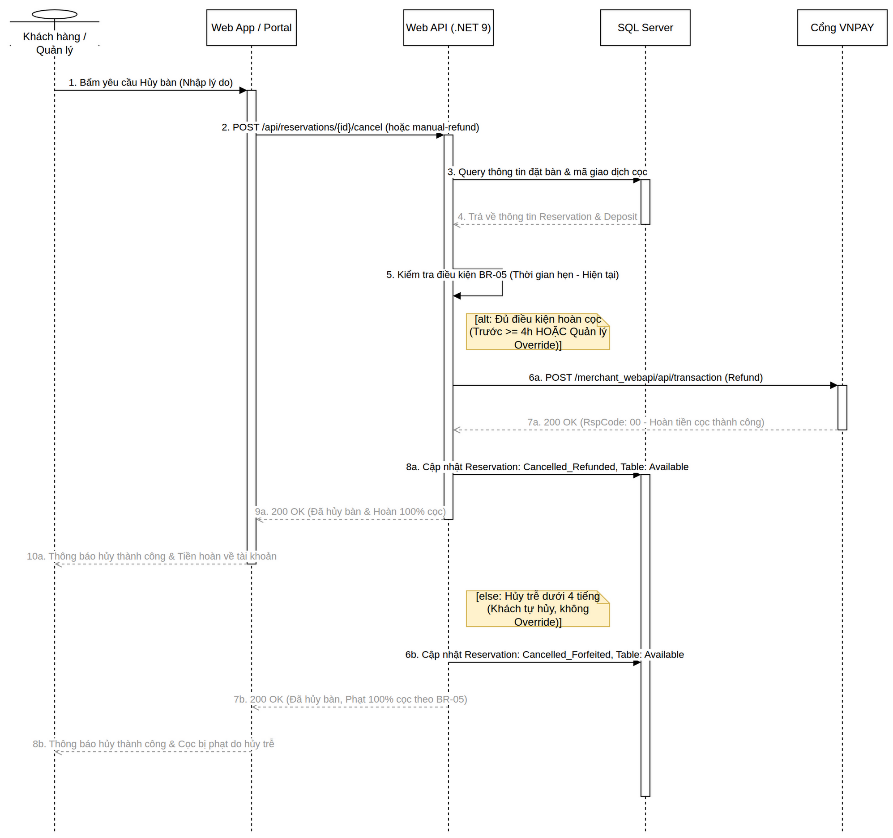

---

### 4.6 SD-06: Đăng nhập & Xác thực JWT Token nhân viên nội bộ

> 📐 **Tệp thiết kế Draw.io**: [`sd06_staff_login.drawio`](./drawio/sd06_staff_login.drawio)

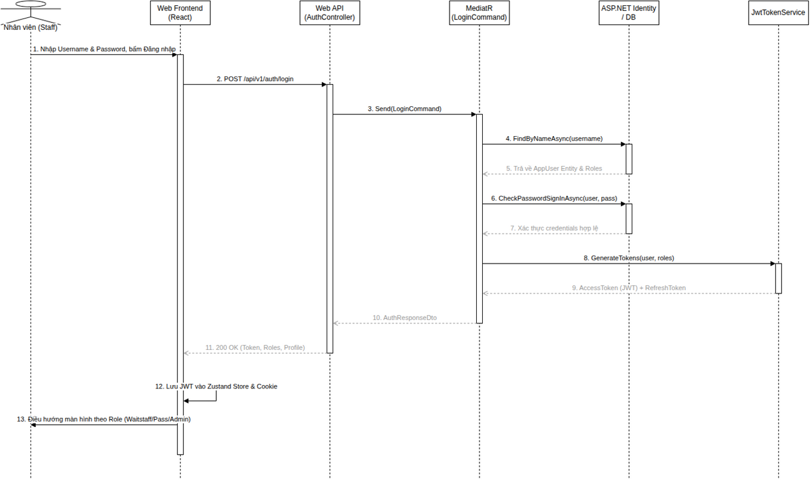

---

### 4.7 SD-07: Chuyển bàn / Đổi bàn trực tiếp tại nhà hàng

> 📐 **Tệp thiết kế Draw.io**: [`sd07_change_table.drawio`](./drawio/sd07_change_table.drawio)

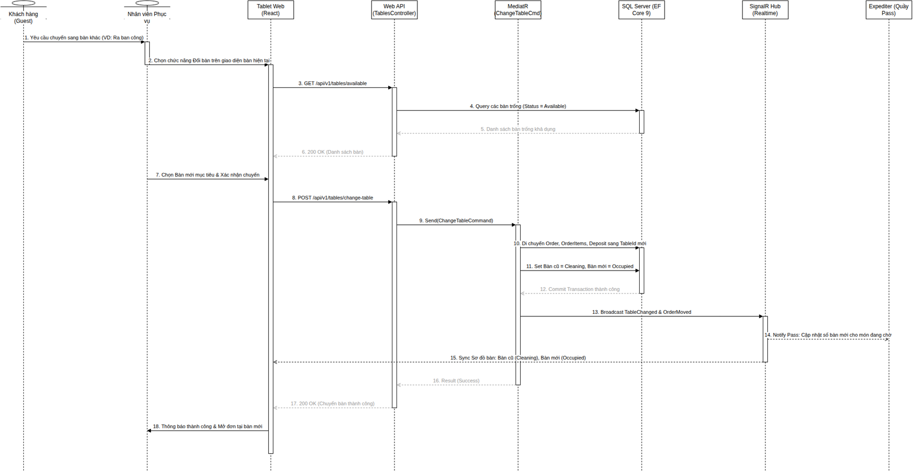

---

### 4.8 SD-08: Quản trị & Cấu hình Sơ đồ bàn ăn (Floor Plan Configuration)

> 📐 **Tệp thiết kế Draw.io**: [`sd08_tablet_pairing.drawio`](./drawio/sd08_tablet_pairing.drawio)

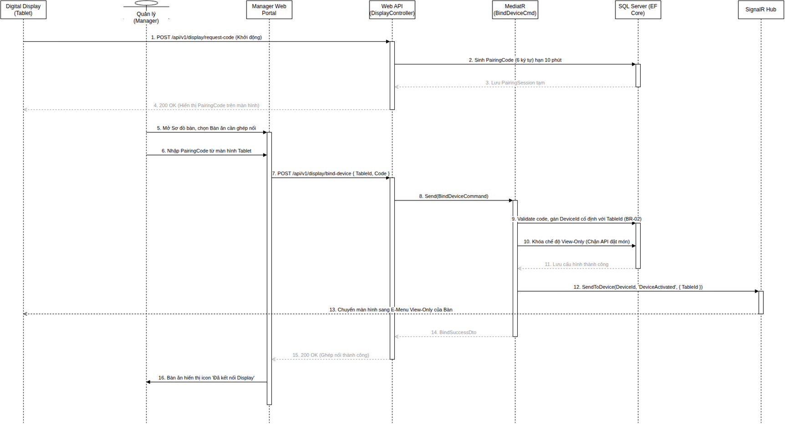

---

### 4.9 SD-09: Quản lý duyệt hoàn tiền cọc thủ công ngoại lệ

> 📐 **Tệp thiết kế Draw.io**: [`sd09_manual_refund.drawio`](./drawio/sd09_manual_refund.drawio)

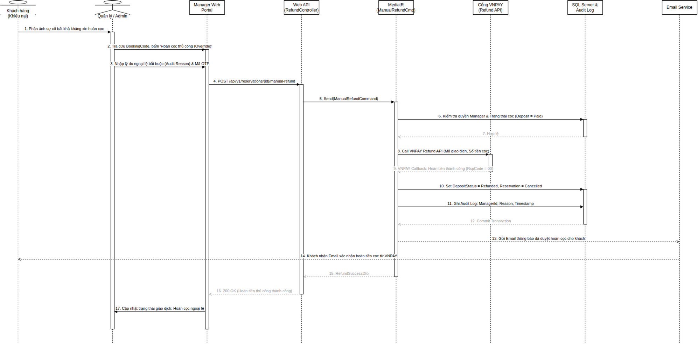

---

### 4.10 SD-10: Tự động giải phóng bàn hết hạn giữ cọc & Xử lý Late IPN

> 📐 **Tệp thiết kế Draw.io**: [`sd10_auto_release_late_ipn.drawio`](./drawio/sd10_auto_release_late_ipn.drawio)

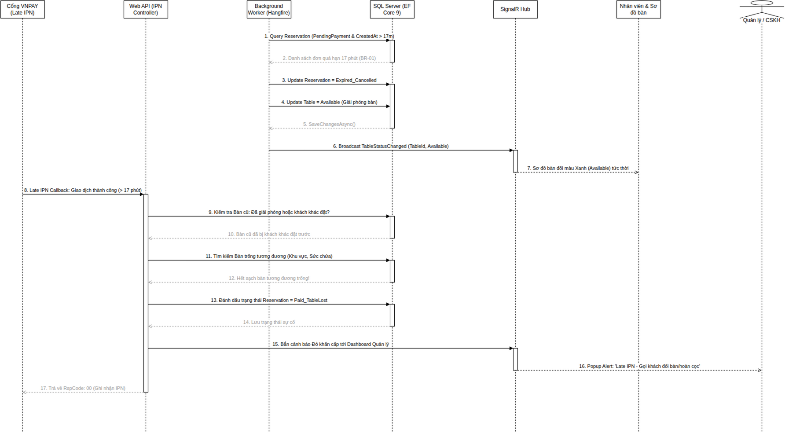

---

### 4.11 SD-11: Quản trị Thực đơn & Cập nhật trạng thái Còn/Hết món

> 📐 **Tệp thiết kế Draw.io**: [`sd11_menu_management.drawio`](./drawio/sd11_menu_management.drawio)

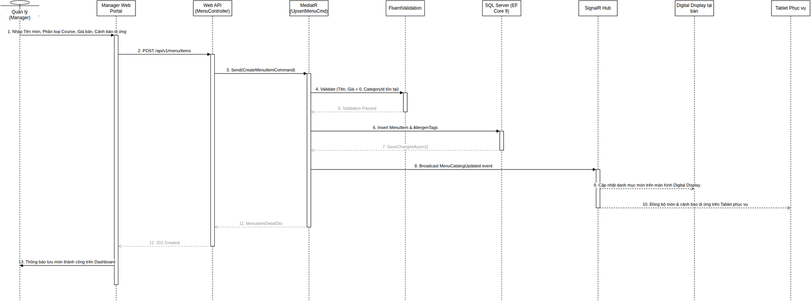

---

### 4.12 SD-12: Khách hàng đánh giá dịch vụ & Tự động gửi Email CSAT

> 📐 **Tệp thiết kế Draw.io**: [`sd12_guest_feedback.drawio`](./drawio/sd12_guest_feedback.drawio)

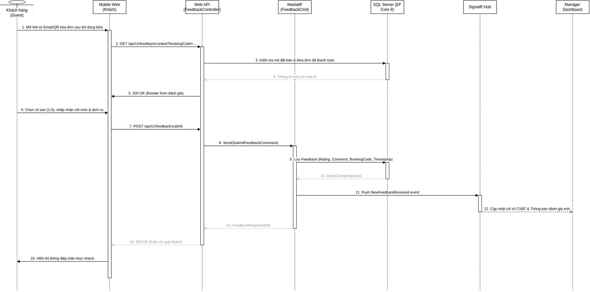

---

## CHƯƠNG 5: QUY TẮC NGHIỆP VỤ BẮT BUỘC (BUSINESS RULES MATRIX)

| Mã quy tắc | Tên quy tắc | Mô tả nội dung logic nghiệp vụ bắt buộc | Tầng kiểm soát |
| :--- | :--- | :--- | :--- |
| **BR-01** | **Thời hạn giữ cọc tạm thời (Reservation Lock Timeout)** | Khi khách hàng chọn bàn và bấm đặt cọc, hệ thống khóa giữ chỗ tạm thời trên sơ đồ trong **tối đa 15 phút**. Quá 15 phút không nhận được xác nhận IPN thành công từ VNPAY, hệ thống tự động giải phóng vị trí bàn về trạng thái `Available`. | Backend Background Worker / Hangfire |
| **BR-02** | **Màn hình hiển thị thực đơn tĩnh (Passive Digital Display)** | Mỗi bàn ăn vật lý được trang bị một màn hình hiển thị thụ động (View-only E-Menu) để khách ngắm thực đơn và cảnh báo dị ứng. Màn hình hoàn toàn không có tương tác đặt món. Toàn bộ thao tác chọn bàn và tạo Order do Nhân viên phục vụ (Waitstaff) thực hiện trên ứng dụng cầm tay qua Sơ đồ bàn trực tuyến. | Backend API Middleware & Frontend Router |
| **BR-03** | **Công thức tính Hóa đơn chuẩn (Financial Calculation Formula)** | Công thức tính bắt buộc áp dụng theo trình tự tuần tự: 1. $\text{Subtotal} = \sum (\text{Tiền món dùng thực tế})$ 2. $\text{Phí dịch vụ (5\%)} = \text{Subtotal} \times 0.05$ 3. $\text{Thuế VAT (10\%)} = (\text{Subtotal} + \text{Phí dịch vụ}) \times 0.10$ 4. $\text{Số tiền phải trả} = (\text{Subtotal} + \text{Phí dịch vụ} + \text{Thuế VAT}) - \text{Deposit Paid}$ | Application Service Layer & Domain Entity |
| **BR-04** | **Thẩm quyền xác nhận phục vụ món (Service Confirmation Privilege)** | Chỉ có tài khoản Nhân viên Điều phối (Expediter/Checkfood) hoặc Quản lý (Manager) mới có quyền bấm nút "Xác nhận món đã hoàn thành" trên thiết bị tại quầy Pass. Đầu bếp và Khách hàng không có quyền thực hiện thao tác này để tránh lỗi báo khống tiến độ phục vụ. | Backend JWT Role-based Authorization |
| **BR-05** | **Chính sách hủy bàn & Hoàn phạt tiền cọc (Cancellation & Refund Policy)** | - Khách được **hoàn cọc tự động 100%** nếu thực hiện hủy đặt bàn trước giờ hẹn **tối thiểu 04 tiếng**. - Mọi giao dịch hủy **dưới 04 tiếng** sẽ bị phạt 100% tiền cọc (không hoàn tiền). - *Ngoại lệ*: Quản lý (Manager) có quyền sử dụng chức năng `Manual Refund Override` để hoàn cọc thủ công trong các tình huống bất khả kháng. | Application Service Layer & VNPAY API |

---

## CHƯƠNG 6: MA TRẬN TRUY XUẤT NGUỒN GỐC YÊU CẦU (RTM MATRIX)

| Mã yêu cầu | Tên yêu cầu nghiệp vụ cấp cao | Mã Use Case | Mã Activity | Mã Sequence | Quy tắc nghiệp vụ | Mã Test Case kiểm thử |
| :---: | :--- | :---: | :---: | :---: | :---: | :---: |
| **REQ-01** | Đặt bàn trực tuyến & Đặt cọc VNPAY | `UC-U1` | `AD-01` | `SD-01` | `BR-01`, `BR-05` | `TC-RES-01`, `TC-RES-02` |
| **REQ-02** | Xem E-Menu qua Digital Display tại bàn | `UC-U2` | `AD-02` | `SD-02` | `BR-02` | `TC-ORD-01`, `TC-ORD-02` |
| **REQ-03** | Hủy đặt bàn trực tuyến & Hoàn cọc tự động | `UC-U3` | `AD-05` | `SD-05` | `BR-05` | `TC-RES-03` |
| **REQ-04** | Khách hàng đánh giá chất lượng dịch vụ | `UC-U4` | `AD-12` | `SD-12` | `BR-03` | `TC-FB-01` |
| **REQ-05** | Nhân viên tạo Order trực tiếp & In phiếu Bếp | `UC-E1` | `AD-02` | `SD-02` | `BR-04` | `TC-KIT-01`, `TC-KIT-02` |
| **REQ-06** | Phục vụ món & Xác nhận hoàn thành tại quầy Pass | `UC-E2` | `AD-03` | `SD-03` | `BR-04` | `TC-SER-01` |
| **REQ-07** | Xuất hóa đơn, Cấn trừ tiền cọc & Đóng bàn | `UC-E3` | `AD-04` | `SD-04` | `BR-03` | `TC-INV-01`, `TC-INV-02` |
| **REQ-08** | Chuyển bàn / Đổi bàn / Ghép bàn | `UC-E4` | `AD-07` | `SD-07` | `BR-02` | `TC-TBL-03` |
| **REQ-09** | Đăng nhập & Xác thực tài khoản nội bộ | `UC-E5` | `AD-06` | `SD-06` | `BR-04` | `TC-SEC-01`, `TC-SEC-02` |
| **REQ-10** | Quản trị Danh mục & Thực đơn món ăn | `UC-A1` | `AD-11` | `SD-11` | `BR-04` | `TC-MNU-01` |
| **REQ-11** | Quản trị & Cấu hình Sơ đồ bàn ăn | `UC-A2` | `AD-08` | `SD-08` | `BR-02` | `TC-TBL-01`, `TC-TBL-02` |
| **REQ-12** | Duyệt hoàn tiền cọc thủ công ngoại lệ | `UC-A3` | `AD-09` | `SD-09` | `BR-05` | `TC-REF-01` |
| **REQ-13** | Quản trị Tài khoản nhân viên & Phân quyền | `UC-A4` | — | — | `BR-04` | `TC-SEC-03` |
| **REQ-14** | Báo cáo Thống kê Doanh thu & Dashboard | `UC-A5` | — | — | — | `TC-REP-01` |
| **REQ-15** | Tự động quét & Giải phóng bàn hết hạn giữ cọc | `UC-S1` | `AD-10` | `SD-10` | `BR-01` | `TC-SYS-01` |
---

---

## PHỤ LỤC A: THIẾT KẾ KIẾN TRÚC MẠNG & CƠ SỞ DỮ LIỆU

### A.1 Sơ đồ Triển khai Hệ thống Vật lý & Mạng (Deployment Architecture)
> 📐 **Tệp thiết kế Draw.io**: [`deployment_architecture.drawio`](./drawio/deployment_architecture.drawio)

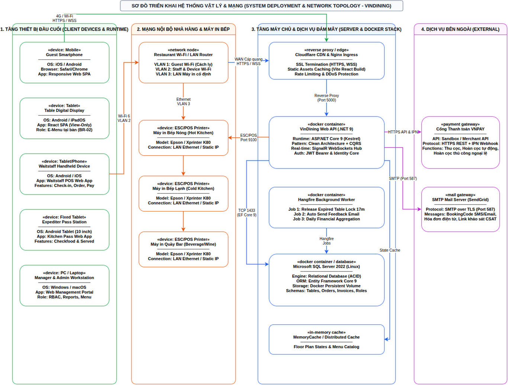

### A.2 Sơ đồ Thực thể Liên kết Cơ sở dữ liệu (Database ERD)
> 📐 **Tệp thiết kế Draw.io**: [`database_erd.drawio`](./drawio/database_erd.drawio)

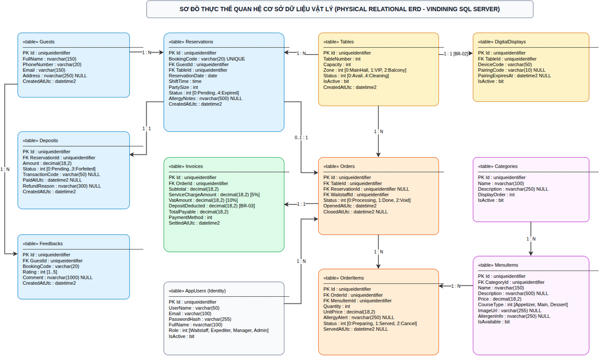

---

## PHỤ LỤC B: SƠ ĐỒ MÁY TRẠNG THÁI VÒNG ĐỜI THỰC THỂ (STATE MACHINE DIAGRAMS)

### B.1 Vòng đời Đặt bàn & Tiền cọc (Reservation Lifecycle)
> 📐 **Tệp thiết kế Draw.io**: [`state_reservation_lifecycle.drawio`](./drawio/state_reservation_lifecycle.drawio)

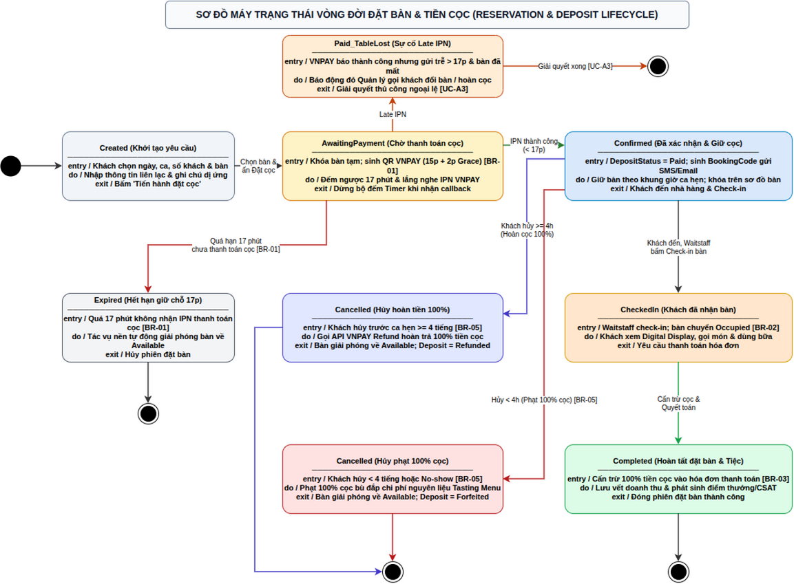

### B.2 Vòng đời Hóa đơn & Quyết toán (Invoice Lifecycle)
> 📐 **Tệp thiết kế Draw.io**: [`state_invoice_lifecycle.drawio`](./drawio/state_invoice_lifecycle.drawio)

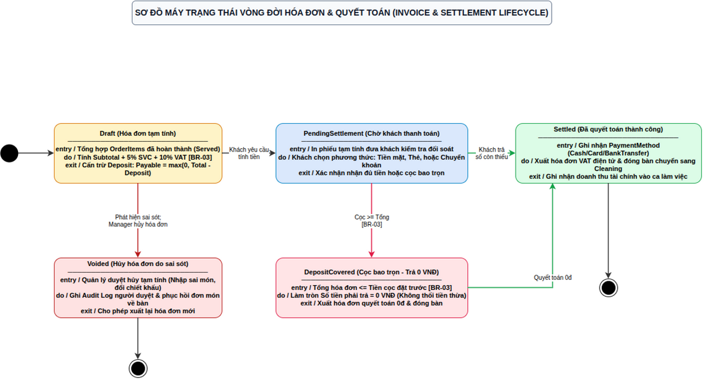

### B.3 Vòng đời Bàn ăn (Table Lifecycle)
> 📐 **Tệp thiết kế Draw.io**: [`state_table_lifecycle.drawio`](./drawio/state_table_lifecycle.drawio)

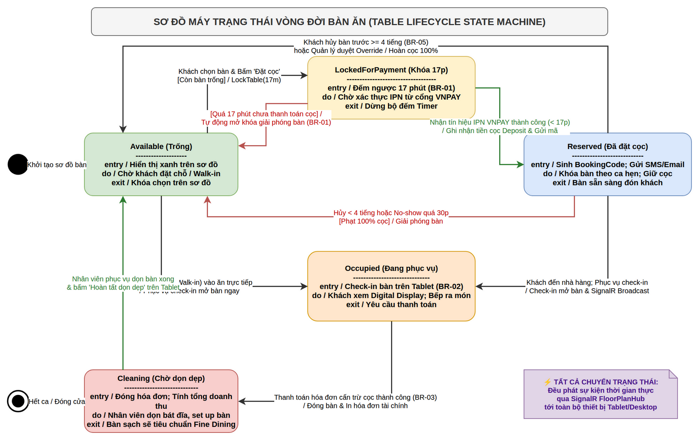

### B.4 Vòng đời Đơn hàng & Món (Order Lifecycle)
> 📐 **Tệp thiết kế Draw.io**: [`state_order_lifecycle.drawio`](./drawio/state_order_lifecycle.drawio)

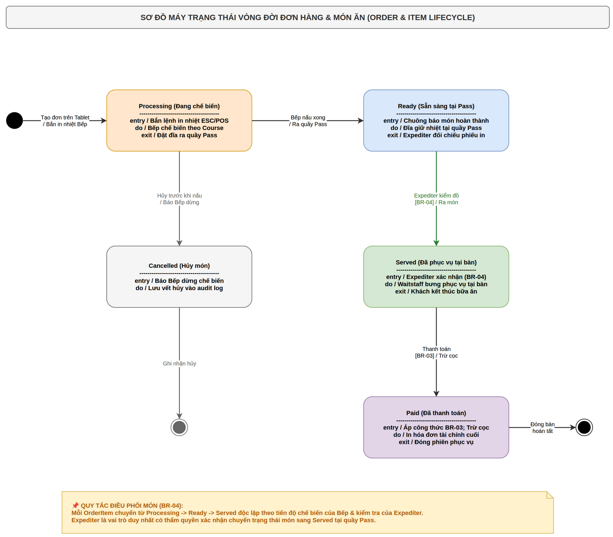

## CHƯƠNG 7: DANH MỤC TÀI LIỆU THAM KHẢO (REFERENCES)

1. **Microsoft Corporation** (2026), *ASP.NET Core Web API & SignalR Real-time Communication Documentation*, Microsoft Learn.
2. **Martin Fowler** (2002), *Patterns of Enterprise Application Architecture*, Addison-Wesley Professional.
3. **Robert C. Martin** (2017), *Clean Architecture: A Craftsman's Guide to Software Structure and Design*, Prentice Hall.
4. **VNPAY Payment Gateway** (2025), *VNPAY E-Commerce Merchant Integration Specifications (v2.1.0)*, Vietnam Payment Solution Joint Stock Company.
5. **Epson ESC/POS** (2024), *ESC/POS Application Programming Guide for POS Thermal Printers*, Seiko Epson Corporation.
