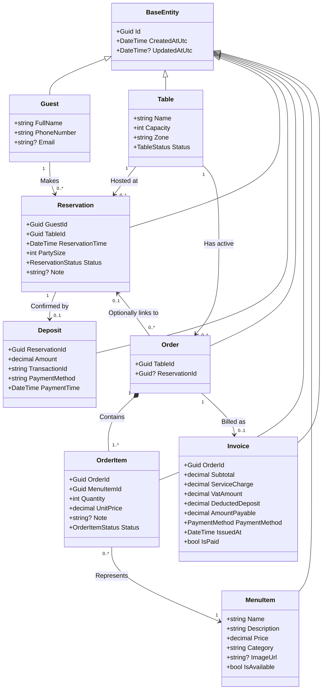

# Domain Class Diagram

```mermaid
classDiagram
    class BaseEntity {
        +Guid Id
        +DateTime CreatedAtUtc
        +DateTime? UpdatedAtUtc
    }

    class Guest {
        +string FullName
        +string PhoneNumber
        +string? Email
    }

    class Table {
        +string Name
        +int Capacity
        +string Zone
        +TableStatus Status
    }

    class Reservation {
        +Guid GuestId
        +Guid TableId
        +DateTime ReservationTime
        +int PartySize
        +ReservationStatus Status
        +string? Note
    }

    class Deposit {
        +Guid ReservationId
        +decimal Amount
        +string TransactionId
        +string PaymentMethod
        +DateTime PaymentTime
    }

    class Order {
        +Guid TableId
        +Guid? ReservationId
    }

    class OrderItem {
        +Guid OrderId
        +Guid MenuItemId
        +int Quantity
        +decimal UnitPrice
        +string? Note
        +OrderItemStatus Status
    }

    class MenuItem {
        +string Name
        +string Description
        +decimal Price
        +string Category
        +string? ImageUrl
        +bool IsAvailable
    }

    class Invoice {
        +Guid OrderId
        +decimal Subtotal
        +decimal ServiceCharge
        +decimal VatAmount
        +decimal DeductedDeposit
        +decimal AmountPayable
        +PaymentMethod PaymentMethod
        +DateTime IssuedAt
        +bool IsPaid
    }

    BaseEntity <|-- Guest
    BaseEntity <|-- Table
    BaseEntity <|-- Reservation
    BaseEntity <|-- Deposit
    BaseEntity <|-- Order
    BaseEntity <|-- OrderItem
    BaseEntity <|-- MenuItem
    BaseEntity <|-- Invoice

    Guest "1" --> "0..*" Reservation : Makes
    Table "1" --> "0..*" Reservation : Hosted at
    Table "1" --> "0..*" Order : Has active
    Reservation "1" --> "0..1" Deposit : Confirmed by
    Reservation "0..1" <-- "0..*" Order : Optionally links to
    Order "1" *-- "1..*" OrderItem : Contains
    OrderItem "0..*" --> "1" MenuItem : Represents
    Order "1" --> "0..1" Invoice : Billed as
```
