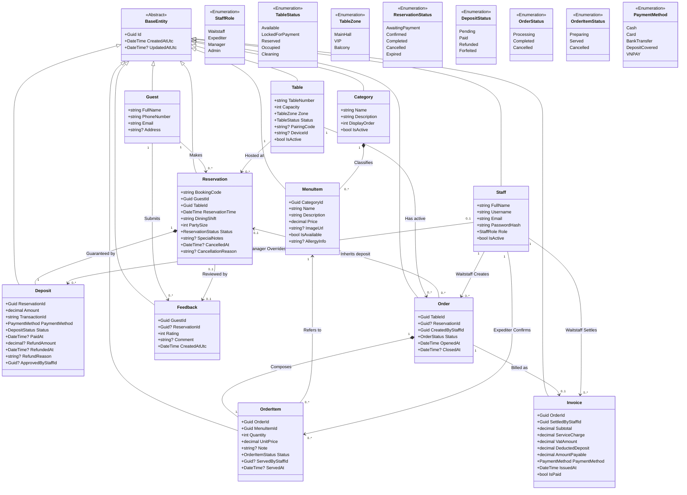

# SƠ ĐỒ LỚP MIỀN THỰC THỂ (DOMAIN CLASS DIAGRAM)
## Dự án: Hệ thống Quản lý và Đặt bàn Nhà hàng Fine Dining (VinDining)

---

### 1. Giới thiệu tổng quan
Sơ đồ lớp miền thực thể (Domain Class Diagram) mô tả cấu trúc dữ liệu cốt lõi, thuộc tính, các mối quan hệ quan trọng (Aggregation, Composition, Association, Inheritance) và các kiểu liệt kê (Enums) của hệ thống VinDining.

Mô hình được thiết kế bám sát theo:
* Kiến trúc **Clean Architecture** (.NET 9 Domain Layer).
* Bộ quy tắc nghiệp vụ bất biến (`BR-01` đến `BR-05`) trong [CONTEXT.md](../../CONTEXT.md).
* Hệ thống 15 Use Case chuẩn hóa: **Khách hàng (`UC-U1`..`UC-U4`) $\rightarrow$ Nhân viên nội bộ (`UC-E1`..`UC-E5`) $\rightarrow$ Quản trị & Quản lý (`UC-A1`..`UC-A5`) $\rightarrow$ Tự động Hệ thống (`UC-S1`)**.

---

### 2. Sơ đồ Class Diagram (Mermaid)

---

### 3. Bảng Từ điển Thực thể & Ánh xạ Quy tắc Nghiệp vụ

| STT | Thực thể (Entity) | Vai trò trong hệ thống | Ánh xạ Use Case | Quy tắc nghiệp vụ liên quan |
| :---: | :--- | :--- | :---: | :--- |
| 1 | **Guest** | Lưu trữ thông tin định danh liên lạc của khách đặt bàn (Họ tên, SĐT, Email). Khách hàng **không có tài khoản** trong hệ thống. | `UC-U1`, `UC-U3`, `UC-U4` | Định danh phiên giao dịch và nhận SMS/Email xác nhận `BookingCode`. |
| 2 | **Staff** | Đại diện nhân sự nội bộ có tài khoản đăng nhập (Waitstaff, Expediter, Manager, Admin). | `UC-E5`, `UC-A4` | Quản lý phiên làm việc bằng JWT Token và phân quyền RBAC. |
| 3 | **Table** | Đại diện vị trí bàn ăn vật lý, khu vực (VIP, Sảnh, Ban công), sức chứa và liên kết thiết bị Digital Display. | `UC-E1`, `UC-E4`, `UC-A2`, `UC-S1` | `BR-01` (Khóa 17p), `BR-02` (Ghép nối PairingCode với Tablet). |
| 4 | **Reservation** | Đơn đặt bàn trước của khách, quản lý mã `BookingCode`, ca phục vụ và trạng thái giữ chỗ. | `UC-U1`, `UC-U3`, `UC-S1` | `BR-01` (Hết hạn 17p hủy tự động), `BR-05` (Chính sách hủy trước $\ge$ 4h). |
| 5 | **Deposit** | Giao dịch đặt cọc giữ chỗ qua cổng VNPAY. Lưu trữ lịch sử thu cọc, hoàn tiền tự động hoặc hoàn tiền thủ công. | `UC-U1`, `UC-U3`, `UC-A3` | `BR-01` (Giao dịch VNPAY IPN), `BR-05` (Hoàn cọc 100% hoặc phạt 100%). |
| 6 | **Category** | Danh mục phân loại thực đơn (Khai vị, Món chính, Tráng miệng, Đồ uống cao cấp). | `UC-U2`, `UC-A1` | Sắp xếp thứ tự hiển thị (`DisplayOrder`) trên giao diện E-Menu. |
| 7 | **MenuItem** | Món ăn hoặc thức uống trong thực đơn A La Carte, kèm giá bán và cảnh báo dị ứng thực phẩm. | `UC-U2`, `UC-E1`, `UC-A1` | In đậm thông tin dị ứng (`AllergyInfo`) trên phiếu in nhiệt Bếp. |
| 8 | **Order** | Đơn gọi món tại bàn của khách đang dùng bữa (`Occupied`), do nhân viên phục vụ tạo. | `UC-E1`, `UC-E4` | Chỉ tạo khi bàn `Occupied`. Có thể kế thừa `ReservationId` để đối soát cọc. |
| 9 | **OrderItem** | Từng món ăn chi tiết trong đơn hàng. Lưu trạng thái chế biến và mốc thời gian hoàn thành tại Pass. | `UC-E1`, `UC-E2` | `BR-04` (Chỉ Expediter/Manager mới được xác nhận `Served` tại quầy Pass). |
| 10 | **Invoice** | Hóa đơn thanh toán tài chính sau bữa ăn, tự động cấn trừ tiền cọc đã trả trước. | `UC-E3` | `BR-03` (Công thức Subtotal + 5% Phí PV + 10% VAT - Tiền cọc). |
| 11 | **Feedback** | Đánh giá sao (1–5 sao) và phản hồi dịch vụ của khách hàng sau khi dùng bữa. | `UC-U4` | Tổng hợp báo cáo mức độ hài lòng khách hàng tại Dashboard quản trị (`UC-A5`). |
| 12 | **BaseEntity** | Lớp trừu tượng cung cấp các thuộc tính kiểm toán cơ sở (`Id`, `CreatedAtUtc`, `UpdatedAtUtc`) cho toàn bộ Entity. | Toàn hệ thống | Đảm bảo tính nhất quán của Clean Architecture. |
