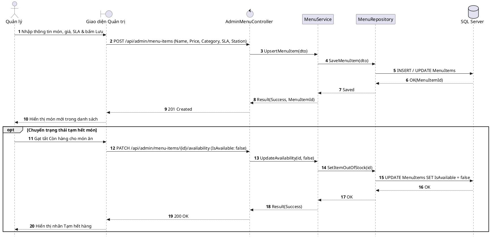

```plantuml
@startuml SD_UC_A1_Menu_PrepSLA
autonumber
skinparam style strictuml
skinparam sequenceMessageAlign center
skinparam responseMessageBelowArrow true
skinparam defaultFontName "Segoe UI", Arial, sans-serif
skinparam defaultFontSize 16
skinparam sequenceActorFontSize 16
skinparam sequenceParticipantFontSize 16
skinparam sequenceArrowFontSize 15
skinparam sequenceGroupFontSize 15
skinparam sequenceGroupHeaderFontSize 15

actor "Quản lý" as Manager
boundary "Giao diện Quản trị" as UI
control "AdminMenuController" as Controller
participant "MenuService" as Service
participant "MenuRepository" as Repo
database "SQL Server" as DB

Manager -> UI: Nhập thông tin món, giá, SLA & bấm Lưu
UI -> Controller: POST /api/admin/menu-items (Name, Price, Category, SLA, Station)
Controller -> Service: UpsertMenuItem(dto)
Service -> Repo: SaveMenuItem(dto)
Repo -> DB: INSERT / UPDATE MenuItems
DB --> Repo: OK(MenuItemId)
Repo --> Service: Saved
Service --> Controller: Result(Success, MenuItemId)
Controller --> UI: 201 Created
UI --> Manager: Hiển thị món mới trong danh sách

opt Chuyển trạng thái tạm hết món
    Manager -> UI: Gạt tắt Còn hàng cho món ăn
    UI -> Controller: PATCH /api/admin/menu-items/{id}/availability (IsAvailable: false)
    Controller -> Service: UpdateAvailability(id, false)
    Service -> Repo: SetItemOutOfStock(id)
    Repo -> DB: UPDATE MenuItems SET IsAvailable = false
    DB --> Repo: OK
    Repo --> Service: OK
    Service --> Controller: Result(Success)
    Controller --> UI: 200 OK
    UI --> Manager: Hiển thị nhãn Tạm hết hàng
end
@enduml
```
