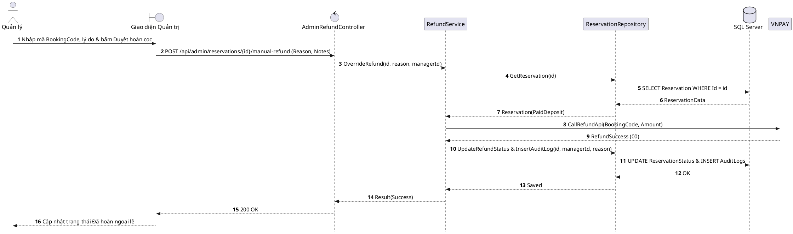

```plantuml
@startuml SD_UC_A3_Manual_Refund_Approval
autonumber
skinparam style strictuml
skinparam sequenceMessageAlign center
skinparam responseMessageBelowArrow true
skinparam defaultFontName "Segoe UI", Arial, sans-serif
skinparam defaultFontSize 16
skinparam sequenceActorFontSize 16
skinparam sequenceParticipantFontSize 16
skinparam sequenceArrowFontSize 15
skinparam sequenceGroupFontSize 15
skinparam sequenceGroupHeaderFontSize 15

actor "Quản lý" as Manager
boundary "Giao diện Quản trị" as UI
control "AdminRefundController" as Controller
participant "RefundService" as Service
participant "ReservationRepository" as Repo
database "SQL Server" as DB
participant "VNPAY" as VNPAY

Manager -> UI: Nhập mã BookingCode, lý do & bấm Duyệt hoàn cọc
UI -> Controller: POST /api/admin/reservations/{id}/manual-refund (Reason, Notes)
Controller -> Service: OverrideRefund(id, reason, managerId)
Service -> Repo: GetReservation(id)
Repo -> DB: SELECT Reservation WHERE Id = id
DB --> Repo: ReservationData
Repo --> Service: Reservation(PaidDeposit)
Service -> VNPAY: CallRefundApi(BookingCode, Amount)
VNPAY --> Service: RefundSuccess (00)
Service -> Repo: UpdateRefundStatus & InsertAuditLog(id, managerId, reason)
Repo -> DB: UPDATE ReservationStatus & INSERT AuditLogs
DB --> Repo: OK
Repo --> Service: Saved
Service --> Controller: Result(Success)
Controller --> UI: 200 OK
UI --> Manager: Cập nhật trạng thái Đã hoàn ngoại lệ
@enduml
```
