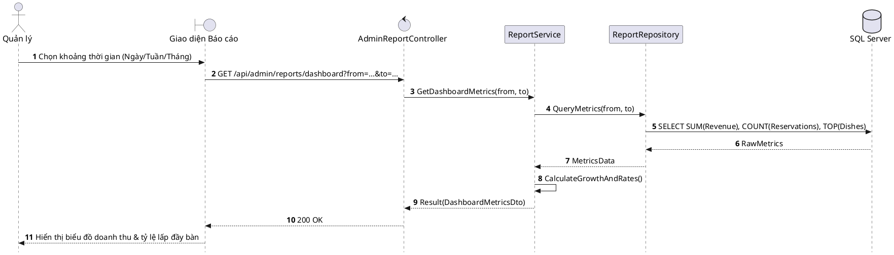

```plantuml
@startuml SD_UC_A5_Analytics_Dashboard
autonumber
skinparam style strictuml
skinparam sequenceMessageAlign center
skinparam responseMessageBelowArrow true
skinparam defaultFontName "Segoe UI", Arial, sans-serif
skinparam defaultFontSize 16
skinparam sequenceActorFontSize 16
skinparam sequenceParticipantFontSize 16
skinparam sequenceArrowFontSize 15
skinparam sequenceGroupFontSize 15
skinparam sequenceGroupHeaderFontSize 15

actor "Quản lý" as Manager
boundary "Giao diện Báo cáo" as UI
control "AdminReportController" as Controller
participant "ReportService" as Service
participant "ReportRepository" as Repo
database "SQL Server" as DB

Manager -> UI: Chọn khoảng thời gian (Ngày/Tuần/Tháng)
UI -> Controller: GET /api/admin/reports/dashboard?from=...&to=...
Controller -> Service: GetDashboardMetrics(from, to)
Service -> Repo: QueryMetrics(from, to)
Repo -> DB: SELECT SUM(Revenue), COUNT(Reservations), TOP(Dishes)
DB --> Repo: RawMetrics
Repo --> Service: MetricsData
Service -> Service: CalculateGrowthAndRates()
Service --> Controller: Result(DashboardMetricsDto)
Controller --> UI: 200 OK
UI --> Manager: Hiển thị biểu đồ doanh thu & tỷ lệ lấp đầy bàn
@enduml
```
