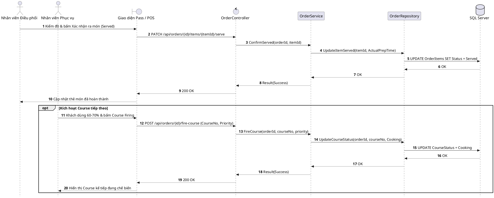

```plantuml
@startuml SD_UC_E2_Expediter_Serve_CourseFiring
autonumber
skinparam style strictuml
skinparam sequenceMessageAlign center
skinparam responseMessageBelowArrow true
skinparam defaultFontName "Segoe UI", Arial, sans-serif
skinparam defaultFontSize 16
skinparam sequenceActorFontSize 16
skinparam sequenceParticipantFontSize 16
skinparam sequenceArrowFontSize 15
skinparam sequenceGroupFontSize 15
skinparam sequenceGroupHeaderFontSize 15

actor "Nhân viên Điều phối" as Expediter
actor "Nhân viên Phục vụ" as Waitstaff
boundary "Giao diện Pass / POS" as UI
control "OrderController" as Controller
participant "OrderService" as Service
participant "OrderRepository" as Repo
database "SQL Server" as DB

Expediter -> UI: Kiểm đồ & bấm Xác nhận ra món (Served)
UI -> Controller: PATCH /api/orders/{id}/items/{itemId}/serve
Controller -> Service: ConfirmServed(orderId, itemId)
Service -> Repo: UpdateItemServed(itemId, ActualPrepTime)
Repo -> DB: UPDATE OrderItems SET Status = Served
DB --> Repo: OK
Repo --> Service: OK
Service --> Controller: Result(Success)
Controller --> UI: 200 OK
UI --> Expediter: Cập nhật thẻ món đã hoàn thành

opt Kích hoạt Course tiếp theo
    Waitstaff -> UI: Khách dùng 60-70% & bấm Course Firing
    UI -> Controller: POST /api/orders/{id}/fire-course (CourseNo, Priority)
    Controller -> Service: FireCourse(orderId, courseNo, priority)
    Service -> Repo: UpdateCourseStatus(orderId, courseNo, Cooking)
    Repo -> DB: UPDATE CourseStatus = Cooking
    DB --> Repo: OK
    Repo --> Service: OK
    Service --> Controller: Result(Success)
    Controller --> UI: 200 OK
    UI --> Waitstaff: Hiển thị Course kế tiếp đang chế biến
end
@enduml
```
