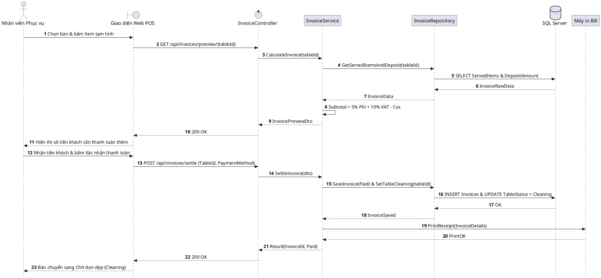

```plantuml
@startuml SD_UC_E3_Settle_Invoice
autonumber
skinparam style strictuml
skinparam sequenceMessageAlign center
skinparam responseMessageBelowArrow true
skinparam defaultFontName "Segoe UI", Arial, sans-serif
skinparam defaultFontSize 16
skinparam sequenceActorFontSize 16
skinparam sequenceParticipantFontSize 16
skinparam sequenceArrowFontSize 15
skinparam sequenceGroupFontSize 15
skinparam sequenceGroupHeaderFontSize 15

actor "Nhân viên Phục vụ" as Waitstaff
boundary "Giao diện Web POS" as UI
control "InvoiceController" as Controller
participant "InvoiceService" as Service
participant "InvoiceRepository" as Repo
database "SQL Server" as DB
participant "Máy in Bill" as Printer

Waitstaff -> UI: Chọn bàn & bấm Xem tạm tính
UI -> Controller: GET /api/invoices/preview/{tableId}
Controller -> Service: CalculateInvoice(tableId)
Service -> Repo: GetServedItemsAndDeposit(tableId)
Repo -> DB: SELECT ServedItems & DepositAmount
DB --> Repo: InvoiceRawData
Repo --> Service: InvoiceData
Service -> Service: Subtotal + 5% Phí + 10% VAT - Cọc
Service --> Controller: InvoicePreviewDto
Controller --> UI: 200 OK
UI --> Waitstaff: Hiển thị số tiền khách cần thanh toán thêm

Waitstaff -> UI: Nhận tiền khách & bấm Xác nhận thanh toán
UI -> Controller: POST /api/invoices/settle (TableId, PaymentMethod)
Controller -> Service: SettleInvoice(dto)
Service -> Repo: SaveInvoice(Paid) & SetTableCleaning(tableId)
Repo -> DB: INSERT Invoices & UPDATE TableStatus = Cleaning
DB --> Repo: OK
Repo --> Service: InvoiceSaved
Service -> Printer: PrintReceipt(InvoiceDetails)
Printer --> Service: PrintOK
Service --> Controller: Result(InvoiceId, Paid)
Controller --> UI: 200 OK
UI --> Waitstaff: Bàn chuyển sang Chờ dọn dẹp (Cleaning)
@enduml
```
