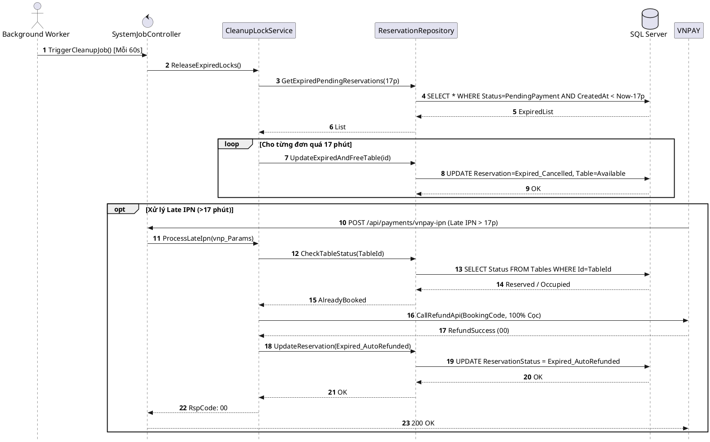

```plantuml
@startuml SD_UC_S1_Auto_Release_Expired_Lock
autonumber
skinparam style strictuml
skinparam sequenceMessageAlign center
skinparam responseMessageBelowArrow true
skinparam defaultFontName "Segoe UI", Arial, sans-serif
skinparam defaultFontSize 16
skinparam sequenceActorFontSize 16
skinparam sequenceParticipantFontSize 16
skinparam sequenceArrowFontSize 15
skinparam sequenceGroupFontSize 15
skinparam sequenceGroupHeaderFontSize 15

actor "Background Worker" as Worker
control "SystemJobController" as Controller
participant "CleanupLockService" as Service
participant "ReservationRepository" as Repo
database "SQL Server" as DB
participant "VNPAY" as VNPAY

Worker -> Controller: TriggerCleanupJob() [Mỗi 60s]
Controller -> Service: ReleaseExpiredLocks()
Service -> Repo: GetExpiredPendingReservations(17p)
Repo -> DB: SELECT * WHERE Status=PendingPayment AND CreatedAt < Now-17p
DB --> Repo: ExpiredList
Repo --> Service: List

loop Cho từng đơn quá 17 phút
    Service -> Repo: UpdateExpiredAndFreeTable(id)
    Repo -> DB: UPDATE Reservation=Expired_Cancelled, Table=Available
    DB --> Repo: OK
end

opt Xử lý Late IPN (>17 phút)
    VNPAY -> Controller: POST /api/payments/vnpay-ipn (Late IPN > 17p)
    Controller -> Service: ProcessLateIpn(vnp_Params)
    Service -> Repo: CheckTableStatus(TableId)
    Repo -> DB: SELECT Status FROM Tables WHERE Id=TableId
    DB --> Repo: Reserved / Occupied
    Repo --> Service: AlreadyBooked
    Service -> VNPAY: CallRefundApi(BookingCode, 100% Cọc)
    VNPAY --> Service: RefundSuccess (00)
    Service -> Repo: UpdateReservation(Expired_AutoRefunded)
    Repo -> DB: UPDATE ReservationStatus = Expired_AutoRefunded
    DB --> Repo: OK
    Repo --> Service: OK
    Service --> Controller: RspCode: 00
    Controller --> VNPAY: 200 OK
end
@enduml
```
