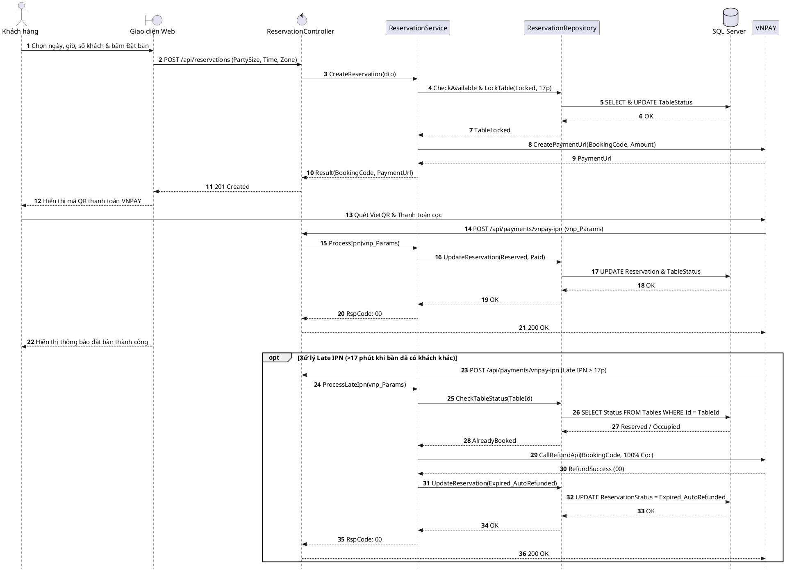

```plantuml
@startuml SD_UC_U1_Reservation_Deposit
autonumber
skinparam style strictuml
skinparam sequenceMessageAlign center
skinparam responseMessageBelowArrow true
skinparam defaultFontName "Segoe UI", Arial, sans-serif
skinparam defaultFontSize 16
skinparam sequenceActorFontSize 16
skinparam sequenceParticipantFontSize 16
skinparam sequenceArrowFontSize 15
skinparam sequenceGroupFontSize 15
skinparam sequenceGroupHeaderFontSize 15

actor "Khách hàng" as Guest
boundary "Giao diện Web" as UI
control "ReservationController" as Controller
participant "ReservationService" as Service
participant "ReservationRepository" as Repo
database "SQL Server" as DB
participant "VNPAY" as VNPAY

Guest -> UI: Chọn ngày, giờ, số khách & bấm Đặt bàn
UI -> Controller: POST /api/reservations (PartySize, Time, Zone)
Controller -> Service: CreateReservation(dto)
Service -> Repo: CheckAvailable & LockTable(Locked, 17p)
Repo -> DB: SELECT & UPDATE TableStatus
DB --> Repo: OK
Repo --> Service: TableLocked
Service -> VNPAY: CreatePaymentUrl(BookingCode, Amount)
VNPAY --> Service: PaymentUrl
Service --> Controller: Result(BookingCode, PaymentUrl)
Controller --> UI: 201 Created
UI --> Guest: Hiển thị mã QR thanh toán VNPAY

Guest -> VNPAY: Quét VietQR & Thanh toán cọc
VNPAY -> Controller: POST /api/payments/vnpay-ipn (vnp_Params)
Controller -> Service: ProcessIpn(vnp_Params)
Service -> Repo: UpdateReservation(Reserved, Paid)
Repo -> DB: UPDATE Reservation & TableStatus
DB --> Repo: OK
Repo --> Service: OK
Service --> Controller: RspCode: 00
Controller --> VNPAY: 200 OK
UI --> Guest: Hiển thị thông báo đặt bàn thành công

opt Xử lý Late IPN (>17 phút khi bàn đã có khách khác)
    VNPAY -> Controller: POST /api/payments/vnpay-ipn (Late IPN > 17p)
    Controller -> Service: ProcessLateIpn(vnp_Params)
    Service -> Repo: CheckTableStatus(TableId)
    Repo -> DB: SELECT Status FROM Tables WHERE Id = TableId
    DB --> Repo: Reserved / Occupied
    Repo --> Service: AlreadyBooked
    Service -> VNPAY: CallRefundApi(BookingCode, 100% Cọc)
    VNPAY --> Service: RefundSuccess (00)
    Service -> Repo: UpdateReservation(Expired_AutoRefunded)
    Repo -> DB: UPDATE ReservationStatus = Expired_AutoRefunded
    DB --> Repo: OK
    Repo --> Service: OK
    Service --> Controller: RspCode: 00
    Controller --> VNPAY: 200 OK
end
@enduml
```
