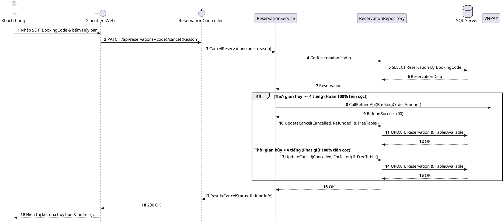

```plantuml
@startuml SD_UC_U3_Cancel_Reservation
autonumber
skinparam style strictuml
skinparam sequenceMessageAlign center
skinparam responseMessageBelowArrow true
skinparam defaultFontName "Segoe UI", Arial, sans-serif
skinparam defaultFontSize 16
skinparam sequenceActorFontSize 16
skinparam sequenceParticipantFontSize 16
skinparam sequenceArrowFontSize 15
skinparam sequenceGroupFontSize 15
skinparam sequenceGroupHeaderFontSize 15

actor "Khách hàng" as Guest
boundary "Giao diện Web" as UI
control "ReservationController" as Controller
participant "ReservationService" as Service
participant "ReservationRepository" as Repo
database "SQL Server" as DB
participant "VNPAY" as VNPAY

Guest -> UI: Nhập SĐT, BookingCode & bấm Hủy bàn
UI -> Controller: PATCH /api/reservations/{code}/cancel (Reason)
Controller -> Service: CancelReservation(code, reason)
Service -> Repo: GetReservation(code)
Repo -> DB: SELECT Reservation By BookingCode
DB --> Repo: ReservationData
Repo --> Service: Reservation

alt Thời gian hủy >= 4 tiếng (Hoàn 100% tiền cọc)
    Service -> VNPAY: CallRefundApi(BookingCode, Amount)
    VNPAY --> Service: RefundSuccess (00)
    Service -> Repo: UpdateCancel(Cancelled, Refunded) & FreeTable()
    Repo -> DB: UPDATE Reservation & Table(Available)
    DB --> Repo: OK
else Thời gian hủy < 4 tiếng (Phạt giữ 100% tiền cọc)
    Service -> Repo: UpdateCancel(Cancelled, Forfeited) & FreeTable()
    Repo -> DB: UPDATE Reservation & Table(Available)
    DB --> Repo: OK
end

Repo --> Service: OK
Service --> Controller: Result(CancelStatus, RefundInfo)
Controller --> UI: 200 OK
UI --> Guest: Hiển thị kết quả hủy bàn & hoàn cọc
@enduml
```
